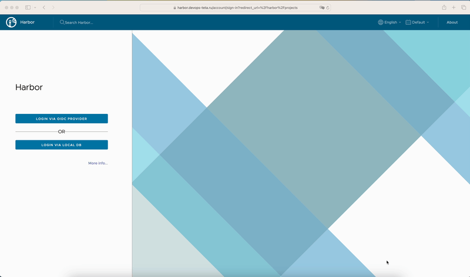
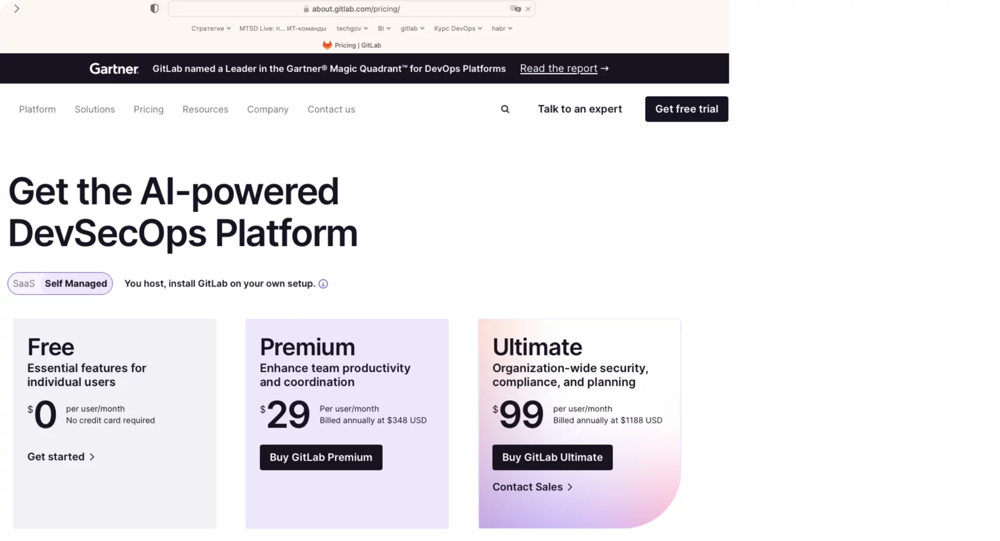
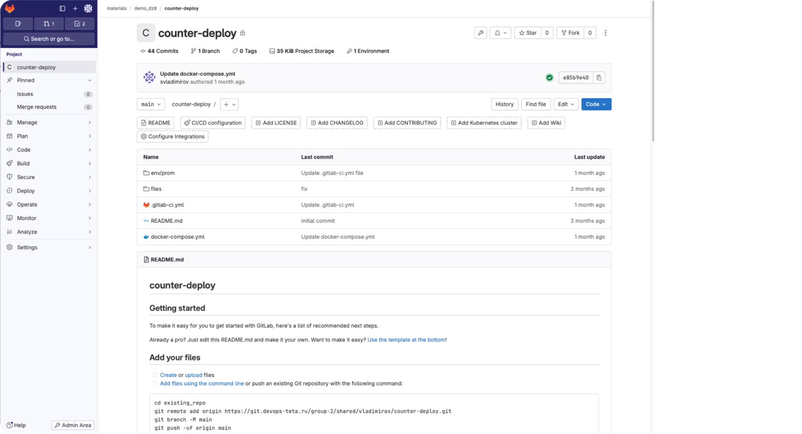
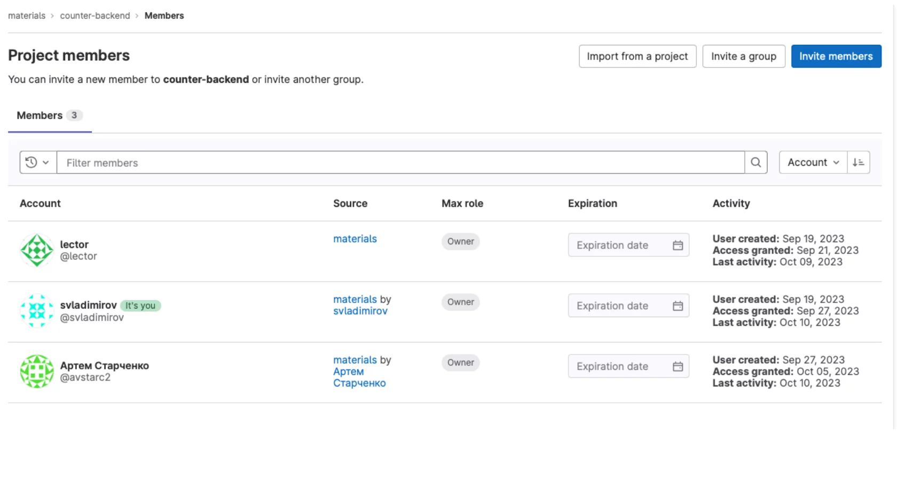
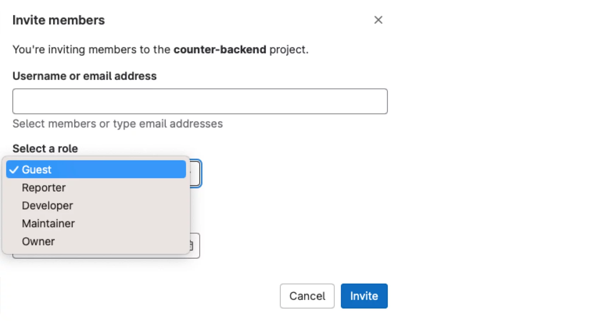
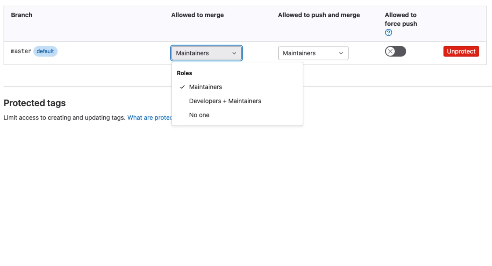
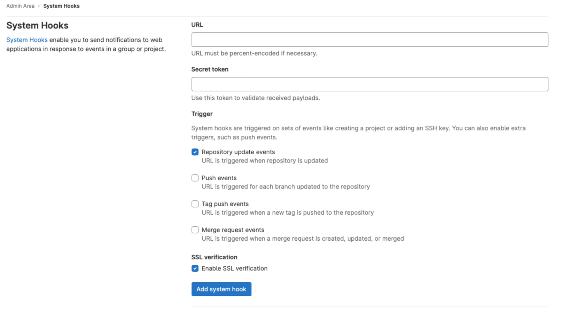
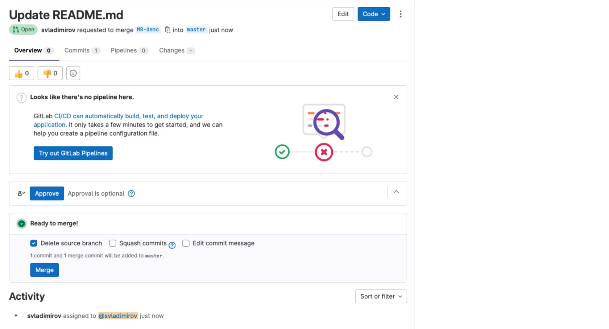
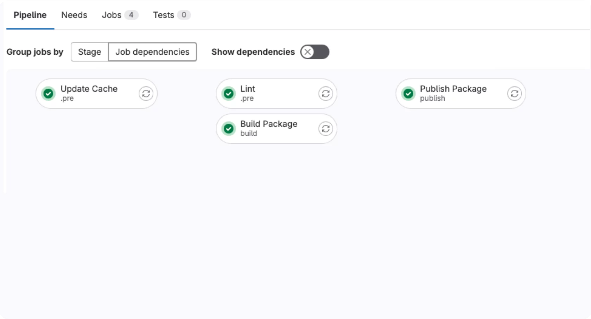
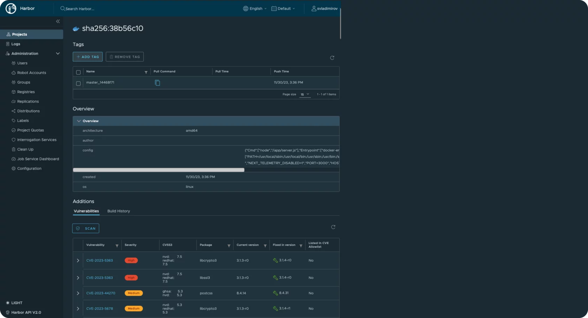

Harbor

Harbor — это открытый реестр с управлением контейнерами с открытым исходным кодом, предназначенный для предприятий. Он построен на основе Docker Registry и добавляет дополнительные функции, такие как поддержка Helm Charts, сборка с использованием BuildKit, а также поддержка нескольких репозиториев.  
  
Harbor также предоставляет дополнительные функции, такие как аудит, учетные записи пользователей, ролевое управление доступом и автоматическое обновление доменов. Он может быть развернут на Kubernetes или на выделенных серверах и может быть настроен для работы в кластере высокой доступности.  
  
Harbor может быть интегрирован с инструментами CI/CD, такими как Jenkins, GitLab CI/CD и TeamCity, для автоматической сборки и развертывания приложений на основе изменений кода. Он также может быть интегрирован с системами управления уязвимостями, такими как WhiteSource и Snyk, для обеспечения безопасности приложений. Кроме того, Harbor поддерживает различные форматы образов, такие как Docker, Open Container Initiative (OCI) и Flatcar Container Linux (FCL).

Создание проекта в Harbor

Создадим проект в harbor и robot account для аутентификации.



Разрешим этого роботу работать только с Registry и запретим удалять образы. Копируем токен и сохраняем, его будем использовать позже в Gitlab.  
  
Теперь нам надо сформировать переменные окружение, которые мы будем использовать в нашем будущем CI. Запишем полученные от harbor данные в таком виде. Их мы будем использовать дальше, в наших CI скриптах.

**harbor.yml**

```
variables:
  HARBOR_HOST: harbor.teta-mts.ru
  HARBOR_PROJECT: demo
  HARBOR_USER: robot_demo+gitlab
  HARBOR_PASSWORD: $__HARBOR_PASSWORD
```

GItLab

Gitlab — это популярная система контроля версий, изначально написанная на ruby, однако многие части позже переписаны на GoLang, которая предназначена для разработчиков программного обеспечения. Она имеет множество возможностей, которые делают ее привлекательной для использования в различных проектах.  
  
Одной из главных возможностей Gitlab является возможность управления репозиториями. Вы можете создавать новые репозитории, добавлять в них файлы и работать с ними. Также Gitlab позволяет работать с ветками кода, что позволяет разработчикам работать над разными задачами одновременно, не мешая друг другу.  
  
Еще одной важной возможностью Gitlab является поддержка различных протоколов, таких как SSH, HTTPS и GIT.  
  
Gitlab также имеет встроенный CI/CD (Continuous Integration/Continuous Delivery) инструмент, который позволяет автоматизировать процесс сборки, тестирования и развертывания приложений. Это значительно ускоряет процесс разработки и делает его более эффективным.  
  
Кроме того, Gitlab имеет встроенный сервис управления задачами, который позволяет командам обмениваться информацией о задачах и контролировать их выполнение.

Версии GitLab

GitLab Community Edition (CE) является бесплатной версией GitLab с открытым исходным кодом. Она предназначена для небольших команд и индивидуальных разработчиков и предлагает базовые функции для контроля версий, такие как создание репозиториев, ветки кода, слияния и разрешения конфликтов.  
  
Premium/Ultimate версия GitLab, также известная как GitLab Enterprise Edition (EE), предлагает расширенные функции и возможности, которые могут быть полезны для более крупных и сложных команд. Некоторые из этих функций включают в себя:  
 

*   Улучшенная масштабируемость и производительность;
*   Управление доступом на основе ролей (Role-Based Access Control, RBAC);
*   Интеграция со сторонними системами, такими как Jira и Trello
*   Шифрование репозиториев с помощью OpenPGP;
*   Поддержка нескольких сред выполнения, таких как Docker и Kubernetes;
*   Мониторинг и аудит действий пользователей;
*   Расширенные возможности CI/CD;
*   Интеграция с системами управления уязвимостями, такими как WhiteSource;
*   Многое другое.

  
Важно отметить, что Premium версия также предлагает поддержку от команды GitLab и доступ к обновлениям безопасности и новым функциям, которые могут не быть доступны в Community Edition.



Интерфейс

GitLab имеет простой и интуитивно понятный интерфейс, который позволяет пользователям легко находить нужную информацию и выполнять необходимые действия. Основной экран GitLab содержит список проектов, к которым у пользователя есть доступ, а также информацию о последних действиях в этих проектах.  
  
Для каждого проекта отображается его название, владелец, описание, количество звезд и количество коммитов. При нажатии на проект открывается страница с подробной информацией о проекте, его репозиториях, merge request, issues и wiki. На странице репозитория можно просмотреть историю коммитов, скачать код или создать новый merge request или issue.  
  
На странице merge request можно просмотреть все открытые и закрытые merge request по проекту, а также создать новый merge request из ветки в репозитории или из внешнего репозитория другой системы контроля версий.  
  
На странице issues можно создавать, редактировать и закрывать задачи, а также назначать их конкретным разработчикам или группам. Wiki-страница позволяет создавать и редактировать документацию по проекту, которую могут просматривать все участники проекта.  
  
В целом, интерфейс GitLab удобен для использования и позволяет быстро находить нужную информацию, управлять проектами и репозиториями, а также взаимодействовать с другими участниками команды.



Репозитории

Репозитории организованы в группы, вложенность групп может быть любая, а уникальность имен групп и репозиториев должна обеспечиваться только в рамках каждой группы. Таким образом, в рамках одного GitLab может существовать множество репозиториев с одним названием.  
Например repo1, но находиться они должны в разных группах.  
  
Например, наличие repo1:

Корректно  
/group1/subgroup1/repo1  
/group2/subgroup1/repo1  
/group3/subgroup2/repo1

Каждый репозиторий имеет свои настройки. Однако принимает настройки всех вышестоящих над ним групп. Не обязательно настраивать каждый репозиторий отдельно, можно управлять настройками в рамках групп.

Группы видимости, доступа

В GitLab существуют следующие типы репозиториев:  
Публичные репозитории — доступны для всех пользователей GitLab и могут быть клонированы любым пользователем.  
Приватные репозитории — создаются для определенной команды или проекта и доступны только для авторизованных пользователей.  
Внутренние репозитории (Internal Repositories) — используются для хранения кода внутри компании и доступны только сотрудникам компании.  
Внешние репозитории (External Repositories) — позволяют работать с репозиториями сторонних систем контроля версий, таких как GitHub, Bitbucket и других.

Список доступа к репозиторию



Роли доступа

В GitLab есть несколько ролей доступа, которые определяют, какие действия пользователь может выполнять в проекте. Некоторые из них включают:  
  
Owner — владелец проекта имеет полный доступ ко всем аспектам проекта, включая репозитории, merge requests, issues, wiki и настройки проекта.  
  
Maintainer — сопровождающий имеет доступ к репозиториям и может создавать merge requests, но не может изменять настройки проекта или удалять репозитории.  
  
Developer — разработчик имеет доступ только к репозиториям, в которых он участвует, и может создавать и отправлять изменения в коде.  
  
Reporter (репортер) — это роль в GitLab, которая позволяет пользователю создавать и обновлять задачи (issues) в проекте. Репортеры могут описывать проблемы, добавлять ссылки на код и описывать предлагаемые решения. Они также могут комментировать на задачах и голосовать за них.  
  
Guest — гость имеет доступ только к просмотру информации о проекте и может оставлять комментарии на issues и merge requests.



Подробно о правах ролей в документации:  
[https://docs.gitlab.com/ee/user/permissions.html](https://docs.gitlab.com/ee/user/permissions.html)

Protected branch and tags

Protected branch — это функция в GitLab, которая позволяет защитить определенные ветки в репозитории от случайных или нежелательных изменений. Она может быть полезна для веток, содержащих стабильную версию кода, или для веток с экспериментальным кодом, который не должен быть случайно объединен в основную ветку.  
  
Protected branches позволяют определить правила, которые должны быть выполнены перед тем, как можно будет выполнить слияние в защищенную ветку. Эти правила могут включать требования к прохождению автоматических тестов, наличие определенного количества голосов за слияние или даже необходимость утверждения слияния от определенного члена команды.  
  
Аналогичные настройки можно применять и к тэгам. Это помогает обеспечить качество кода и согласованность процесса разработки, а также предотвращает случайные изменения в важных частях кодовой базы.



Интеграции

GitLab имеет множество интеграций с другими системами, включая:  
  
Jira для управления задачами и назначения их разработчикам;  
Trello для организации работы в командах;  
Jenkins для автоматического выполнения тестов и сборки проектов;  
Slack для обмена сообщениями и уведомлениями о событиях в GitLab;  
GitHub для совместной работы с репозиториями и обмена кодом между проектами;  
Docker для управления контейнерами и их образами;  
Kubernetes для управления кластерами и развертывания приложений в облаке.  
  
Полный список можно посмотреть в GitLab или документации:  
[https://archives.docs.gitlab.com/15.11/ee/user/project/integrations/index.html](https://archives.docs.gitlab.com/15.11/ee/user/project/integrations/index.html)

web-hooks

GitLab поддерживает несколько типов веб-хуков, которые позволяют автоматически выполнять определенные действия при изменении репозитория или других событиях в системе.  
  
Некоторые из них включают:  
Push Hook — срабатывает при каждом push-обновлении репозитория;  
Merge Request Hook — срабатывает при создании, изменении или удалении merge request;  
Issue Hook — срабатывает при создании, обновлении или закрытии issue;  
Pipeline Hook — срабатывает после успешного завершения pipeline;  
Tag Push Hook — срабатывает при добавлении новой тега в репозиторий.



Токены доступа

Токен доступа в GitLab используется для аутентификации при выполнении Git-запросов. Он позволяет заменить ваш пароль и обеспечить более безопасный способ подключения к репозиторию. Уровень доступа к токену определяет, какие операции можно выполнять с проектом, например, только чтение или чтение/запись. В GitLab существует несколько типов токенов доступа:  
  
Personal access tokens (PAT) — персональный токен доступа, который может использоваться для доступа к GitLab API. Он может быть создан пользователем в своем профиле и имеет ограниченный срок действия.  
  
Deploy tokens — токены развертывания, которые используются для аутентификации при выполнении задач развертывания. Они создаются проектом и имеют ограниченный срок действия и область видимости.  
  
Job tokens — токены заданий, используемые для аутентификации в GitLab CI/CD. Они создаются заданиями и имеют ограниченный срок действия, область видимости и могут быть использованы только один раз.  
  
System OAuth tokens — системные токены OAuth, которые используются для авторизации приложений на основе OAuth. Они создаются администратором GitLab и имеют неограниченный срок действия.

Merge Request

Merge request — это механизм в GitLab, который позволяет разработчикам предлагать изменения в основном репозитории на рассмотрение. Когда разработчик хочет внести изменения в существующий репозиторий, он создает новую ветку с изменениями, затем отправляет запрос на слияние (merge request) в основную ветку репозитория.  
  
MR — основной функционал Gitlab. Имеет продвинутые настройки и гибкие настройки.  
  
MR позволяет автоматизировать вливание нового кода в ветки, с помощью автоматизированных проверок через pipeline. А так же валидировать код устанавливая различные ограничения на вливание веток, например список лиц Reviewers — кто валидирует вносимые доработки.  
  
Другие разработчики могут просмотреть предложенные изменения, обсудить их и принять или отклонить слияние. Если слияние принято, оно автоматически выполняется, и изменения добавляются в основную ветку репозитория. Если слияние отклонено, разработчик может внести изменения в свою ветку и отправить новый merge request.



GitLab API

GitLab API — это набор методов и протоколов, которые позволяют разработчикам и другим пользователям взаимодействовать с GitLab через программы и скрипты. Он предоставляет RESTful интерфейс для выполнения различных операций, таких как создание проектов, управление репозиториями, создание и обновление задач, просмотр статистики и многое другое.  
  
API может быть использовано для автоматизации рутинных задач, интеграции GitLab с другими системами и приложениями, а также для создания пользовательских инструментов и расширений, которые улучшают работу с GitLab. GitLab API предоставляет следующие возможности:  
  
Создание и управление проектами  
Управление репозиториями  
Создание, обновление и закрытие задач (issues)  
Управление пулл-реквестами (pull requests)  
Просмотр статистики проекта  
Интеграция с другими системами через Webhooks  
Аутентификация пользователей  
Управление правами доступа пользователей к проектам и репозиториям  
Получение информации о ходе выполнения Pipeline-ов  
Работа с метками (tags)  
и многое другое… [https://docs.gitlab.com/ee/api/api_resources.html](https://docs.gitlab.com/ee/api/api_resources.html)

GitLab CI

Рассмотрим интегрированный в GitLab инструмент для разработки CI/CD пайплайнов — GitLab CI. Верхнеуровнего GitLab CI состоит из следующих компонентов:  
**проект** — код, над которым выполняются различные действия (сборка, статический анализ, запуск тестов, развертывание и т. д.), для конфигурирования пайплайнов в проекте (или группе проектов) можно задавать переменные CI/CD;  
**раннер** — сервер, запускающий задачи CI/CD; он регулярно опрашивает сервер GitLab;  
**пайплайн** — набор запускаемых задач CI/CD, каждая задача запускается независимо (иногда на разных раннерах).  
  
GitLab СI пайплайн представляет собой YAML файл, задающий задачи и их зависимости. В задаче содержится информация, когда запускать задачу (правила), где ее запускать (теги раннера) и что в ней делать (скрипты). Действия в задаче описываются shell скриптом.

Локальная отладка пайплайнов

Для начала рассмотрим инструменты для локальной валидации и запуска пайплайнов. Мы, очевидно, можем загружать все изменения в GitLab и проверять пайплайны, запуская их, но это довольно долго.

GitLab CLI (glab)

В GitLab есть встроенный инструмент для синтаксической проверки. gitlab-ci.yml: ci lint. Его можно запускать из консольной утилиты glab.  
  
Для начала создадим персональный токен доступа:  
 

1.  Перейдите по [ссылке](https://git.devops-teta.ru/-/profile/personal_access_tokens);
2.  Введите в поле ввода Token name произвольное имя, например glab или gitlab-cli;
3.  Очистите Expiration date, нажав на крест;
4.  Выберите права: api;
5.  Нажмите на кнопку Create personal access token;
6.  Скопируйте сгенерированный токен из появившегося поля Your new personal access token;
7.  Сохраните токен в файл token. txt на ВМ1.

Теперь загрузим и настроим эту утилиту:

```
$ filename=$(curl -LOsw '%{filename_effective}' https://gitlab.com/gitlab-org/cli/-/releases/v1.34.0/downloads/glab_1.34.0_Linux_x86_64.deb)
$ sudo apt install --yes $(realpath -- "$filename")
$ glab auth login --stdin --hostname git.devops-teta.ru <token.txt
```

Запуск проверки синтаксиса с помощью glab:

```
$ glab ci lint .gitlab-ci.yml
 
 Validating...
✓ CI/CD YAML is valid!
```

GitLab CI Local

Также существует сторонняя утилита [gitlab-ci-local](https://github.com/firecow/gitlab-ci-local), которая позволяет валидировать пайплайны, запускать их целиком и задавать произвольные переменные. При помощи этой утилиты можно почти полностью тестировать пайплайны, но она реимплементирует GitLab CI, поэтому не стоит полностью полагаться на ее поведение.  
  
Эта утилита написана на NodeJS, установим NodeJS 18 из [Nodesource](https://github.com/nodesource/distributions) (в репозиториях Ubuntu находится версия 12, слишком старая для этого пакета):

```
$ sudo apt-get install --yes curl gnupg ca-certificates
$ sudo mkdir -p /etc/apt/keyrings
$ curl -fsSL https://deb.nodesource.com/gpgkey/nodesource-repo.gpg.key | sudo gpg --dearmor -o /etc/apt/keyrings/nodesource.gpg
$ echo "deb [signed-by=/etc/apt/keyrings/nodesource.gpg] https://deb.nodesource.com/node_18.x nodistro main" | sudo tee /etc/apt/sources.list.d/nodesource.list
$ sudo apt-get update
$ sudo apt install nodejs -y
```

Запускать gitlab-ci-local будем командой:

```
$ npx --user --package gitlab-ci-local@4.44.0 -- gitlab-ci-local
```

Добавим алиас для этой команды в ~/.bashrc (или ~/.bash\_profile), чтобы упростить запуск:

```
$ echo "alias gitlab-ci-local='npx --user --package gitlab-ci-local@4.44.0 -- gitlab-ci-local'" >> ~/.bashrc
```

Использовать эти инструменты будем далее.

Первый пайплайн

Вернемся к проекту [counter-frontend](https://git.devops-teta.ru/materials/counter-frontend) и напишем для него сборочный пайплайн, который будет:  
 

*   компилировать проект;
*   проверять исходный код при помощи eslint;
*   публиковать Docker-образ в Harbor.

Fork проекта и .gitlab-ci.yml

Для начала форкнем проект:  
  
 

1.  Перейдите в проект [counter-frontend](https://git.devops-teta.ru/materials/counter-frontend);
2.  Нажмите на кнопку Fork сверху справа;
3.  В качестве целевой выберите группу из п. 1.

После этого склонируйте проект и создайте в его корне файл. gitlab-ci.yml:

```
$ git clone git@git.devops-teta.ru:${YOUR_SUBGROUP}/counter-frontend.git
$ cd counter-frontend
$ touch .gitlab-ci.yml
```

Пайплайны GitLab CI состоят из задач (_jobs_), разделенных на стадии (_stages_). По-умолчанию задачи выполняются в соответствии с их стадиями, в одной стадии задачи выполняются параллельно.  
Напишем скелет нашего пайплайна:

```
stages:
  - build
  - publish
 
# @NoArtifactsToSource
Lint:
  stage: .pre
 
# @NoArtifactsToSource
Build Package:
  stage: build
 
# @NoArtifactsToSource
Publish Package:
  stage: publish
```

\# @NoArtifactsToSource — аннотация gitlab-ci-local, пока мы ее проигнорируем

stages

Стадии задаются директивой [stages](https://docs.gitlab.com/ee/ci/yaml/#stage), если она не указана, то пайплайн будет содержать следующие стадии: build, test, deploy. Также пайплайн всегда содержит две служебные стадии .pre и .post, задачи в .pre выполняются перед всеми остальными, .post — после.  
  
Для более точного упорядочивания задач используют директиву [needs](https://docs.gitlab.com/ee/ci/yaml/#needs), которая явно указывает зависимые задачи:

```
stages:
  - build
  - publish
 
# @NoArtifactsToSource
Lint:
  stage: .pre
  needs: []
 
# @NoArtifactsToSource
Build Package:
  stage: build
  needs: []
 
# @NoArtifactsToSource
Publish Package:
  stage: publish
  needs:
    - Build Package
```

При указании needs задачи игнорируют свои стадии и запускаются после родительских. Далее мы будем указывать зависимости задач явно.  
Теперь укажем, что именно выполняется в задаче.  
  
Для этого воспользуемся директивами [image](https://docs.gitlab.com/ee/ci/yaml/#image) и [script](https://docs.gitlab.com/ee/ci/yaml/#script). Первая указывает в каком Docker-образе запускается задача, вторая — shell-скрипт, выполняющийся в задаче.

```
stages:
  - build
  - publish
 
# @NoArtifactsToSource
Lint:
  stage: .pre
  needs: []
  image:
    name: registry.devops-teta.ru/materials/ci/images/nodejs:18.18.2-bookworm
    entrypoint: [""]
  script:
    - echo 1
 
# @NoArtifactsToSource
Build Package:
  stage: build
  needs: []
  image:
    name: registry.devops-teta.ru/materials/ci/images/nodejs:18.18.2-bookworm
    entrypoint: [""]
  script:
    - echo 2
 
# @NoArtifactsToSource
Publish Package:
  stage: publish
  needs:
    - Build Package
  image:
    name: registry.devops-teta.ru/materials/ci/images/kaniko:1.9.1    
    entrypoint: [""]
  script:
    - echo 3
```

variables

Параметры пайплайна задаются при помощи переменных, директивой [variables](https://docs.gitlab.com/ee/ci/yaml/#variables) в пайплайне или в настройках проекта/группы. Эти переменные пробрасываются в скрипты как переменные окружения, также большинство директив пайплайна поддерживают подстановку переменных с синтаксисом, аналогичным Shell.  
Вынесем имена образов в переменные:

```
stages:
  - build
  - publish
variables:
  NODEJS_IMAGE: registry.devops-teta.ru/materials/ci/images/nodejs:18.18.2-bookworm
  KANIKO_IMAGE: registry.devops-teta.ru/materials/ci/images/kaniko:1.9.1  
 
# @NoArtifactsToSource
Lint:
  stage: .pre
  needs: []
  image:
    name: $NODEJS_IMAGE
    entrypoint: [""]
  script:
    - echo 1
 
# @NoArtifactsToSource
Build Package:
  stage: build
  needs: []
  image:
    name: $NODEJS_IMAGE
    entrypoint: [""]
  script:
    - echo 2
 
# @NoArtifactsToSource
Publish Package:
  stage: publish
  needs:
    - job: Build Package
      artifacts: true
  image:
    name: $KANIKO_IMAGE
    entrypoint: [""]
  script:
    - echo 3
```

Build Package

Начнем наполнять пайплайн, сначала напишем скрипт сборки в Build Package:

```
variables:
  NODEJS_IMAGE: registry.devops-teta.ru/materials/ci/images/nodejs:18.18.2-bookworm
 
# @NoArtifactsToSource
Build Package:
  stage: build
  needs: []
  image:
    name: $NODEJS_IMAGE
    entrypoint: [""]
  script:
    - npm clean-install
    - npm run build
    - mv .next/standalone dist
    - mv public dist/public
    - mv .next/static dist/.next/static
```

Запустим Build Package при помощи gitlab-ci-local:

```
$ gitlab-ci-local 'Build Package'
Using fallback git user.name
Using fallback git user.email
parsing and downloads finished in 82 ms
Build Package   starting registry.devops-teta.ru/materials/ci/images/nodejs:18.18.2-bookworm (build)
Build Package   copied to docker volumes in 5 s
Build Package   $ npm clean-install
Build Package   >
Build Package   > added 282 packages, and audited 283 packages in 25s
Build Package   >
Build Package   > 107 packages are looking for funding
Build Package   >   run `npm fund` for details
Build Package   >
Build Package   > 3 vulnerabilities (1 low, 2 moderate)
Build Package   >
Build Package   > To address all issues, run:
Build Package   >   npm audit fix --force
Build Package   >
Build Package   > Run `npm audit` for details.
Build Package   $ npm run build
Build Package   >
Build Package   > > counter@0.1.0 build
Build Package   > > next build
Build Package   >
Build Package   > ⚠ No build cache found. Please configure build caching for faster rebuilds. Read more: https://nextjs.org/docs/messages/no-cache
Build Package   > Attention: Next.js now collects completely anonymous telemetry regarding usage.
Build Package   > This information is used to shape Next.js' roadmap and prioritize features.
Build Package   > You can learn more, including how to opt-out if you'd not like to participate in this anonymous program, by visiting the following URL:
Build Package   > https://nextjs.org/telemetry
Build Package   >
Build Package   >    Creating an optimized production build ...
Build Package   >  ✓ Compiled successfully
Build Package   >    Linting and checking validity of types ...
Build Package   >    Collecting page data ...
Build Package   >    Generating static pages (0/4) ...
   Generating static pages (1/4)
   Generating static pages (2/4)
   Generating static pages (3/4)
 ✓ Generating static pages (4/4)
Build Package   >    Finalizing page optimization ...
Build Package   >
Build Package   > Route (app)                              Size     First Load JS
Build Package   > ┌ ○ /                                    897 B          80.1 kB
Build Package   > └ ○ /_not-found                          878 B          80.1 kB
Build Package   > + First Load JS shared by all            79.2 kB
Build Package   >   ├ chunks/864-65fc85184976041b.js       26.6 kB
Build Package   >   ├ chunks/fd9d1056-cda7bdae809f14dd.js  50.8 kB
Build Package   >   ├ chunks/main-app-0cd0fef21f043671.js  221 B
Build Package   >   └ chunks/webpack-bf1a64d1eafd2816.js   1.61 kB
Build Package   >
Build Package   >
Build Package   > ○  (Static)  automatically rendered as static HTML (uses no initial props)
Build Package   >
Build Package   $ mv .next/standalone dist
Build Package   $ mv public dist/public
Build Package   $ mv .next/static dist/.next/static
```

Обратим внимание на предупреждения сборщика NextJS: ему не нравится отсутствие кеша сборки, также нас предупреждают о сборе телеметрии. Выключим сбор телеметрии и добавим кеширование.  
Телеметрия выключается переменной окружения NEXT\_TELEMETRY\_DISABLED:

```
Build Package:
  stage: build
  needs: []
  image:
    name: $NODEJS_IMAGE
    entrypoint: [""]
  variables:
    NEXT_TELEMETRY_DISABLED: "1"
  script:
    - npm clean-install
    - npm run build
    - mv .next/standalone dist
    - mv public dist/public
    - mv .next/static dist/.next/static
```

Переменные можно задавать на уровне пайплайна и конкретных задач. Используйте глобальные переменные, чтобы указывать переменные использующиеся в нескольких задачах или параметры пайплайна, которые могут быть переопределены пользователями в параметрах группы/проекта или при ручном запуске пайплайна/задачи. Переменные задач следует использовать для непереопределяемых констант.

cache

Перейдем к кешированию. GitLab CI поддерживает кеширование файлов для ускорения сборок. В отличие от артефактов кеш хранится в раннере и необязателен для успешного запуска задачи. В Build Package мы можем закешировать кеш пакетного менеджера npm, установленные пакеты в папке node\_modules и сборочный кеш NextJS в .next/cache:

```
# @NoArtifactsToSource
Build Package:
  stage: build
  needs: []
  image:
    name: $NODEJS_IMAGE
    entrypoint: [""]
  variables:
    NEXT_TELEMETRY_DISABLED: "1"
    NPM_CONFIG_CACHE: $CI_PROJECT_DIR/.cache/npm
  cache:
    - key: npm-packages
      paths:
        - .cache
      unprotect: true
    - key:
        prefix: npm-node-modules
        files:
          - package-lock.json
      paths:
        - node_modules
      unprotect: true
    - key: npm-next-cache
      paths:
        - .next/cache
  script:
    - if [ ! -e node_modules ] ; then npm clean-install ; fi
    - npm run build
    - mv .next/standalone dist
    - mv public dist/public
    - mv .next/static dist/.next/static
```

Параметры кеширования задаются директивой [cache](https://docs.gitlab.com/ee/ci/yaml/#cache). Ключом кеширования является либо строка, либо хеш файлов. Здесь мы используем lock-файл как ключ кеширования установленных модулей, чтобы инвалидировать кеш при любом изменении зависимостей.  
  
По умолчанию GitLab CI отделяет кеш для запущенных в защищенных ветках задач, опция unprotect: true отключает это поведение. Таким образом мы ускорим сборки в защищенных ветках, но пользователи смогут переопределить пайплайн в незащищенной ветке и переписать значение кеша.

artifacts

Собранный проект нужно передать в задачу Publish Package, чтобы упаковать его в Docker-образ. Для передачи информации между задачами используются артефакты:

```
# @NoArtifactsToSource
Build Package:
  stage: build
  needs: []
  image:
    name: $NODEJS_IMAGE
    entrypoint: [""]
  variables:
    NEXT_TELEMETRY_DISABLED: "1"
    NPM_CONFIG_CACHE: $CI_PROJECT_DIR/.cache/npm
  cache:
    - key: npm-packages
      paths:
        - .cache
      unprotect: true
    - key:
        prefix: npm-node-modules
        files:
          - package-lock.json
      paths:
        - node_modules
      unprotect: true
    - key: npm-next-cache
      paths:
        - .next/cache
  script:
    - if [ ! -e node_modules ] ; then npm clean-install ; fi
    - npm run build
    - mv .next/standalone dist
    - mv public dist/public
    - mv .next/static dist/.next/static
  artifacts:
    expire_in: 1h
    paths:
      - dist
```

Директива [artifacts](https://docs.gitlab.com/ee/ci/yaml/#artifacts) задает параметры экспорта артефактов из задачи. Время жизни артефактов задается параметром [expire\_in](https://docs.gitlab.com/ee/ci/yaml/#artifactsexpire_in), здесь мы указали один час. Артефакты задач из последнего запущенного пайплайна не подчиняются этому правилу, они хранятся постоянно, если такое поведение не выключено в настройках проекта.

Lint

Напишем скрипт для задачи Lint:

```
# @NoArtifactsToSource
Lint:
  stage: .pre
  needs: []
  image:
    name: $NODEJS_IMAGE
    entrypoint: [""]
  variables:
    ESLINT_CODE_QUALITY_REPORT: eslint.codequality.json
    NEXT_TELEMETRY_DISABLED: "1"
    NPM_CONFIG_CACHE: $CI_PROJECT_DIR/.cache/npm
  cache:
    - key: npm-packages
      paths:
        - .cache
    - key:
        prefix: npm-node-modules
        files:
          - package-lock.json
      paths:
        - node_modules
  script:
    - if [ ! -e node_modules ] ; then npm clean-install ; fi
    - npm run lint -- --format gitlab ## В ситуациях, когда npm-скрипт запускается из другого npm-скрипта, перед передачей флага CLI также необходимо добавить два тире.
  artifacts:
    paths:
      - $ESLINT_CODE_QUALITY_REPORT
    reports:
      codequality: $ESLINT_CODE_QUALITY_REPORT
```

Артефакты также используются для генерации различных отчетов. Здесь мы сканируем проект статическим анализатором eslint и экспортируем его вывод в формате, поддерживаемом GitLab. Другие поддерживаемые отчеты смотрите в [документации](https://docs.gitlab.com/ee/ci/yaml/artifacts_reports.html).  
Запустим задачу Lint:

```
$ gitlab-ci-local Lint
parsing and downloads finished in 71 ms
Lint            starting registry.devops-teta.ru/materials/ci/images/nodejs:18.18.2-bookworm (.pre)
Lint            copied to docker volumes in 5 s
Lint            imported cache 'npm-packages' in 5 s
Lint            $ if [ ! -e node_modules ] ; then npm clean-install ; fi
Lint            >
Lint            > added 282 packages, and audited 283 packages in 13s
Lint            >
Lint            > 107 packages are looking for funding
Lint            >   run `npm fund` for details
Lint            >
Lint            > 3 vulnerabilities (1 low, 2 moderate)
Lint            >
Lint            > To address all issues, run:
Lint            >   npm audit fix --force
Lint            >
Lint            > Run `npm audit` for details.
Lint            $ npm run lint -- --format gitlab
Lint            >
Lint            > > counter@0.1.0 lint
Lint            > > next lint --format GitLab
Lint            >
Lint            > ✔ No ESLint warnings or errors
Lint            finished in 5 s
Lint            exported cache .cache 'npm-packages' in 5 s
Lint            exported cache node_modules 'md-d21182c067aca226931e07dfadf5d468a9ab9e7d' in 5 s
Lint            exported artifacts in 5 s
```

Publish Package

Docker DIND

Docker DIND (Docker in Docker) — это техника, которая позволяет запускать контейнеры Docker внутри других контейнеров Docker. Это полезно в ситуациях, когда требуется изоляция или когда основное приложение должно работать внутри контейнера для обеспечения безопасности или стандартизации окружения.  
  
Docker DIND работает, запуская Docker-демона (обычно dockerd) внутри уже работающего контейнера Docker. Это позволяет использовать Docker-команды внутри контейнера, не влияя на хост-систему. Основной Docker-демон (на хост-системе) управляет контейнерами, которые запускаются внутри других контейнеров. Это обеспечивает изоляцию контейнеров и гарантирует, что они не будут иметь доступ к ресурсам хост-системы.  
  
В результате Docker DIND обеспечивает повышенную безопасность и изоляцию, позволяя разработчикам и системным администраторам запускать Docker-контейнеры внутри контейнеров для тестирования или разработки.

Kaniko

Kaniko — это инструмент для создания Docker-образов из Git-репозиториев. Он работает путем извлечения исходного кода из Git, компиляции его в целевой системе и создания Docker-образа из скомпилированных файлов.  
  
Для сборки образа воспользуемся [kaniko](https://github.com/GoogleContainerTools/kaniko). Она поддерживает не все директивы Dockerfile, но позволяет собирать контейнеры в кластерах Kubernetes и Docker контейнерах без дополнительных настроек.  
Детали по сборке при помощи kaniko смотрите в [документации](https://docs.gitlab.com/ee/ci/docker/using_kaniko.html).  
  
Напишем скрипт Publish Package:

```
Publish Package:
  stage: publish
  needs:
    - job: Build Package
      artifacts: true
  interruptible: false
  image:
    name: $KANIKO_IMAGE
    entrypoint: [""]
  variables:
    HARBOR_HOST: harbor.devops-teta.ru
    HARBOR_PROJECT: demo
    HARBOR_USER: robot_demo+gitlab
    HARBOR_PASSWORD: $__HARBOR_PASSWORD
  script:
    - b64_auth=$(printf '%s:%s' "$HARBOR_USER" "$HARBOR_PASSWORD" | base64 | tr -d '\n')
    - >-
      printf '{"auths": {"%s": {"auth": "%s"}}}' "$HARBOR_HOST" "$b64_auth"
      >/kaniko/.docker/config.json
    - >-
      /kaniko/executor
      --cache
      --use-new-run
      --skip-unused-stages
      --context "$CI_PROJECT_DIR"
      --dockerfile "$CI_PROJECT_DIR/Dockerfile"
      --destination "$HARBOR_HOST/$HARBOR_PROJECT/$CI_PROJECT_NAME:${CI_COMMIT_REF_NAME}_${CI_COMMIT_SHORT_SHA}"
      --cache-repo "$HARBOR_HOST/$HARBOR_PROJECT/$CI_PROJECT_NAME/cache"
```

Здесь мы используем переменные которые получили, когда создавали проект в harbor:  
HARBOR\_HOST — адрес реестра контейнеров;  
HARBOR\_USER — имя пользователя для авторизации в реестре;  
HARBOR\_PASSWORD — пароль для авторизации в реестре;  
HARBOR\_PROJECT — имя загружаемого образа;  
  
В качестве тега воспользуемся комбинацией имени ветки (CI\_COMMIT\_REF\_NAME) и первых восьми символов хеша коммита (CI\_COMMIT\_SHORT\_SHA).  
  
Обе эти переменные предопределны и доступны всем задачам, также доступно множество других предопределенных переменных, полный список смотрите в [документации](https://docs.gitlab.com/ee/ci/variables/predefined_variables.html).  
  
Также обратим внимание на директиву interruptible: false — она значит, что задача не будет отменена, если запустится новый такой же пайплайн. Используйте этот параметр для задач, создающих побочные эффекты во внешних системах, особенно в задачах, выполняющих развертывания.  
Получим следующий пайплайн:

```
stages:
  - build
  - publish
variables:
  NODEJS_IMAGE: registry.devops-teta.ru/materials/ci/images/nodejs:18.18.2-bookworm
  KANIKO_IMAGE: registry.devops-teta.ru/materials/ci/images/kaniko:1.9.1
 
# @NoArtifactsToSource
Lint:
  stage: .pre
  needs: []
  image:
    name: $NODEJS_IMAGE
    entrypoint: [""]
  variables:
    ESLINT_CODE_QUALITY_REPORT: eslint.codequality.json
    NEXT_TELEMETRY_DISABLED: "1"
    NPM_CONFIG_CACHE: $CI_PROJECT_DIR/.cache/npm
  cache:
    - key: npm-packages
      paths:
        - .cache
    - key:
        prefix: npm-node-modules
        files:
          - package-lock.json
      paths:
        - node_modules
  script:
    - if [ ! -e node_modules ] ; then npm clean-install ; fi
    - npm run lint -- --format gitlab
  artifacts:
    paths:
      - $ESLINT_CODE_QUALITY_REPORT
    reports:
      codequality: $ESLINT_CODE_QUALITY_REPORT
 
# @NoArtifactsToSource
Build Package:
  stage: build
  needs: []
  image:
    name: $NODEJS_IMAGE
    entrypoint: [""]
  variables:
    NEXT_TELEMETRY_DISABLED: "1"
    NPM_CONFIG_CACHE: $CI_PROJECT_DIR/.cache/npm
  cache:
    - key: npm-packages
      paths:
        - .cache
      unprotect: true
    - key:
        prefix: npm-node-modules
        files:
          - package-lock.json
      paths:
        - node_modules
      unprotect: true
    - key: npm-next-cache
      paths:
        - .next/cache
  script:
    - if [ ! -e node_modules ] ; then npm clean-install ; fi
    - npm run build
    - mv .next/standalone dist
    - mv public dist/public
    - mv .next/static dist/.next/static
  artifacts:
    expire_in: 1h
    paths:
      - dist
 
Publish Package:
  stage: publish
  needs:
    - job: Build Package
      artifacts: true
  interruptible: false
  image:
    name: $KANIKO_IMAGE
    entrypoint: [""]
  variables:
    HARBOR_HOST: harbor.devops-teta.ru
    HARBOR_PROJECT: demo
    HARBOR_USER: robot_demo+gitlab
    HARBOR_PASSWORD: $__HARBOR_PASSWORD
  script:
    - b64_auth=$(printf '%s:%s' "$HARBOR_USER" "$HARBOR_PASSWORD" | base64 | tr -d '\n')
    - >-
      printf '{"auths": {"%s": {"auth": "%s"}}}' "$HARBOR_HOST" "$b64_auth"
      >/kaniko/.docker/config.json
    - >-
      /kaniko/executor
      --cache
      --use-new-run
      --skip-unused-stages
      --context "$CI_PROJECT_DIR"
      --dockerfile "$CI_PROJECT_DIR/Dockerfile"
      --destination "$HARBOR_HOST/$HARBOR_PROJECT/$CI_PROJECT_NAME:${CI_COMMIT_REF_NAME}_${CI_COMMIT_SHORT_SHA}"
      --cache-repo "$HARBOR_HOST/$HARBOR_PROJECT/$CI_PROJECT_NAME/cache"
```

Update Cache

Вынесем повторяющиеся переменные на уровень пайплайна и добавим задачу Update Cache, которая будет инициализировать кеш npm. Ключи кеширования общие на проект, поэтому мы сможем переиспользовать кеш в нескольких задачах. При этом следует скопировать код инициализации кеша во все задачи, которые его используют, т.к. ошибка при получении кеша не приводит к падению задачи.

```
stages:
  - build
  - publish
variables:
  NODEJS_IMAGE: registry.devops-teta.ru/materials/ci/images/nodejs:18.18.2-bookworm
  KANIKO_IMAGE: registry.devops-teta.ru/materials/ci/images/kaniko:1.9.1
  NEXT_TELEMETRY_DISABLED: "1"
  NPM_CONFIG_CACHE: $CI_PROJECT_DIR/.cache/npm
 
Update Cache:
  stage: .pre
  needs: []
  allow_failure: true
  image:
    name: $NODEJS_IMAGE
    entrypoint: [""]
  cache:
    - key: npm-packages
      paths:
        - .cache
      unprotect: true
    - key:
        prefix: npm-node-modules
        files:
          - package-lock.json
      paths:
        - node_modules
      unprotect: true
  script:
    - if [ ! -e node_modules ] ; then npm clean-install ; fi
 
# @NoArtifactsToSource
Lint:
  stage: .pre
  needs:
    - job: Update Cache
      artifacts: false
  allow_failure: true
  image:
    name: $NODEJS_IMAGE
    entrypoint: [""]
  variables:
    ESLINT_CODE_QUALITY_REPORT: eslint.codequality.json
  cache:
    - key: npm-packages
      paths:
        - .cache
      unprotect: true
      policy: pull
    - key:
        prefix: npm-node-modules
        files:
          - package-lock.json
      paths:
        - node_modules
      unprotect: true
      policy: pull
  script:
    - if [ ! -e node_modules ] ; then npm clean-install ; fi
    - npm run lint -- --format gitlab
  artifacts:
    paths:
      - $ESLINT_CODE_QUALITY_REPORT
    reports:
      codequality: $ESLINT_CODE_QUALITY_REPORT
 
# @NoArtifactsToSource
Build Package:
  stage: build
  needs:
    - job: Update Cache
      artifacts: false
  image:
    name: $NODEJS_IMAGE
    entrypoint: [""]
  cache:
    - key: npm-packages
      paths:
        - .cache
      unprotect: true
      policy: pull
    - key:
        prefix: npm-node-modules
        files:
          - package-lock.json
      paths:
        - node_modules
      unprotect: true
      policy: pull
    - key: npm-next-cache
      paths:
        - .next/cache
  script:
    - if [ ! -e node_modules ] ; then npm clean-install ; fi
    - npm run build
    - mv .next/standalone dist
    - mv public dist/public
    - mv .next/static dist/.next/static
  artifacts:
    expire_in: 1h
    paths:
      - dist
 
Publish Package:
  stage: publish
  needs:
    - job: Build Package
      artifacts: true
  interruptible: false
  image:
    name: $KANIKO_IMAGE
    entrypoint: [""]
  variables:
    HARBOR_HOST: harbor.devops-teta.ru
    HARBOR_PROJECT: demo
    HARBOR_USER: robot_demo+gitlab
    HARBOR_PASSWORD: $__HARBOR_PASSWORD
  script:
    - b64_auth=$(printf '%s:%s' "$HARBOR_USER" "$HARBOR_PASSWORD" | base64 | tr -d '\n')
    - >-
      printf '{"auths": {"%s": {"auth": "%s"}}}' "$HARBOR_HOST" "$b64_auth"
      >/kaniko/.docker/config.json
    - >-
      /kaniko/executor
      --cache
      --use-new-run
      --skip-unused-stages
      --context "$CI_PROJECT_DIR"
      --dockerfile "$CI_PROJECT_DIR/Dockerfile"
      --destination "$HARBOR_HOST/$HARBOR_PROJECT/$CI_PROJECT_NAME:${CI_COMMIT_REF_NAME}_${CI_COMMIT_SHORT_SHA}"
      --cache-repo "$HARBOR_HOST/$HARBOR_PROJECT/$CI_PROJECT_NAME/cache"
```

Добавим к задачам Update Cache и Lint параметр allow\_failure: true, который указывает, что падение этой задачи не должно приводить к падению пайплайна. Также добавим параметр policy: pull к кешам в задачах Lint и Build Package, которая укажет, что после выполнения этих задач не следует обновлять кеш.  
Мы получили свой первый пайплайн собирающий наше приложение и загружающий финальный докер образ в Harbor.



Так же имея образ в харбор, можно видеть работу еще одного модуля Harbor — Trivy**.**

