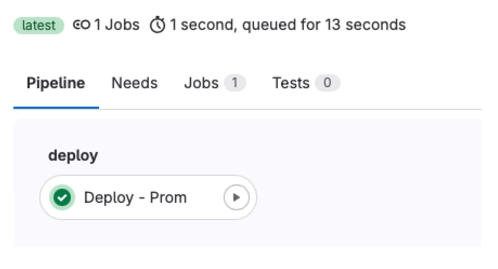
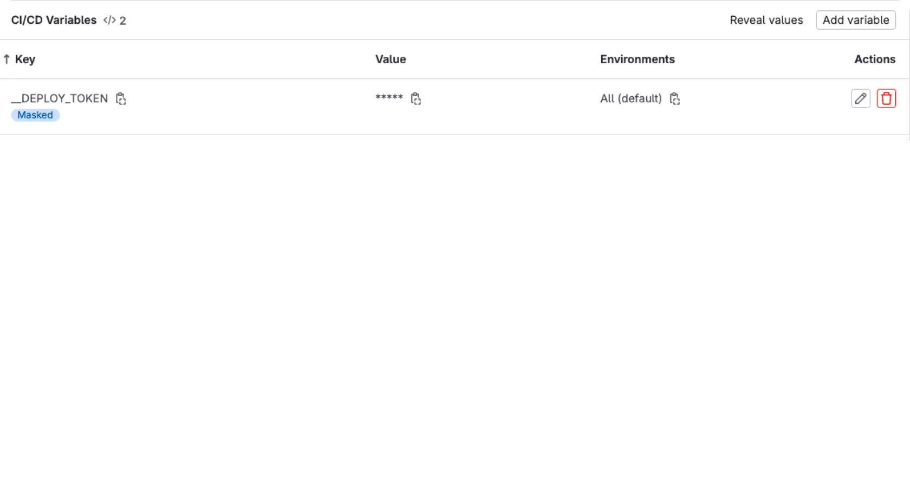
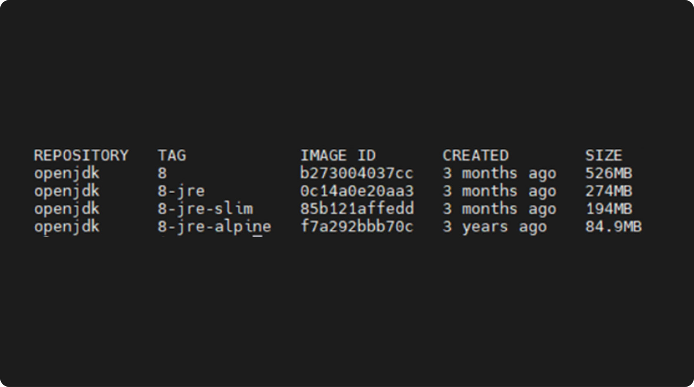

Раздельный CI и CD

Разделение Continuous Integration (CI) и Continuous Delivery (CD) на разные репозитории может иметь как плюсы, так и минусы, в зависимости от контекста и требований проекта. Вот некоторые преимущества разделения CI и CD репозиториев для развертывания:  
  
Чистота и независимость: Раздельные репозитории для CI и CD могут помочь держать кодовую базу чистой и не загромождать ее скриптами и конфигурациями для развертывания.  
  
Управление правами доступа: Разделение позволяет более точно настроить права доступа к репозиториям. Например, команда для CI может иметь более широкий доступ, чем команда для CD, что повышает безопасность.  
  
Упрощение развертывания на сторонних платформах: Часто CI процессы могут быть настроены для запуска на сторонних CI-серверах, в то время как CD процессы могут выполняться напрямую на серверах развертывания, таким образом проще настроить CI/CD процессы для совместного использования.  
  
Улучшение шаблонирования и переиспользования: Разделенные репозитории позволяют создавать шаблоны или библиотеки, которые могут быть повторно использованы между различными проектами для CI и CD, что облегчает поддержку и управление процессами.  
  
Улучшение управления изменениями: Разделение CI и CD репозиториев помогает лучше контролировать изменения в процессах CI/CD и позволяет более гибко обновлять и адаптировать их без влияния на другие компоненты процесса.  
  
Однако стоит отметить, что разделение CI и CD может привести к увеличению сложности и настройки в зависимости от требований проекта и командных процессов. Важно тщательно продумать и оценить плюсы и минусы разделения CI и CD репозиториев для конкретного проекта перед принятием данного решения.

Пайплайны развертывания

До этого мы заканчивали пайплайны публикацией Docker-образа, т. е. мы находились только в области CI: проверяли, что код работает, делали интеграции для упрощения процесса разработки, собирали и упаковывали наш код. После публикации образов (или других артефактов) в репозиторий нам остается лишь установить эти артефакты на целевые ВМ (или другие платформы запуска приложений), т. е. развернуть их в целевые окружения.  
  
Для начала определимся с методом развертывания: очевидно что наши проекты counter-frontend и counter-backend сильно связаны, т.к. они реализуют клиентскую и серверную часть одного приложения, а их разделение на два отдельных репозитория — чисто организационное решение, т.к. они используют разный стек технологий и пишут их разные люди.  
  
Если бы counter было нативным приложением, то обе эти части располагались бы в одном репозитории, но в разных модулях. Из этих соображений логично развертывать их вместе (в одном пайплайне), чтобы контролировать версии обоих проектов при развертывании.  
  
Для начала создадим проект, содержащий конфигурацию развертывания, в своей группе. Назовите его counter-deploy и инициализируйте [README.md](http://readme.md/). Мы вернемся к нему позднее.  
  
Чтобы обезопасить себя от случайных или зловредных изменений, инфраструктуру, на которой работают промышленные версии (те к которым имеют доступ пользователи), отделяют от остальной инфраструктуры при помощи политик доступа, межсетевых экранов и т. д.  
  
У нас в компании это реализуется при помощи размещения приложений в изолированных корпоративным межсетевым экраном (в простонародье — файрволлом) участках сети (так называемых DMZ сегментах) с предоставлением доступа минимально необходимому набору сотрудников.  
  
Сейчас для сборки наших проектов мы пользуемся общим на весь сервер GitLab раннером, очевидно, если мы решим развертывать приложение тем же раннером, то мы лишимся как минимум одного слоя защиты — сетевого (забудьте на секунду, что все курсовые ВМ расположены в одной подсети), также при взломе соседнего проекта (получении push прав в репозиторий стороннего проекта) злоумышленник сможет получить доступ к раннеру целиком и, следовательно, к развертываниям всех проектов, которые пользовались этим раннером.  
  
Из этих соображений будем пользоваться для развертывания отдельными раннерами, размещенными в том же окружении, что и приложение. Представим в нашем примере, что у нас одно окружение — промышленное, и оно расположено на ВМ2. Для самого развертывания воспользуемся Shell движком GitLab раннера (запускает задачи в обычном Shell на хосте, без контейнеров) и Docker Compose.

Настройка раннера

Сервис gitlab runner

Для начала установим раннер. Зайдем на ВМ2 и выполним следующие команды:

```
$ curl -L "https://packages.GitLab.com/install/repositories/runner/gitlab-runner/script.deb.sh" | sudo bash
$ sudo apt install --yes gitlab-runner
```

Так как мы будем использовать раннер для работы с Docker, то добавим пользователя gitlab-runner в группу docker:

```
# usermod -aG docker gitlab-runner
```

Символ # перед командой означает, что ее нужно выполнить с правами суперпользователя.

GitLab раннер использует в качестве конфигов TOML файлы; по структуре они совпадают с JSON или YAML файлами. TOML файлы используют, т.к. они внешне имеют более плоскую структуру, что упрощает чтение конфигов с небольшим уровнем вложенности.  
  
Напишем следующий шаблон конфига и сохраним его в /etc/gitlab-runner/template.toml:

```
concurrent = 1
[[runners]]
  name = "Deploy runner"
  url = "https://git.devops-teta.ru"
  executor = "shell"
  shell = "bash"
  limit = 1
  builds_dir = "/data/gitlab-runner/builds"
  cache_dir = "/data/gitlab-runner/cache"
  [runners.custom_build_dir]
    enabled = true
```

Такой файл в YAML формате выглядит так:

```
concurrent: 1
runners:
  - name: Deploy runner
    url: https://git.devops-teta.ru
    executor: shell
    shell: bash
    limit: 1
    builds_dir: /data/gitlab-runner/builds
    cache_dir: /data/gitlab-runner/cache
    custom_build_dir:
      enabled: true
```

Как видите, секции \[name\] — это ключи словарей, \[\[name\]\] — ключи коллекций (списков, элементами которых являются словари).  
Смысл большинства опций понятен исходя из нашего опыта работы с GitLab CI, поясним некоторые:  
limit — количество задач, которые одновременно будет выполнять этот раннер;  
builds\_dir, cache\_dir — директории на хосте, где будут храниться склонированные проекты и кеши;  
runners.custom\_build\_dir.enabled — разрешить ли использование опции GIT\_CLONE\_PATH, переопределяющей путь клонирования проекта.  
  
Остальные опции смотри в [документации](https://docs.gitlab.com/runner/configuration/advanced-configuration.html).  
  
Создадим указанные в шаблоне директории:

```
# mkdir -p /data/gitlab-runner/builds /data/gitlab-runner/cache
# chown -R gitlab-runner:gitlab-runner /data/gitlab-runner
# chmod -R 0700 /data/gitlab-runner
```

Теперь нужно зарегистрировать раннер на нашем сервере GitLab. Для этого откройте проект counter-deploy в GitLab, перейдите в Settings -> CI/CD -> Runners и скопируйте регистрационный токен (registration token), затем выполните команду на ВМ2 (подставьте вместо «$(cat token.txt)» ваш токен или сохраните токен в файл token.txt):

```
# gitlab-runner register \
  --template-config /etc/gitlab-runner/template.toml \
  --registration-token "$(cat token.txt)" \
  --access-level ref_protected \
  --tag-list 'deploy,prom' \
  --run-untagged false
```

Здесь мы указали некоторые параметры раннера, хранящиеся на сервере GitLab:  
\--access\_level ref\_protected — использовать раннер только для задач, запускаемых в защищенных ветках или тегах (значение по умолчанию — not\_protected);  
\--tag-list 'deploy, prom' — теги раннера, разделенные запятой;  
\--run-untagged false — не выполнять этим раннером задачи без тегов.  
  
До этого в пайплайнах мы не сталкивались с понятием тэгов. Этот механизм служит для распределения задач между раннерами: в задаче GitLab СI (или в секции default) можно указать директиву tags, которая содержит список тегов.  
  
Эта задача будет отправлена на раннер, когда он содержит все теги указанные в задаче. Если задача не содержит тегов, то она будет запущена на одном из раннеров, согласных запускать нетегированные задачи. Если же раннеров с нужным набором тегов нет, то задача не будет запущена и _зависнет_.

Здесь мы используем теги, чтобы задачи развертывания не запускались на общем сборочном раннере.

Снова откройте меню Settings -> CI/CD -> Runners в проекте counter-deploy и проверьте, что раннер зарегистрирован. Указанные нами при регистрации настройки можно изменить в этом же интерфейсе.

Про безопасность пайплайнов  
Внимательный читатель заметит противоречие: мы разворачиваем отдельный Shell раннер из соображений безопасности, когда документация GitLab CI и другие авторитетные источники говорят, что Shell — самый небезопасный движок раннера и рекомендуют избегать его. Это правда и описанные здесь условия, когда раннер используется отдельным проектом для развертывания приложения на выделенную ВМ — одни из немногих, когда использование Shell раннера оправдано и относительно безопасно. Если вы планируете повторить описанный здесь подход (не стоит, это учебный пример), то дополнительно ограничьте доступ к репозиторию развертывания и его пайплайнам:  
 

*   предоставьте доступ к репозиторию развертывания минимально необходимому числу людей;
*   переопределите источник пайплайна в настройках проекта, вместо включения переиспользуемого пайплайна в. gitlab-ci.yml (см. [документацию](https://docs.gitlab.com/ee/ci/pipelines/settings.html#specify-a-custom-cicd-configuration-file));
*   ссылайтесь на фиксированную версию пайплайна из [защищенного тега](https://docs.gitlab.com/ee/user/project/protected_tags.html); удостоверьтесь, что права на изменение защищенных тегов в репозитории с пайплайнами есть только у тех людей, у которых есть права на изменение репозитория развертывания;
*   если изменения в вашем репозитории развертывания выполняются ботами (например после сборки новой версии приложения бот загружает в репозиторий развертывания ссылку на новый образ), то распространите  доступ к пайплайнам на все связанные проекты.

Пайплайн развертывания

Теперь напишем сам пайплайн развертывания. Склонируйте counter-deploy и создайте файл .gitlab-ci.yml, затем скопируйте в него скелет пайплайна:

```
stages:
  - deploy
variables:
  GIT_CLONE_PATH: $CI_BUILDS_DIR/$CI_PROJECT_PATH_SLUG
  COMPOSE_PROJECT_NAME: $CI_PROJECT_PATH_SLUG
default:
  before_script:
    - set -eu
 
Deploy - Prom:
  tags:
    - deploy
    - prom
  script:
    - echo 1
```

Во-первых, мы здесь переопределили GIT\_CLONE\_PATH, чтобы гарантировать постоянный путь для склонированного проекта (для монтирования локальных конфигов в контейнеры).  
  
Во-вторых, мы явно задали имя проекта Docker Compose переменной COMPOSE\_PROJECT\_NAME. В-третьих, как уже было сказано выше, мы используем теги, чтобы явно указать раннер, использующийся для выполнения этой задачи.  
  
Ключевое отличие задач развертывания от сборочных в том, что они изменяют состояние внешних систем, составляющих окружение развертывания. GitLab CI позволяет отслеживать число и состояние таких окружений при помощи механизма с одноименным названием:

```
Deploy - Prom:
  # ...
  environment:
    name: prom
    deployment_tier: production
```

Здесь директива environment указывает, что задача выполняет развертывание в окружение с именем prom (промышленное) и это окружение имеет класс (deployment\_dier) — промышленное (production). При указании в задаче окружения GitLab начнет отслеживать все развертывания в это окружение и будет отображать в интерфейсе коммит, содержащий последнее состояние этого окружения.  
  
Также GitLab позволяет определять переменные CI для конкретного окружения при настройке проектных/групповых переменных. Таким образом мы можем задать разные параметры запуска для одного и того же пайплайна в разных окружениях (аналогично заданию разных параметров для роли Ansible в двух инвентарях).  
  
Наполним задачу Deploy — Prom:

```
Deploy - Prom:
  tags:
    - deploy
    - prom
  environment:
    name: prom
    deployment_tier: production
  script:
    - docker-compose up --remove-orphans --detach
```

Создадим конфиги развертывания:

**Конфигурация Docker Compose docker-compose.yml:**

```
services:
  frontend:
    image: counter-frontend:latest
  backend:
    image: counter-backend:latest
  nginx:
    image: nginx:1.20
    volumes:
      - ./files/default.conf:/etc/nginx/conf.d/default.conf:ro
    ports:
      - 8080:8080/tcp
```

**Конфигурация Nginx files/default.conf:**

```
server {
  listen 8080 _ default_server;
 
  location / {
    proxy_pass http://frontend:8080;
  }
 
  location /api {
    proxy_pass http://backend:8080;
  }
}
```

Такая конфигурация работает, но она не расширяема. Добавим в репозиторий поддержку dotenv файлов для различных окружений:

```
Deploy - Prom:
  stage: deploy
  tags:
    - deploy
    - prom
  environment:
    name: prom
    deployment_tier: production
  script:
    - |-
      for script in $(find 'env' "env/$CI_ENVIRONMENT_NAME" -maxdepth 1 -type f -name '*.env'); do
        printf >&2 'reading environment variables from %s\n' "$script"
        eval "$(sed -e 's/^/export /' <"$script")"
      done
    - docker-compose up --remove-orphans --detach
```

И перенесем имена образов в отдельные dotenv файлы:

**env/prom/frontend.image.env:**

```
FRONTEND_IMAGE="counter-frontend:latest"
```

**env/prom/backend.image.env:**

```
BACKEND_IMAGE="counter-backend:latest"
```

Изменим docker-compose.yml так, чтобы имена образов подставлялись из переменных окружения:

```
services:
  frontend:
    image: $FRONTEND_IMAGE
  backend:
    image: $BACKEND_IMAGE
  nginx:
    image: nginx:1.20
    volumes:
      - ./files/default.conf:/etc/nginx/conf.d/default.conf:ro
    ports:
      - 8080:8080/tcp
```

Задача развертывания должна запускаться только при коммите в ветку по-умолчанию, добавим соответствующие правила:

```
Deploy - Prom:
  # ...
  rules:
    - if: $CI_COMMIT_BRANCH == $CI_DEFAULT_BRANCH
```

И приведем пайплайн целиком:

```
stages:
  - deploy
variables:
  GIT_CLONE_PATH: $CI_BUILDS_DIR/$CI_PROJECT_PATH_SLUG
  COMPOSE_PROJECT_NAME: $CI_PROJECT_PATH_SLUG
  HARBOR_HOST: harbor.devops-teta.ru
  HARBOR_USER: robot_demo+gitlab
  HARBOR_PASSWORD: $__HARBOR_PASSWORD
default:
  before_script:
    - set -eu
 
Deploy - Prom:
  stage: deploy
  tags:
    - deploy
    - prom
  environment:
    name: prom
    deployment_tier: production
  script:
    - docker login -u $HARBOR_USER -p $HARBOR_PASSWORD $HARBOR_HOST
    - |-
      for script in $(find 'env' "env/$CI_ENVIRONMENT_NAME" -maxdepth 1 -type f -name '*.env'); do
        printf >&2 'reading environment variables from %s\n' "$script"
        eval "$(sed -e 's/^/export /' <"$script")"
      done
    - docker-compose up --remove-orphans --detach
  rules:
    - if: $CI_COMMIT_BRANCH == $CI_DEFAULT_BRANCH
```

При успешном выполнении пайплайна, у нас запустятся 3 контейнера с нашим приложением на нашем сервере, где установлен docker runner.



Интеграция репозитория кода и репозитория деплоя

Несложно заметить, что наш репозиторий деплоя никоим образом не интегрирован с репозиториями counter-frontend и counter-backend. Нам предстоит это исправить. Наша задача состоит в том, что бы обновлять переменные в репозитории деплоя.  
  
Для этого нам необходимо организовать дополнительный job в пайплайне приложений, который будет обновлять наш репозиторий деплоя. Приступим.

Доработка скриптов развертывания

Изменим название переменных в шаблоне docker-compose.yml. При написании шаблонов очень удобно опираться на неизменяемые и легко определяемые сущности. В нашем примере это название репозиториев counter-frontend и counter-backend.

```
services:
  frontend:
    image: $counter_frontend_IMAGE
  backend:
    image: $counter_backend_IMAGE
  nginx:
    image: nginx:1.20
    volumes:
      - ./files/default.conf:/etc/nginx/conf.d/default.conf:ro
    ports:
      - 8080:8080/tcp
```

Создаем ключ для доступа к репозиторию counter-deploy

В репозиториях counter-backend и counter-frontend  мы будем использовать скрипт для автоматизации нашего репозитория деплоя. Для доступа к репозиторию в гитлаб, отличных от источника, запустившего задачу на runner, необходим токен для доступа. Создадим его в репозитории counter-deploy:


Сохраним полученный токен в переменных группы нашего проекта.



Создаем задачу с git push в репозиториях с кодом

Воспользуемся нашим репозиторием шаблонов templates. Создадим новый скрипт-шаблон, который будем использовать в counter-frontend и counter-backend.  
Сначала доработаем текущую последнюю джобу Publish Package. Ведь именно там есть нужная нам информация о текущем собранном имени образа.

**jobs/kaniko.yml**

```
include:
  - local: jobs/git_strategy.yml
 
variables:
  IMAGE_TAG: ""
  IMAGE_OUTPUT_DOTENV_KEY: $CI_PROJECT_NAME
  IMAGE_OUTPUT_DOTENV_FILE: $CI_PROJECT_NAME
 
.job__kaniko_publish_image:
  extends:
    - .job__shallow_clone
  stage: publish
  needs:
    - job: Build Package
      artifacts: true
  interruptible: false
  image:
    name: $KANIKO_IMAGE
    entrypoint: [""]
  script:
    - b64_auth=$(printf '%s:%s' "$HARBOR_USER" "$HARBOR_PASSWORD" | base64 | tr -d '\n')
    - >-
      printf '{"auths": {"%s": {"auth": "%s"}}}' "$HARBOR_HOST" "$b64_auth"
      >/kaniko/.docker/config.json
    - >-
      /kaniko/executor
      --cache
      --use-new-run
      --skip-unused-stages
      --context "$CI_PROJECT_DIR"
      --dockerfile "$CI_PROJECT_DIR/Dockerfile"
      --destination "$HARBOR_IMAGE:$IMAGE_TAG"
      --cache-repo "$HARBOR_IMAGE/cache"
    # добавленный скрипт
    - >-
      if [ -n "${IMAGE_OUTPUT_DOTENV_KEY:-}" ]
      ; then printf '%s=%s' "${IMAGE_OUTPUT_DOTENV_KEY//-/_}_IMAGE" "$HARBOR_IMAGE:$IMAGE_TAG" >"$IMAGE_OUTPUT_DOTENV_FILE"
      ; fi
  artifacts:
    paths:
      - $IMAGE_OUTPUT_DOTENV_FILE
```

Записываем в файл имя образа и тег. И упаковываем этот файл в артефакт для передачи в другую джобу. Его то мы и должны передать в наш counter-deploy.  
  
${IMAGE\_OUTPUT\_DOTENV\_KEY//-/\_}\_IMAGE — имя переменной указанной в docker-compose  
  
$IMAGE\_OUTPUT\_DOTENV\_FILE — имя файла, который мы передаем в следующую джобу, может быть произвольным.

**jobs/dotenv\_push.yml:**

```
include:
  - local: jobs/git_strategy.yml
  - local: variables/dotenv_vars.yml
.job__dotenv_push:
  stage: publish
  image:
    name: $KANIKO_IMAGE
    entrypoint: [""]
  script:
    - export PUSH_DOTENV_TOKEN=$__DEPLOY_TOKEN # Используем токен созданный для counter-deploy
    - cat $CI_PROJECT_NAME # Проверяем, что файл передался и содержит нужные нам данные
    - git clone --depth 1 --branch "$PUSH_DOTENV_PROJECT_BRANCH" "https://ci-bot:$PUSH_DOTENV_TOKEN@$CI_SERVER_HOST/${PUSH_DOTENV_PROJECT_PATH}.git" $PUSH_DOTENV_TARGET_DIR # Клонируем репозиторий counter-deploy
    - git -C $PUSH_DOTENV_TARGET_DIR config user.name ci-bot # Настраиваем обязательные парамметры для git commit
    - git -C $PUSH_DOTENV_TARGET_DIR config user.email ci-bot@git.devops-teta.ru # Настраиваем обязательные парамметры для git commit
    - ls -l $PUSH_DOTENV_TARGET_DIR/$PUSH_DOTENV_VARS_PATH
    - PUSH_DOTENV_TARGET_PATH="$PUSH_DOTENV_TARGET_DIR/$PUSH_DOTENV_VARS_PATH/${CI_PROJECT_NAME//-/_}.env" # Определяем путь до файла с переменной, которую нам необходимо изменить.
    - cp $CI_PROJECT_NAME $PUSH_DOTENV_TARGET_PATH
    - IFCHANGED=$(git -C $PUSH_DOTENV_TARGET_DIR  status --porcelain) # Проверяем, было ли изменение или запущен текущий коммит/тег.
    - if [ ! -n "${IFCHANGED:-}" ]; then echo "Not changed"; exit 0; fi
    - git -C $PUSH_DOTENV_TARGET_DIR add .
    - git -C $PUSH_DOTENV_TARGET_DIR commit -m "$CI_COMMIT_MESSAGE"
    - git -C $PUSH_DOTENV_TARGET_DIR push origin "HEAD:$PUSH_DOTENV_PROJECT_BRANCH" #делаем коммит и пуш
  extends:
    - .job__no_clone # используем no_clone, т.к. никакие исходные коды приложения на данном этапе нам не нужны. Экономит время выполнения.
```

Разберем некоторые моменты нашей новой задачи.  
  
PUSH\_DOTENV\_TARGET\_PATH — Определяем путь до файла с переменной, которую нам необходимо изменить. Именно тут мы ссылаемся на имя репозитория в котором запущена джоба. Таким образом обеспечивается и уникальность файлов внутри counter-deploy и постоянность при сборке одного и того же проекта.  
  
Также в задаче есть условие, если файл не изменился — значит изменения образа приложения не было. Чтобы попусту не запускать задачу деплоя и не выполнять ненужную итерацию скриптов на «боевом» сервере, просто выходим и не продолжаем работу.  
  
Мы объявили много переменных, порах их заполнить.

**variables/dotenv\_vars.yml:**

```
variables:
  PUSH_DOTENV_PROJECT_BRANCH: main
  PUSH_DOTENV_PROJECT_PATH: $CI_PROJECT_NAMESPACE/counter-deploy
  PUSH_DOTENV_TARGET_DIR: cloned_repo
  PUSH_DOTENV_VARS_PATH: env/prom
```

Добавим нашу новую джобу в пайплайн для frontend.

**jobs/nextjs\_standalone\_docker.yml:**

```
include:
  - local: jobs/dotenv_push.yml
 
{...}
 
Deploy Job:
  stage: deploy
  extends:
    - .job__dotenv_push
  needs:
    - job: Publish Package
      artifacts: true
  rules:
    - !reference [.rule__on_default_branch]
    - !reference [.rule__on_release_tag]
```

Если все сработало как мы ожидали, теперь у нас работает цепочка пайплайнов. Коммит в код после сборки приложения и публикации докер образа в harbor, обновляет файл с переменной в counter-deploy. После чего counter-deploy запускает задачу на обновление стенда.

Основные способы ускорения выполнения задач CI/CD в пайплайнах

Ранее в курсе мы делали фокус на построение пайплайна оптимизируя его. Пайплайн запускается часто, и время его работы существенно. Хотелось бы ещё раз проговорить основные оптимизации, которые влияют на ускорение выполнения задач нашего пайплайна.

Оптимизация зависимостей устанавливаемых в базовые Docker образы



Slim образы — это образы, в которых присутствует минимальное количество пакетов и, в первую очередь, такие образы предназначены для запуска написанных программ. В качестве примера можно привести образ node: slim, в котором отсутствует компилятор.  
  
Alpine образы — это образы, которые содержат в себе одноименную операционную систему, разработанную специально для запуска внутри контейнера. Легковесность Alpine объясняется тем, что в данном дистрибутиве не используются привычные функции, которые доступны в других дистрибутивах Linux, такие как пакетные менеджеры apt/yum/dnf, система инициализации systemd, а также существенно сокращён список используемых стандартных утилит.  
  
У многих разработчиков велик соблазн использовать стандартный slim образ, в который по мере надобности устанавливаются нужные инструменты во время выполнения пайплайнов. Чаще всего это ведет к тому, что одни и те же компоненты скачиваются и устанавливаются несколько раз. Сам по себе процесс выкачивания и установки зависимостей занимает **больше**времени, чем скачивание и подгрузка подготовленного образа. Таким образом необходимо использовать заранее подготовленный образ, заточенный для конкретной задачи и содержащий в себе минимальный набор требуемых зависимостей и библиотек. Если такого базового образа нет, мы можем его создать сами.

Оптимизация образов Docker

Это обратная оптимизация. Не нужно в один и тот же образ добавлять все возможные инструменты, которые могут потребоваться для выполнения задач (как на практике, так и в теории). Это в свою очередь приводит к разрастанию образа до гигантских размеров. Хотя это упрощает процесс написания пайплайнов (автору не требуется выбирать и подготавливать образ), но ведет к снижению эффективности их выполнения. Чем меньше наш образ, тем быстрее CI задача.  
  
 

*   Используем базовые slim образы (но смотрим на зависимости выше).
*   Избегаем установки пользовательских инструментов (vim, curl, и т. д.).
*   Отключаем установку man-страниц и прочей документации.
*   Минимизируем количество слоев RUN (комбинируя команды в один слой)
*   Используйте мультисборки
*   Если используем apt, то отключаем установку ненужных зависимостей при помощи ключа --no-install-recommends
*   Не забываем почистить кэш (например, rm -rf /var/lib/apt/lists/\* для Debian)
*   Такие инструменты как [dive](https://github.com/wagoodman/dive) или [DockerSlim](https://github.com/docker-slim/docker-slim) могут помочь с дальнейшей оптимизацией

Docker кэш при сборке образов

При выполнении команды docker build, сборка слоев производятся с нуля. Использование ключа --cache-from с указанием образов, которые послужат источником кэша, может значительно ускорить сборку. Мы также можем передать процессу несколько аргументов --cache-from, задействовав таким образом несколько образов.

```
#.gitlab-ci.yml
---
build:
  stage: build
  script:
    - docker pull $CI_REGISTRY_IMAGE:latest || true
    - docker build --cache-from $CI_REGISTRY_IMAGE:latest --tag $CI_REGISTRY_IMAGE:$CI_COMMIT_SHA --tag $CI_REGISTRY_IMAGE:latest .
```

Локальное кэширование Docker образов

Где хранятся базовые образы и как добиться минимизации задержки сети при работе с ними? GitLab содержит в себе Container Registry Dependency Proxy, который умеет проксировать и кэшировать образы. Таким образом GitLab может использоваться как pull-through сервис. В зависимости от нашей сети и того, где располагаются GitLab раннеры, подобное кэширование может значительно ускорить процесс запуска CI задач. Использование Dependency Proxy так же позволяет обойти ограничения количества запросов на Docker Hub в «100 скачиваний».  
  
Для использование этой возможности нам необходимо:  
 

1.  Включить функционал на уровне группы (Settings > Packages & Registries > Dependency Proxy > Enable Proxy)
2.  Добавить префикс ${CI\_DEPENDENCY\_PROXY\_GROUP\_IMAGE\_PREFIX} к имени образа в. gitlab-ci.yml

```
# .gitlab-ci.yml
---
    image: ${CI_DEPENDENCY_PROXY_GROUP_IMAGE_PREFIX}/alpine:latest
```

Ну или мы можем использовать специально подготовленные для этого корпоративные зеркала.

Политики скачивания Docker образов

При настройке собственных раннеров мы можем указать политику скачивания при помощи параметра pull\_policy (делается это в конфигурационном файле config. toml). Этот параметр определяет то, как раннер будет подгружать требуемые образы из регистра.  
  
Возможные значения:  
 

*   always (дефолтное значение): образы каждый раз подгружаются из удаленного регистра.
*   never: образы вообще не выгружаются из удаленного регистра, а должны быть вручную закэшированы на Docker хосте.
*   if-not-present: раннер сначала проверит локальный кэш и лишь при отсутствии искомого образа скачает его из внешнего регистра.

  
Значения if-not-present может сократить задержки на скачивание и анализ слоев за счет использования локального кэша, а, значит, ускорить запуск и выполнение задач. Однако если образ часто меняется, то появляется быстрорастущий кэш, который необходимо регулярно чистить, что может свести все выигрыши по времени на нет.

```
# config.toml 
---
[runners.docker]
  pull_policy = "if-not-present"
```

Файл .dockerignore

В данном файле можно указывать, какие файлы и директории не нужно включать в итоговую сборку образа, а следовательно и копировать. Файл. dockerignore (имя файла начинается с символа точки, так как этот файл является скрытым) помещается в корневую папку с проектом и располагается там же, где и файл Dockerfile.

Кэширование CI/CD

Кэш в GitLab CI — мощный и гибкий инструмент для оптимизации работы пайплайнов. Наверно, одним из самых часто встречаемых и популярных примеров его использования является кэширования зависимостей (.npm/, node\_modules, .cache/pip, .go/pkg/mod/, и т. д.).  
Ранее мы уже пользовались им в курсе:

```
Build Package:
# ...Остальная часть
  cache:
    - key: npm-packages
      paths:
        - .cache
      unprotect: true
    - key:
        prefix: npm-node-modules
        files:
          - package-lock.json
      paths:
        - node_modules
      unprotect: true
    - key: npm-next-cache
      paths:
        - .next/cache
---
```

Важной особенностью является то, что CI/CD кэш может быть как локальным (файлы остаются на хосте, на котором запушен раннер), так и распределенным (кэш в виде архива сохраняется в S3 хранилище). Это позволяет оптимизировать работу пайплайнов даже в том случае, если у вас нет выделенных раннеров или если они создаются динамически, а значит является эффективным решением как для собственных, так и для публичных (shared) раннеров

Политика кэширования CI/CD

Использование механизмов кэширования, описанных выше — это хорошо. Однако многие забывают о дополнительных возможностях оптимизации за счёт использования правильной политики. Дело в том, что при стандартной конфигурации кэш скачивается в начале выполнения CI задачи и загружается обратно в конце. При большом размере кэша и медленных сетях это может стать проблемой. В курсе мы уже конфигурировали этот процесс можно за счет параметра cache: policy.  
 

*   push-pul**l** (стандартное поведение): кэш скачивается в начале и загружается обратно в конце выполнения задачи
*   pull: кэш скачивается в начале выполнения задачи, но не загружается в конце
*   push: кэш не скачивается, но загружается в конце выполнения задачи.

Таким образом мы можем оптимизировать продолжительность выполнения задачи за счет использования политики pull для некоторых задач

```
Lint
# ...Остальная часть
  cache:
    - key: npm-packages
      paths:
        - .cache
      unprotect: true
      policy: pull
---
```

Изменение уровня компрессии

Все артефакты и кэш, требуемые для выполнения задач, передаются в сжатом виде. Это означает, что архивы должны разжиматься в начале выполнения задачи и сжиматься в её конце. GitLab Позволяет выбирать желаемый уровень компрессии для этого процесса (_fastest, fast, default, slow, slowest_). Конфигурация производится за счёт использования переменных окружения и может выполняться как для всего пайплайна, так и для индивидуальных задач. Необходимо также включить feature flag FF\_USE\_FASTZIP.

```
# .gitlab-ci.yml
variables:
  # Enable feature flag
  FF_USE_FASTZIP: "true"
  # применимо для задачи или пайплайна
  ARTIFACT_COMPRESSION_LEVEL: "fast"
  CACHE_COMPRESSION_LEVEL: "fast"
```

Стратегии git клонирования

В начале выполнения любой задачи происходит клонирование git репозитория. Влиять на это можно за счет конфигурирования стратегии git клонирования при помощи переменной окружения (GIT\_STRATEGY).  
  
Доступные значение GIT\_STRATEGY:  
 

*   none: репозиторий не клонируется вообще
*   fetch: с использованием локальной рабочей копии (обычно быстрее, особенно на выделенных раннерах)
*   clone: без использования локальной рабочей копии

Ранее в курсе мы уже использовали fetch и clone

```
# jobs/git_strategy.yml
.job__shallow_clone:
  variables:
    GIT_STRATEGY: fetch
    GIT_DEPTH: 20
    GIT_CLONE_PATH: $CI_BUILDS_DIR/$CI_PROJECT_PATH_SLUG
.job__no_clone:
  variables:
    GIT_STRATEGY: none
```

Дополнительные возможности GitLab CI

В курсе мы так же использовали некоторые оптимизации задач, вспомним о них:  
  
rules: директива помогает запускать задачи только тогда, когда они нужны, а так же модифицировать их поведение.  
needs: директива позволяет построить пайплайны таким образом, что задачи не будут ожидать завершения предыдущей стадии, а запустятся в тот момент, когда все зависимости будут удовлетворены (оптимизируя таким образом общее время выполнения)  
interruptible: задачи, помеченные как прерываемые, могут быть автоматически отменены при запуске нового пайплайна на той же ветке кода. Позволяет свести на нет выполнение ненужных задач

Использование собственных раннеров

Использование собственных раннеров бесспорно влияет на ускорение CI/CD задач в пайплайнах.

Домашнее задание

1.  Доработайте шаблон counter-backend для передачи имени образа в counter-deploy.
2.  Перепишите пайплайн в counter-deploy на использование шаблона.

  
Для проверки предоставьте:  
 

*   ссылки на успешно отработанные пайплайны в counter-backend и counter-deploy.
*   ссылки на шаблон для counter-deploy.