Quality Check и Quality Gate

Quality Check (QC), или проверка качества, — это процесс, при котором продукты или услуги проверяются на соответствие определенным стандартам или требованиям. Этот процесс важен для обеспечения высокого качества продукта или услуги, что в свою очередь приводит к увеличению удовлетворенности клиентов.  
  
В контексте разработки программного обеспечения, Quality Check часто связан с рядом действий, направленных на обнаружение ошибок или проблем в коде.  
  
Здесь несколько аспектов, которые могут включать в себя Quality Check:  
Статический анализ кода. Этот процесс включает в себя анализ кода без его выполнения, чтобы найти потенциальные ошибки, уязвимости и нарушения стиля кодирования. Инструменты статического анализа, такие как SonarQube, ESLint или Checkstyle, могут автоматически проверять код на эти проблемы.  
  
Динамический анализ кода. В отличие от статического анализа, динамический анализ включает в себя исполнение кода и анализ его поведения на различных входных данных. Инструменты динамического анализа, такие как системы автоматизированного тестирования (Junit, TestNG) и инструменты поведенческого тестирования (Cucumber, Behave), используются для этой цели.  
  
Ручное тестирование. В дополнение к автоматическим методам проверки качества, ручное тестирование также важно для проверки функциональности и пользовательского интерфейса. Ручное тестирование обычно выполняется человеком, который переходит через различные функции продукта и проверяет их.  
  
Проверка производительности. Проверка производительности заключается в тестировании приложения или системы на скорость, реакцию и стабильность при различных рабочих нагрузках. Инструменты, такие как Apache JMeter или Gatling, используются для этих целей.  
  
Тестирование безопасности. Это подразумевает поиск уязвимостей, которые могут быть эксплуатированы злоумышленниками. Инструменты, такие как OWASP Zap и Nessus, могут быть использованы для выполнения этих проверок.  
Важно понимать, что Quality Check это непрерывный процесс, который должен проводиться на протяжении всего цикла разработки программного обеспечения, начиная с фазы планирования и до фазы поддержки.  
  
Quality Gate (QG) представляет собой проверку качества кода, которая должна быть пройдена перед тем, как изменения в коде могут быть приняты. Это механизм контроля, который обеспечивает соблюдение определенных стандартов и метрик качества в процессе разработки программного обеспечения.  
  
Допустим, вы используете инструменты статического анализа кода такие как SonarQube, тогда Quality Gate может быть настроен для проверки следующих пунктов:  
Технический долг. Quality Gate может проверять, не превышает ли технический долг (код или дизайн, которые должны быть улучшены) установленное значение.  
  
Покрытие кода тестами. Quality Gate может проверять показатель покрытия кода тестами, чтобы быть уверенным, что больше установленного процента кода покрыто тестами.  
  
Количество критических и блокирующих ошибок. Quality Gate может проверять количество таких ошибок и предупреждать, если их количество выше приемлемого.  
  
Дублирование кода. Quality Gate может проверять, не превышает ли доля повторяющегося кода определенное значение.  
  
Соответствие стандартам кодирования. Quality Gate может проверять, насколько код соответствует установленным стандартам кодирования.  
  
Ошибки безопасности. Quality Gate может проверить код на наличие уязвимостей, связанных с безопасностью.  
  
Важно понимать, что эти пункты могут варьироваться в зависимости от конкретных требований вашего проекта и сложности технологий. Это могут быть также прочие метрики, например, проверка производительности или соблюдение требований доступности. Цель состоит в том, чтобы наладить процесс постоянного контроля и улучшения качества кода во время его разработки.

Использование Trivy для сканирования образов

Trivy это компактный и простой в использовании сканер безопасности, предназначенный для поиска уязвимостей в контейнерах и образах контейнерах, а также в файлах проекта. Он разработан компанией Aqua Security.  
  
Особенности Trivy:  
Широкий спектр поддерживаемых форматов. Trivy может сканировать большинство образов контейнеров, поддерживая такие реестры, как Docker ([docker.io](http://docker.io/)), Quay, и Google Container Registry ([gcr.io](http://gcr.io/)). Кроме того, Trivy поддерживает сканирование Infrastructure as Code (IAC) файлов и файлов зависимостей, таких как package. json (Node.js), Gemfile. lock (Ruby), и pipfile. lock (Python).  
  
Тщательный анализ. Trivy может производить глубокий анализ, ища уязвимости не только в операционной системе, но и в приложениях. Это делает его более полезным, чем некоторые другие инструменты сканирования, которые могут ограничиваться только базовым уровнем.  
  
Простое использование. Trivy упрощает процесс сканирования. Вам просто нужно указать имя образа, и Trivy выполнит остальное. Сканирование можно легко встроить в процесс CI/CD.  
  
Интеграции. Trivy можно легко интегрировать с такими системами как GitHub Actions, CircleCI, GitLab CI и другими, что позволяет заметно упростить включение процессов безопасности в рабочий процесс разработки.  
  
База данных уязвимостей. Trivy использует общедоступные базы данных уязвимостей, такие как NVD (National Vulnerability Database), Red Hat Security Data и другие.  
  
Совместимость и переносимость. Trivy доступен как Docker образ, что упрощает его использование в Docker-ориентированных рабочих процессах.  
Важно отметить, что, несмотря на все его возможности, Trivy является одним паззлом в общей стратегии безопасности. Он не заменяет применение политик безопасности, контроля доступа, сетевой безопасности, мониторинга системы и рутинного аудита кода.

Подключаем сканирование Trivy

Основная наша цель сканирования образов Trivy, недопустить push образа с уязвимостями в реестр контейнеров. А наша текущая задача с kaniko сразу собирает и делает push.

Доработка задачи kaniko

Изменим задачу по сборке kaniko.  
Введем переменную KANIKO\_NOPUSH\_FLAG.   
Если она установлена, kaniko будет собирать образ в артефакт, но не будет загружать его в harbor. Так же сохраним tar файл образа в артефакт гитлаба, что бы он был доступен на следующей стадии для сканирования.

**jobs/kaniko.yml**

```
include:
  - local: jobs/git_strategy.yml
 
variables:
  IMAGE_TAG: ""
  IMAGE_OUTPUT_DOTENV_KEY: $CI_PROJECT_NAME
  IMAGE_OUTPUT_DOTENV_FILE: $CI_PROJECT_NAME
  KANIKO_NOPUSH_FLAG: ""
  KANIKO_NOPUSH_OPTIONS: ""
  
.job__kaniko_publish_image:
  extends:
    - .job__shallow_clone
  stage: publish
  needs:
    - job: Build Package
      artifacts: true
  interruptible: false
  image:
    name: $KANIKO_IMAGE
    entrypoint: [""]
  script:
    - b64_auth=$(printf '%s:%s' "$HARBOR_USER" "$HARBOR_PASSWORD" | base64 | tr -d '\n')
    - >-
      printf '{"auths": {"%s": {"auth": "%s"}}}' "$HARBOR_HOST" "$b64_auth"
      >/kaniko/.docker/config.json
    - |
      if [ "${KANIKO_NOPUSH_FLAG}" == "true" ]; then
        export KANIKO_NOPUSH_OPTIONS="--no-push --tar-path ${CI_PROJECT_NAME}.tar"
      fi
    - >-
      /kaniko/executor
      --cache
      --use-new-run
      --skip-unused-stages
      --context "$CI_PROJECT_DIR"
      --dockerfile "$CI_PROJECT_DIR/Dockerfile"
      --destination "$HARBOR_IMAGE:$IMAGE_TAG"
      --cache-repo "$HARBOR_IMAGE/cache"
      $KANIKO_NOPUSH_OPTIONS
    - >-
      if [ -n "${IMAGE_OUTPUT_DOTENV_KEY:-}" ]
      ; then printf '%s=%s' "${IMAGE_OUTPUT_DOTENV_KEY//-/_}_IMAGE" "$HARBOR_IMAGE:$IMAGE_TAG" >"$IMAGE_OUTPUT_DOTENV_FILE"
      ; fi
  artifacts:
    paths:
      - $IMAGE_OUTPUT_DOTENV_FILE
      - ${CI_PROJECT_NAME}.tar
    when: on_success
    expire_in: 1 day
```

Скрипт задачи сканирования Trivy

После выполнения сборки проекта с помощью kaniko, необходимо запустить сканирование Trivy. Так как мы делаем Quality Gate из шага сканирования Trivy, нам необходимы некоторые ключи.  
  
exit-on-eol — выдавать ошибки, если ОС образа больше не поддерживается и не получает устранения уязвимостей;  
ignore-unfixed — игнорировать уязвимости, которые не имеют версии устранения;  
exit-code — выдать ошибку, если найдены уязвимости равные указанному уровню severity.

**jobs/trivy.yml**

```
.scan_image_script:
  variables:
    TRIVY_COMMON_OPTIONS: "--ignore-unfixed --cache-dir /kaniko/cache/.trivycache --exit-on-eol 2 --no-progress"
  script:
    - |
      if [ "$KANIKO_NOPUSH_FLAG" != "true" ]; then
        echo 'Для работы trivy сканера нужно чтобы push и build образа проходил раздельно'
        echo 'Для включения разделения build и push установите переменную KANIKO_NOPUSH_FLAG: true'
        exit 1
      fi
    - trivy image
        --exit-code 1
        --input ${CI_PROJECT_NAME}.tar
        --severity ${IMAGE_SCAN_SEVERITY_LIST}
        --scanners ${IMAGE_SCAN_SCANNERS}
        --format ${IMAGE_SCAN_REPORT_FORMAT}
        ${TRIVY_COMMON_OPTIONS}
```

Так же в задаче мы используем переменные для настройки сканирования. Их настроим чуть позже, в отдельном файле с переменными.

Push образа

Поскольку мы исправили задачу kaniko и при работе нашего quality gate — мы не загружаем образ заранее, нам необходима задача для загрузки образа в Harbor. Для этого воспользуемся простой утилитой для работы с контейнерами [https://github.com/google/go-containerregistry](https://github.com/google/go-containerregistry).  
  
Напишем скрипт, загружающий tar образ в Harbor.

**jobs/crane\_push.yml**

```
.push_image_script:
  script:
    - 'echo " INFO: Загрузка контейнера ${HARBOR_IMAGE}:${IMAGE_TAG} в реестр..."'
    - crane auth login -u ${HARBOR_USER} -p ${HARBOR_PASSWORD} ${HARBOR_HOST}
    - crane push ${CI_PROJECT_NAME}.tar ${HARBOR_IMAGE}:${IMAGE_TAG}
```

Rules для запуска задач сканирования

Наш сканер Trivy будет использоваться как QG для проекта. Так как мы разрабатываем CI шаблон, нам необходимо предусмотреть возможность отключения проверки с помощью переменных. В Pipeline должны появится новые задача, сканирование и загрузка образа. При этом они не должны блокировать проекты, которые не используют на QG.  
  
Для решения этой задачи, введем еще одну переменную ENABLED\_SCAN\_IMAGE на основе нее напишем правила, запрещающие запуск задач сканирования. Так же запретим запуск сканирования, если kaniko сразу делает push, а так же при задачах по расписанию и merge request.

**rules/push\_image.yml**

```
include:
  - local: rules/main.yml
 
.push_image_app_rules:
  stage: publish
  interruptible: true
  image:
    name: ${WRK_IMG_CRANE}
    entrypoint: [""]
  rules:
    - if: '$ENABLED_SCAN_IMAGE == "false" || $KANIKO_NOPUSH_FLAG != "true"'
      when: never
    - if: '$CI_PIPELINE_SOURCE == "schedule" || $CI_PIPELINE_SOURCE == "merge_request_event"'
      when: never
    - !reference [.rule__on_default_branch]
    - !reference [.rule__on_release_tag]
    - when: never
```

**rules/scan\_image.yml**

```
include:
  - local: rules/main.yml
 
.scan_image_app_rules:
  stage: publish
  interruptible: true
  image:
    name: ${WRK_IMG_TRIVY}
    entrypoint: [""]
  rules:
    - if: '$ENABLED_SCAN_IMAGE == "false" || $KANIKO_NOPUSH_FLAG != "true"'
      when: never
    - !reference [.rule__on_default_branch]
    - !reference [.rule__on_release_tag]
    - when: never
```

Конечно, для задачи сканирования и загрузки образа нам нужен системный образ, на котором мы будет запускать задачи. Если образ trivy можно взять готовый, то [go-containerregistry](https://github.com/google/go-containerregistry)необходимо подготовить.  
  
Совместим эти операции:

**Dockerfile:**

```
FROM aquasec/trivy:${TRIVY_VERSION} AS base
 
ADD "https://github.com/google/go-containerregistry/releases/download/v0.19.1/go-containerregistry_Linux_x86_64.tar.gz" go-containerregistry_Linux_x86_64.tar.gz
 
RUN tar -xf go-containerregistry_Linux_x86_64.tar.gz \
  ; mv crane gcrane krane /usr/local/bin/ \
  ; rm -rf go-containerregistry_Linux_x86_64.tar.gz LICENSE README.md
 
ENTRYPOINT [""]
```

Полученный образ загружаем в реестр образов и указываем как базовый для задач gitlab runner. Для этого создадим файл с переменными и заполним нужные нам для работы сканера.

Переменные для задачи trivy

Указываем получившийся образ, настраиваем уровень срабатывания сканера (severity). А так же добавляем переменные-флаги по-умолчанию, которые отключают наши задачи.

**variables/trivy.yml**

```
variables:
  WRK_IMG_TRIVY: registry.devops-teta.ru/materials/ci/images/trivy:0.51.4
  WRK_IMG_CRANE: registry.devops-teta.ru/materials/ci/images/trivy:0.51.4
  IMAGE_SCAN_SEVERITY_LIST: "LOW,MEDIUM,HIGH,CRITICAL"
  IMAGE_SCAN_REPORT_FORMAT: "table"
  IMAGE_SCAN_SCANNERS: "vuln,misconfig"
  ENABLED_SCAN_IMAGE: 'false'
  KANIKO_NOPUSH_FLAG: 'false'
```

Добавим новый файл в общий список.

**variables/main.yml**

```
include:
 - variables/default.yml
 - variables/vars.yml
 - variables/harbor.yml
 - variables/stages.yml
 - variables/trivy.yml
```

Подключение задач в шаблон

Осталась последняя часть разработки нашего pipeline. Добавление задач в наш endpoint для сервисов.  
  
Добавим новые задачи Scan image и Push image а так же воспользуемся функционалом optional в needs. Что бы при отсутствии шагов не получать ошибки со сборкой.

**pipelines/nextjs\_standalone\_docker.yml**

```
include:
  - local: variables/main.yml
  - local: rules/main.yml
  - local: jobs/kaniko.yml
  - local: jobs/npm.yml
  - local: jobs/dotenv_push.yml
  - local: /jobs/trivy.yml
  - local: /jobs/crane_push.yml
  - local: /rules/push_image.yml
  - local: /rules/scan_image.yml
 
 
 
Update Cache:
  stage: .pre
  needs: []
  script:
    - !reference [.script__npm_clean_install]
  extends:
    - .job__npm_build
    - .npm_cache
    - .rule__allow_falure
  rules:
    - !reference [.rule__enable_lint]
    - !reference [.rule__on_merge_requests]
    - !reference [.rule__on_default_branch]
    - !reference [.rule__on_release_tag]
  
Lint:
  extends:
    - .job__npm_build
    - .rule__allow_falure  
  stage: .pre
  needs:
    - job: Update Cache
      artifacts: false
  variables:
    ESLINT_CODE_QUALITY_REPORT: eslint.codequality.json
  script:
    - !reference [.script__npm_clean_install]
    - npm run lint -- --format gitlab
  artifacts:
    paths:
      - $ESLINT_CODE_QUALITY_REPORT
    reports:
      codequality: $ESLINT_CODE_QUALITY_REPORT
  rules:
    - !reference [.rule__enable_lint]
    - !reference [.rule__on_merge_requests]
    - !reference [.rule__on_default_branch]
  
Build Package:
  extends:
    - .job__npm_build
  stage: build
  needs:
    - job: Update Cache
      artifacts: false
  artifacts:
    expire_in: 1h
    paths:
      - dist
  rules:
    - !reference [.rule__on_merge_requests]
    - !reference [.rule__on_default_branch]
    - !reference [.rule__on_release_tag]
  
Publish Package:
  extends:
    - .job__kaniko_publish_image
  stage: publish
  rules:
    - !reference [.rule__on_default_branch]
    - !reference [.rule__on_release_tag]
 
scan image:
  needs:
    - job: Publish Package
      optional: true
      artifacts: true
  extends:
    - .scan_image_app_rules
    - .scan_image_script
 
push image:
  needs:
    - job: Publish Package
      optional: true
      artifacts: true
    - job: scan image
      optional: true
      artifacts: true
  extends:
    - .push_image_app_rules
    - .push_image_script
 
Deploy Job:
  stage: deploy
  extends:
    - .job__dotenv_push
  needs:
    - job: push image
      optional: true
      artifacts: true
    - job: Publish Package
      artifacts: true
  rules:
    - !reference [.rule__on_default_branch]
    - !reference [.rule__on_release_tag]
```

Активация Quality Gate — Trivy в проект

Для активации шагов сканирования в нашем проекте достаточно добавить переменные-флаги.

```
include:
  - project: template
    file:
      - pipelines/nextjs_standalone_docker.yml
 
variables:
  KANIKO_NOPUSH_FLAG: 'true'
  ENABLED_SCAN_IMAGE: 'true'
```

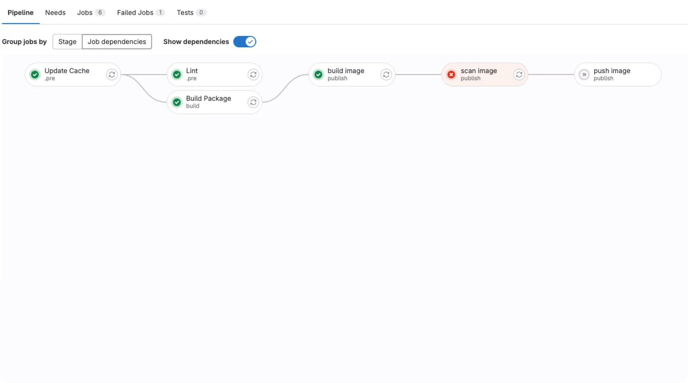

SEVERITY

В нашем проекте есть уязвимости уровня LOW, MEDIUM и HIGH. Может возникнуть ситуация, когда нас для работы GQ может интересовать только уровень CRITICAL.  
  
Чтобы Trivy не блокировал push образа при отсутствии уровня CRITICAL, можно переопределить переменную:

```
IMAGE_SCAN_SEVERITY_LIST: "CRITICAL"
```

Использование SonarQube для анализа кода

SonarQube — это приложение для внедрения статистического анализа кода в процесс разработки программного обеспечения, который поддерживает анализ многих языков программирования.  
Под статическим анализом подразумевается, что Sonar создает снепшот первичного анализа кода и в последующем сравнивает состояния между собой.  
  
SonarQube позволяет анализировать код на некачественное оформление, наличие багов, ошибок и возможных проблем безопасности при написании кода нового приложения.  
  
SonarQube позволяет измерять качество программного кода по семи показателям:  
Потенциальные ошибки — список багов.  
Стиль программирования — например, для Python это проверка отступов внутри кода.  
Тесты.  
Повторения участков кода — используется DRY концепция.  
Комментарии — по соответствию стилистике.  
Архитектура и проектирование.  
Сложность — в частности, Sonar поддерживает оценку когнитивной сложности кода.

Основной состав SonarQube

Пройдемся по основным вкладкам SonarQube  
  
1) Панель проектов

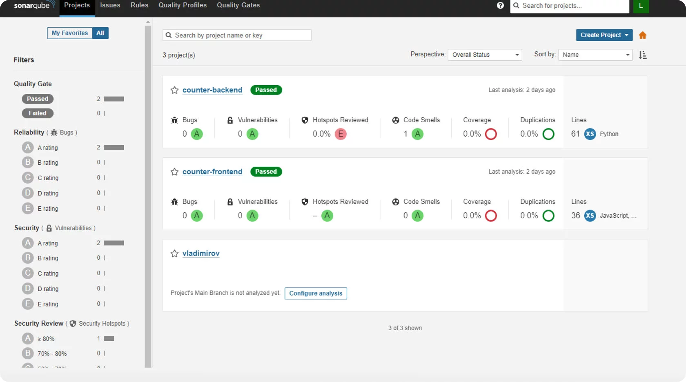

2) Замечания

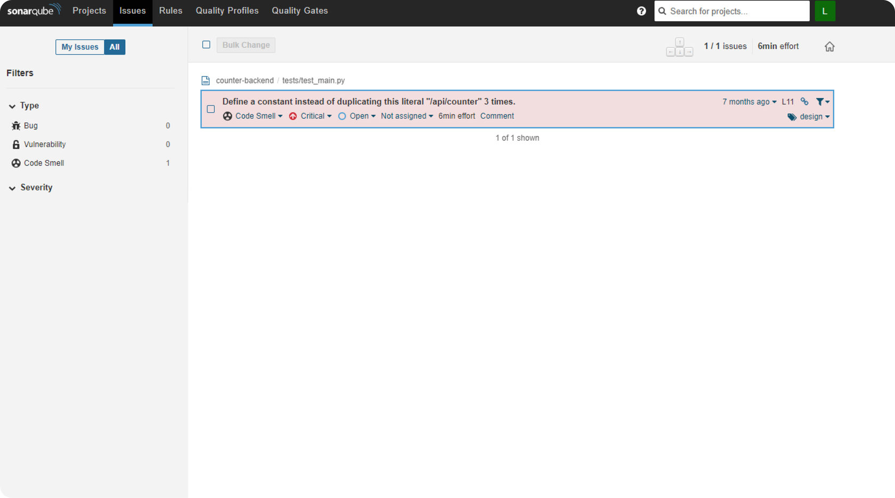

3) Правила

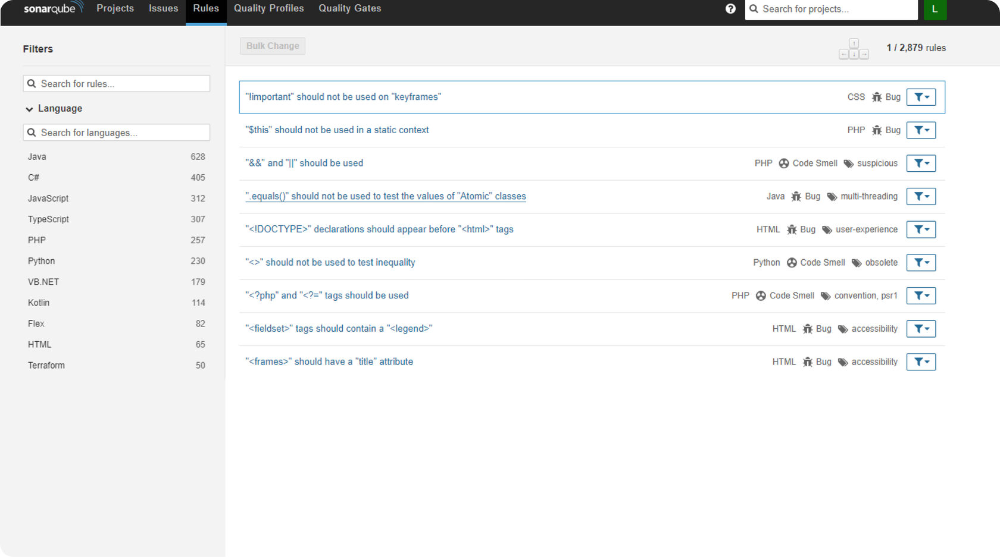

У правил есть следующие типы:  
 

1.  Ошибки
2.  Уязвимости
3.  Дефекты

  
Для правил существует такое понятие как Важность.  
Теги  
Дата появления правила  
И самое интересное — это техдолг, который возникает после срабатывания правила. Общий техдолг считается по формуле: все сработавшие правила умножаются на время их исправления, оцененное Сонаром, и делятся на рабочий день.  
  
4) Quality Gate

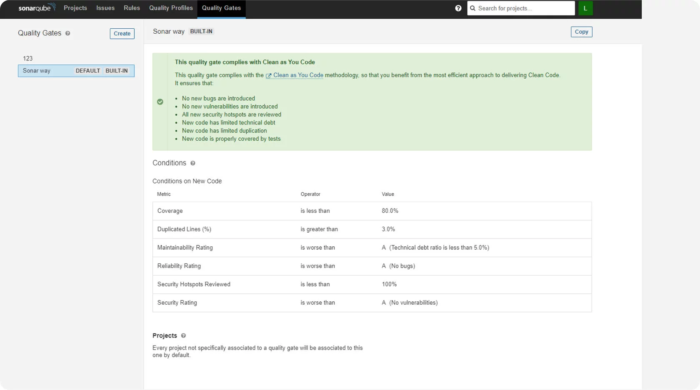

Интеграция с GitLab

Конечно для того, что бы использовать SonarQube необходимо сначала его проинтегрировать.  
Мы рассмотрим самый простой способ интеграции в ручную.  
Для этого вам будет необходимо выполнить следующие шаги:

1\. Залогинится в SonarQube и создать проект, связанный с Gitlab.

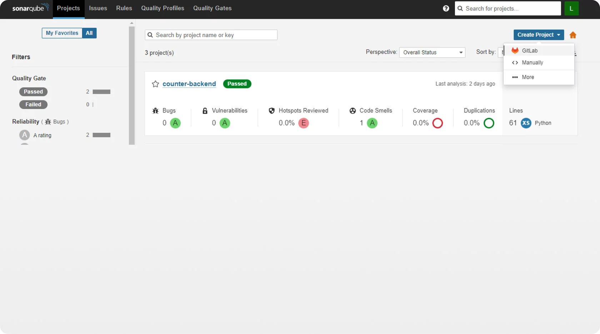

2\. При создании проекта необходимо создать токен внутри Gitlab. Для этого заходим внутрь проекта/группы (в зависимости от планируемого охвата технического токена)

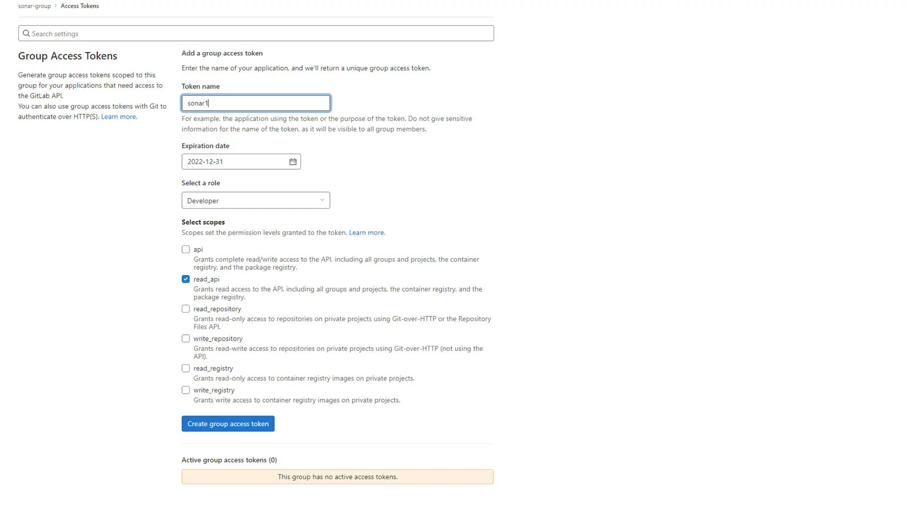

3\. После внесения токена можно увидеть все проекты находящиеся в группе к которой привязан токен. Либо проект на который выписывался токен.

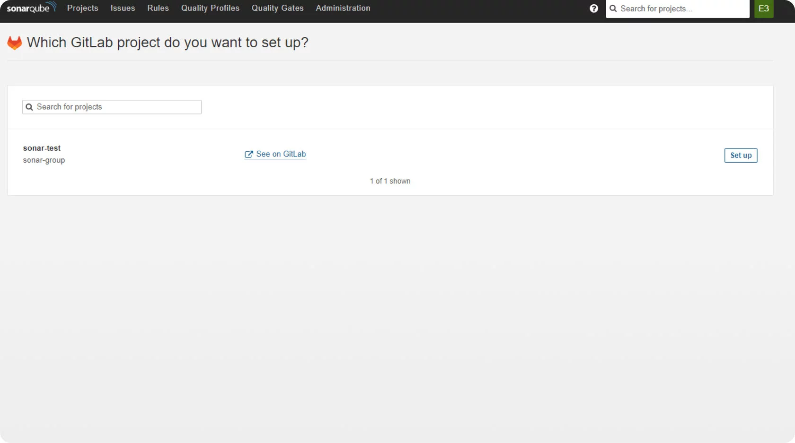

4\. Далее выбираем способ взаимодействия с SonarQube. В нашем случае это Gitlab CI.

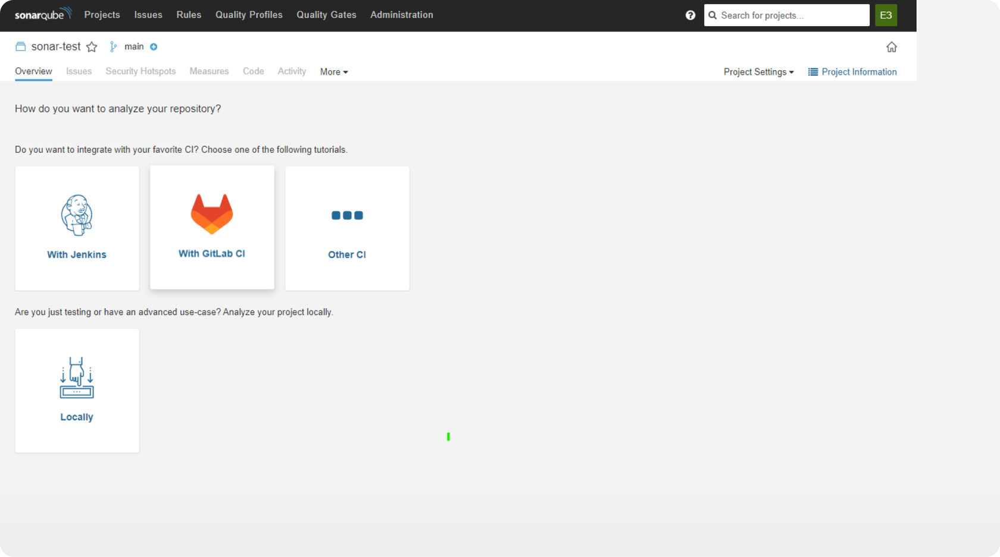

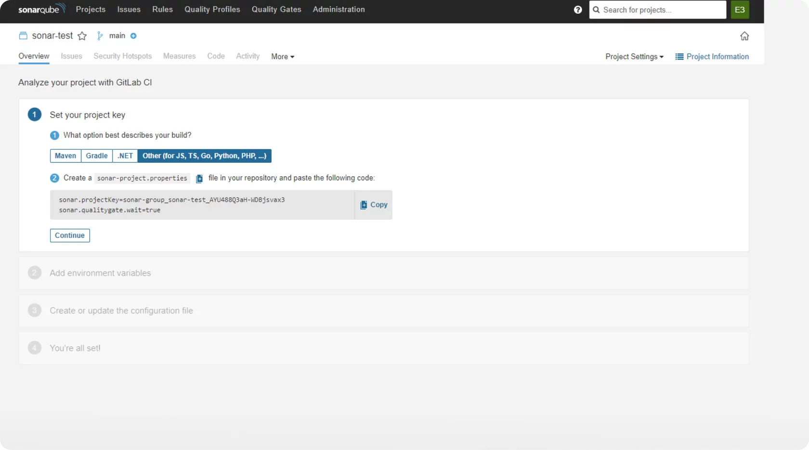

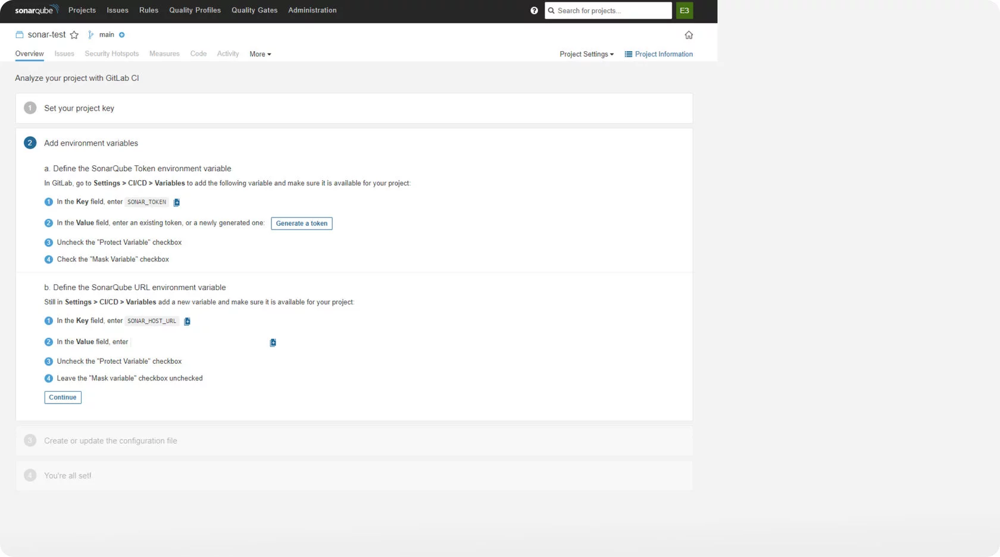

5\. Необходимо внести сгенерированные переменные в Gitlab. Вносить необходимо на уровне того проекта который требуется интегрировать. Следует учесть, что переменная SONAR\_PROJECT\_KEY берется из настроек properties и соответственно нет необходимости использовать ее внутри файла.

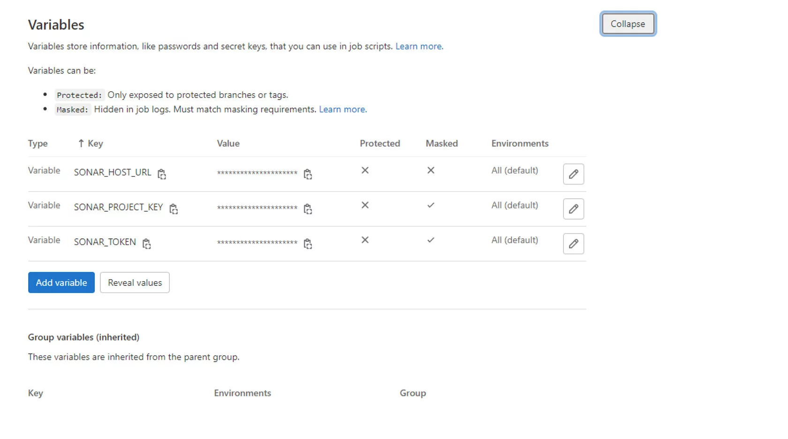

6\. Вносим в CI файл предложенные параметры

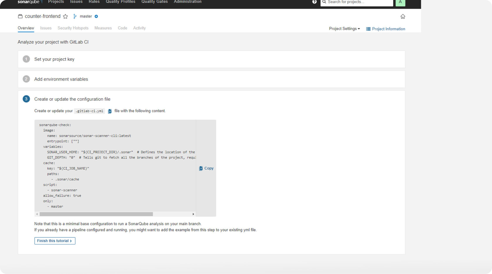

7\. После завершения интеграции запускаем CI и проверяем результат.

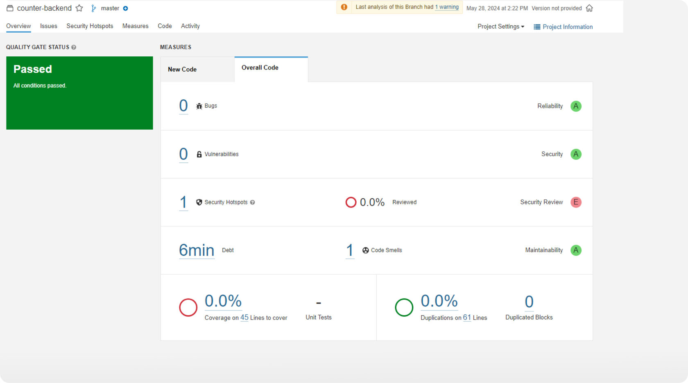