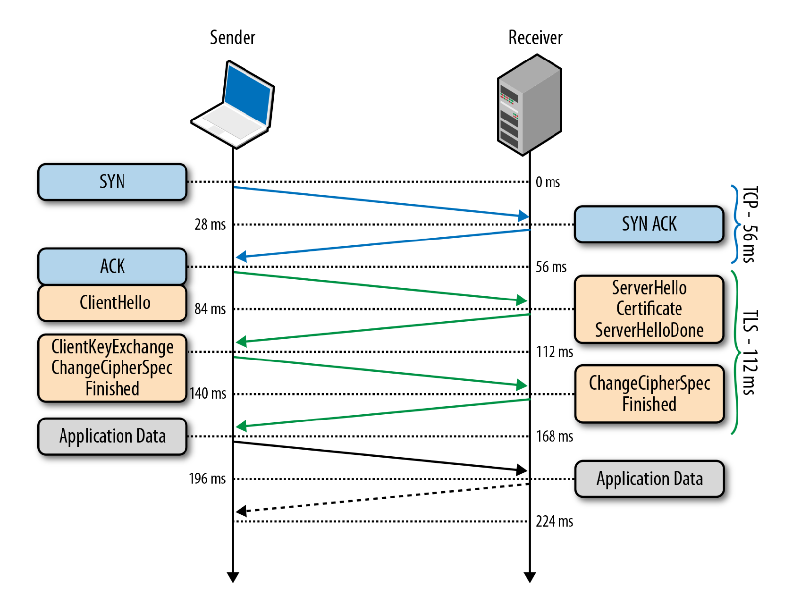
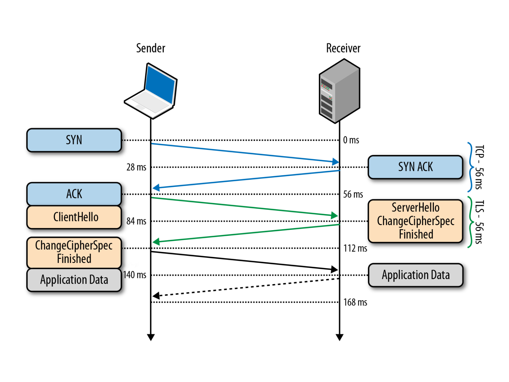
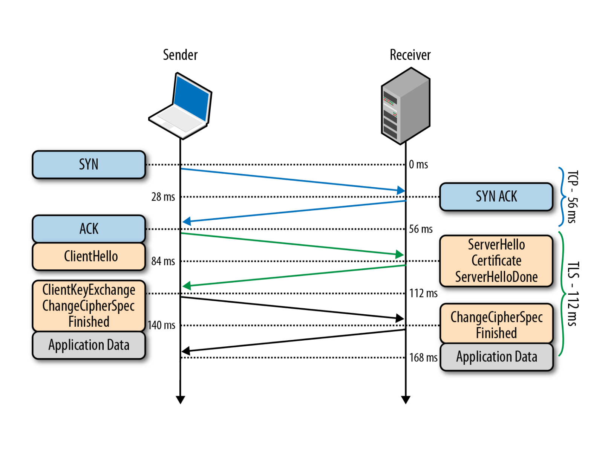
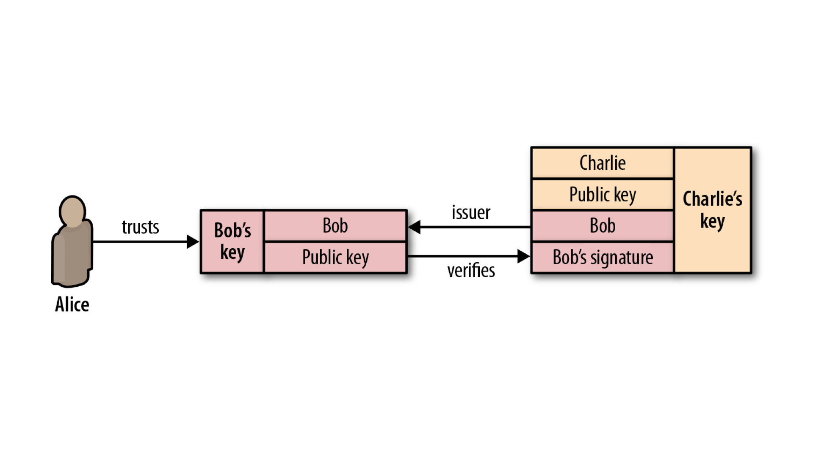
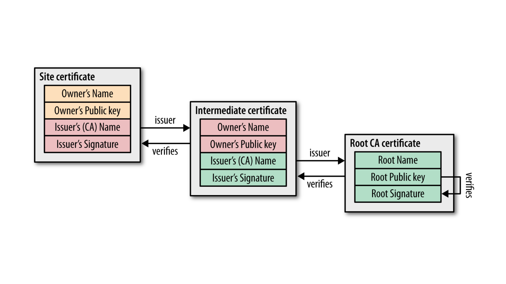

# Инструменты командной строки Linux

Сначала обсудим то, что есть практически во всех операционных системах.

# ps

Команда PS используется для просмотра списка процессов.  
  
Коротко про процессы  
  
Процесс — это программа, которая выполняется в отдельном виртуальном адресном пространстве.  
  
В Linux поддерживается классическая схема мультипрограммирования. Linux поддерживает параллельное или квазипараллельное, при наличии только одного процессора, выполнение процессов пользователя.  
  
Каждый процесс выполняется в собственном виртуальном адресном пространстве, т.е. процессы защищены друг от друга и крах одного процесса никак не повлияет на другие выполняющиеся процессы и на всю систему в целом.  
  
Один процесс не может прочитать что-либо из памяти или записать в нее другого процесса без «разрешения» на то другого процесса. Санкционированные взаимодействия между процессами допускаются системой.  
  
Существуют основные состояния процессов:  
  
Запуск  
Процесс либо уже работает, либо готов к работе и ждет, когда ему будет дано процессорное время;  
  
Ожидание   
Процессы в этом состоянии ожидают какого-либо события или освобождения системного ресурса. Ядро делит такие процессы на два типа: 1) ожидают освобождения аппаратных средств и 2) приостановленные с помощью сигнала;  
  
Остановлено   
Обычно в этом состоянии находятся процессы, которые были остановлены с помощью сигнала;  
  
Зомби   
Это мертвые процессы, они были остановлены и больше не выполняются, но для них есть запись в таблице процессов, возможно, из-за того, что у процесса остались дочерние процессы.  
  
Для просмотра процессов используется команда PS и необходимые в моменте ключи.   
  
Если введем PS, то получим следующие столбцы информации:  
  
PID — это уникальный идентификатор процесса.  
TTY — тип терминала, в который вошел пользователь.  
TIME — общее время, в течение которого процесс был активен.  
CMD — команда, которая запустила процесс.  
  
ps -A — покажет все запущенные процессы  
ps -a — покажет все процессы которые не связаны с терминалом  
ps -T — покажет все процессы наоборот связанные с терминалом  
ps -ax — даст все текущие запущенные процессы  
ps -aux — покажет процессы в формате BSD  
ps -ef — что бы просмотреть список в полном формате  
ps -u user — фильтр по пользователю

# kill

Поскольку мы говорим о процессах и ps логично будет проговорить про команду kill.  
Это инструкция которая завершает указанный процесс. Есть несколько вариантов выполнения привязанных к сигналам. Про сигналы поскольку это обширная тема вам придется почитать отдельно.  
  
Общеизвестные сигналы:

```
kill -9 # немедленно останавливающий процесс

kill -2 # Сигнал INT посылает процессу от управляющего терминала, когда 
        # пользователь желает прервать процесс. Это как правило, инициируется
        # нажатием Control-C, но на некоторых системах, «delete» или «break»

kill -15 # (sigterm) Сигнал TERM посылается в процесс чтобы запросить о его 
         # прекращении. В отличие от сигнала «kill», он может быть и
         # интерпретируемым или игнорируемым в процессе. Это позволяет процессу
         # выполнять «nice» выполнение для прекращения высвобождения ресурсов и
         # сохранения состояния в случае необходимости
```

Следует отметить, что SIGINT почти идентичен SIGTERM.  
  
При этом команда PS позволяет нам найти PID процесса, который мы хотим завершить.  
  
Есть расширенные версии Kill. Команда «pkill» позволяет использовать расширенные шаблоны регулярных выражений и других критериев соответствия.  
  
Вы можете убить приложение, введя имя процесса, вместо использования PID.  
Killall использует имя процесса, а вместо PID, и он «убивает» все экземпляры процесса с тем же именем.

# curl

Curl — это набор библиотек, в которых реализуются базовые возможности работы с URL страницами и передачи файлов. Библиотека поддерживает работу с протоколами: FTP, FTPS, HTTP, HTTPS, TFTP, SCP, SFTP, Telnet, DICT, LDAP, а также POP3, IMAP и SMTP. Она отлично подходит для имитации действий пользователя на страницах и других операций с URL адресами.  
  
Синтаксис curl достаточно простой:  
curl опции ссылка  
  
Рассмотрим наиболее используемые опции.

```
curl -o # Позволяет сохранить вывод в файл. 

curl -o readme.txt \
     https://github.com/hashicorp/terraform-provider-hcp/blob/main/README.md

curl \
  -O https://github.com/hashicorp/terraform-provider-hcp/blob/main/README.md
  # Позволит сохранить файл с названием как в ссылке.

curl -# -C - -O # Возобновит прервавшуюся загрузку. 

curl -L https://www.docker.com/ # Позволяет атоматически пройти по переадресации
                                # если адрес возвращает 3хх ответ.
```

Сетевые порты — это механизм, с помощью которого операционная система определяет какой именно программе необходимо передать сетевой пакет.  
  
Если порт открыт это означает, что какая либо программа, обычно сервис, использует его для связи с другой программой через интернет или в локальной системе.

# netstat

Утилита netstat позволяет увидеть открытые в системе порты, а также открытые на данный момент сетевые соединения.  
  
Наиболее используемые опции netstat:  
  
\-l или --listening — посмотреть только прослушиваемые порты;  
\-p или --program — показать имя программы и ее PID;  
\-t или --tcp — показать tcp порты;  
\-u или --udp — показать udp порты;  
\-n или --numeric — показывать ip адреса в числовом виде.  
  
Открытые порты Linux, которые ожидают соединений имеют тип LISTEN, а перед портом отображается IP адрес на котором сервис ожидает подключений.  
Это может быть определенный IP адрес или \*/0.0.0.0 что означают любой доступный адрес.  
  
Полный список значений TCP сокетов:  
  
CLOSED — закрыт. Сокет не используется.  
LISTEN — ожидает входящих соединений.  
SYN\_SENT — активно пытается установить соединение.  
SYN\_RECEIVED — идет начальная синхронизация соединения.  
ESTABLISHED — соединение установлено.  
CLOSE\_WAIT — удаленная сторона отключилась; ожидание закрытия сокета.  
FIN\_WAIT\_1 — сокет закрыт; отключение соединения.  
CLOSING — сокет закрыт, затем удаленная сторона отключилась; ожидание подтверждения.  
LAST\_ACK — удаленная сторона отключилась, затем сокет закрыт; ожидание подтверждения.  
FIN\_WAIT\_2 — сокет закрыт; ожидание отключения удаленной стороны.  
TIME\_WAIT — ожидание после закрытия повторной передачи отключения удаленной стороны.

```
sudo netstat -tulpn
 
sudo watch netstat -tulpn
```

Покажет TCP/UDP порты в реальном времени.  
С помощью netstat можно просмотреть таблицу маршрутизации.

```
sudo netstat -rn 
netstat -nlp
 
netstat -lnptux
-l все открытые порты (LISTEN)
-t по протоколу TCP
-u по протоколу UDP
-x по протоколу UNIX Socket
-n без резолва IP/имён
-p но с названиями процессов и PID-ами
```

netstat -atun | wc -l  
  
Подсчет активных соединений на сервере.

```
wc

wc -c --bytes  Отобразить размер объекта в байтах
wc -l --lines  Вывести количество строк в объекте
wc -m -count  Показать количесто символов в объекте
wc -w --words  Отобразить количество слов в объекте
```

# Htop

Htop это средство просмотра процессов и приложение текстового режима для системного мониторинга в режиме реального времени, аналогичное top.  
  
Он прост в использовании и отображает полный список выполняемых процессов.  
  
В нижней строке указаны ключи функции, которые можно использовать. Нажмите клавишу F6 для сортировки по разным параметрам, используйте клавиши со PERCENT\_MEM стрелками, чтобы выбрать столбец, а затем нажмите клавишу ВВОД.  
При этом процессы сортируются по использованию памяти.  
  
Краткий список дополнительных команд:  
  
u — показать только процессы, принадлежащие указанному пользователю.  
M — сортировать по количеству занятой памяти (так же, как в утилите top).  
P — сортировать по степени использования CPU (так же, как в top).  
T — сортировать по общему времени работы (так же, как в top).  
F — следить за процессом: если при обновлении списка процессов правила сортировки заставляют переместить текущий процесс вверх или вниз по списку, переместить курсор вслед за ним. Эта возможность полезна для наблюдения за конкретным процессом. Нажатие на любую клавишу перемещения отменяет этот режим.  
K — скрыть процессы ядра: потоки, запущенные ядром, убираются из списка выводимых процессов.  
H — скрыть пользовательские потоки: в современных системах с поддержкой NPTL, которые представляют потоки иначе, чем пользовательские процессы, этот переключатель уберёт пользовательские потоки из списка процессов.  
Ctrl-L — перерисовать экран и перечитать все значения.  
Numbers — поиск по идентификатору процесса (PID). При наборе цифр курсор будет автоматически перемещаться на первый подходящий процесс.  
  
Рассмотрим что нам показывает Htop  
  
Uptime: показывает время непрерывной работы системы.  
Это можно узнать и командой uptime.  
  
Откуда программа uptime это берёт? Она считывает информацию из файла /proc/uptime.

```
cat /proc/uptime
```

_Первое число_ — количество секунд работы системы.  
_Второе число_ — показывает сколько секунд система находилась в бездействии.  
  
Стоит отметить, что на системах с несколькими процессорами, второй показатель может оказаться больше, чем первый, так как это сумма по процессорам.  
Если можно взять это прямо из файла, то зачем нужна утилита uptime?  
  
Дело в том, что uptime форматирует вывод в читаемом виде, тогда как секунды в файле удобно использовать при написании собственных скриптов и программ.

# Load average

Помимо времени непрерывной работы, uptime показывает и среднюю загрузку системы, они отображены как 3 числа. А взяты они из файла /proc/loadavg.

```
cat /proc/loadavg
```

Первые 3 числа измеряют среднюю загрузку системы за последние 1, 5 и 15 минут. 4-ый параметр это количество активных процессов и их общее число. Последнее число — это ID последнего использованного процесса.  
  
Когда запускается процесс, ему присваивается ID.  
  
Как правило, они идут в возрастающем порядке, за исключением случаев, когда число исчерпалось и системе приходится начинать отсчёт заново. ID 1 присваивается процессу /sbin/init, который запускается при старте.  
  
load average— это средняя загрузка системы на протяжении определённого периода времени.  
  
Число загрузки считается как сумма количества процессов, которые запущены, т.е. выполняются или находятся в ожидании запуска, и непрерываемых процессов. Иными словами, это просто число процессов.  
  
Средняя загрузка высчитывается не просто как усреднённое значение за 1, 5 и 15 минут.  
  
Все три значения усредняют среднюю загрузку за всё время работы системы. Они устаревают экспоненциально, но с разной скоростью.  
  
Таким образом, средняя загрузка за 1 минуту это сумма 63% загрузки за последнюю минуту + 37% загрузки с момента запуска без учёта последней минуты.  
  
То же соотношение верно и для 5, 15 минут. Поэтому не совсем верно, что средняя загрузка за последнюю минуту включает активность только за последнюю минуту, но большей частью за последнюю минуту.  
  
Если упростить, то процессор может выполнять один процесс за раз.  
Если бы процессоров было 2 то, можно было бы одновременно выполнять 2 процесса. Максимальная средняя загрузка (100% использования CPU) системы с двумя процессорами составляет 2.00.  
  
Количество процессоров в системе можно узнать в левом верхнем углу htop или при помощи nproc.

# Процессы

В правом верхнем углу htop показывает общее количество процессов и сколько из них активны. Но почему там написано задания tasks, а не процессы?  
  
Задание — это синоним процесса. В ядре Linux процессы и есть задания. htop использует термин задания возможно потому, что это название короче и экономит немного места.  
  
В htop можно увидеть и потоки threads. Для переключения этой опции нужно использовать комбинацию Shift+H. Если отображается что-то вроде Tasks: 23, 10 thr, то это значит, что они видимы.  
  
Отображение потоков выполнения ядра kernel threads можно включить комбинацией Shift+K, и тогда задания будут выглядеть как Tasks: 23, 40 kthr  
  
ID процесса / PID  
  
При каждом запуске процесса, ему присваивается идентификатор PID.  
Если запускать программу в фоновом режиме (&) из bash, то номер задачи job выводится в квадратных скобках, а рядом с ним PID процесса.

```
sleep 1000 &
```

Ещё один способ — это использовать переменную $! в bash, которая хранит PID последнего процесса, запущенного в фоне.

```
echo $!
```

ID процесса очень полезен. С помощью него можно узнать подробности процесса и управлять им.  
Существует псевдо файловая система procfs, с помощью которой программы могут получить информацию от ядра системы путём чтения файлов.  
  
Чаще всего она монтируется в /proc/ и для пользователя выглядит как обычный каталог, который можно смотреть командами, такими как ls и cd.  
  
Вся информация о процессе находится в /proc/\<рid>/\<ID>.

```
ls /proc/<ID>
```

Например в /proc/\<рid>/cmdline содержится команда при помощи которой процесс запустился.  
  
В каталоге процесса могут быть и ссылки! Для примера, cwd ссылается на текущий рабочий каталог, а exe на запущенный исполняемый файл.

```
ls -l /proc/<ID>/{cwd,exe}
```

Таким образом утилиты htop, top, ps и другие показывают информацию о процессе, они просто читают /proc/\<рid>/\<файл>.  
  
Процесс, запускающий новый процесс, называют родительским или просто «родителем». Таким образом, новый процесс — это дочерний процесс родительского. Эти отношения образуют структуру в виде дерева.  
  
Если нажать F5 в htop, то можно увидеть иерархию процессов. Тот же эффект и от флага f команды ps.  
  
У каждого процесса есть владелец, т.е. пользователь. У пользователей, в свою очередь, существуют численные ID.

```
sleep 1000 &
 
grep Uid /proc/<ID>/status
```

Можно воспользоваться командой id, чтобы узнать имя этого пользователя.  
Команда, id берёт эту информацию из файлов /etc/passwd и /etc/group.  
Это обычные текстовые файлы, в которых ID привязаны к именам пользователей.

```
cat /etc/passwd
```

passwd? Но где пароли? А они на самом деле в /etc/shadow

```
sudo cat /etc/shadow
```

Если вы запустите программу, то она запустится от вашего имени, даже если вы не являетесь её владельцем. Если же вам нужно запустить её как root, то нужно использовать sudo, о чем мы говорили ранее.  
  
  
Состояния процесса  
  
Дальше, мы будем разбираться со столбцом состояния процессов в htop.  
Возможные значения состояния:  
  
R — \[running or runnable\] запущенные или находятся в очереди на запуск  
S — \[interruptible sleep\] прерываемый сон  
D — \[uninterruptible sleep\] непрерываемый сон (в основном IO)  
Z — \[zombie\] процесс зомби, прекращенный, но не забранный родителем  
T — Остановленный сигналом управления заданиями  
t — Остановленный отладчиком  
X — Мёртвый (не должен показываться)  
  
Остановимся на нескольких.  
  
R — Запущенные или в очереди  
Процессы в этом состоянии либо запущены, либо находятся в очереди для запуска.  
Что это значит?  
Когда вы компилируете код, то на выходе получаете исполняемый файл в виде инструкций для процессора.  
При запуске, этот файл помещается в память, где процессор выполняет эти инструкции, проще говоря занимается вычислениями.  
  
S — Прерываемый сон  
При этом состоянии инструкции программы не исполняются в процессоре, проще говоря спят. Процесс ждёт события или какого ни будь условия для продолжения. После того, как событие произошло, состояние меняется на запущенное.  
  
Z — Зомби процесс  
Когда процесс заканчивает свою работу с помощью exit и у неё остаются дочерние процессы, дочерние процессы становятся в состоянии зомби.  
  
1\. Абсолютно нормально, если зомби процесс существует недолго  
2\. Зомби процессы которые существуют долгое время, могут говорить о баге в программе  
3\. Зомби процессы не используют память, только лишь ID процесса  
4\. Зомби процесс нельзя «убить»  
5\. Можно вежливо попросить родительский процесс избавиться от зомби (послав SIGCHLD)  
6\. Можно завершить родительский процесс, чтобы избавиться от обоих  
  
  
Время обработки процесса  
  
Linux — многозадачная операционная система. Это означает, что даже если процессор один, то можно одновременно запускать на нём несколько заданий.  
  
Например, можно подключиться к удалённому серверу через SSH и посмотреть на вывод htop, а при этом сам сервер будет показывать ваш блог читателям в интернете.  
  
Как же возможно, что единственный процессор может одновременно выполнять несколько заданий?  
Разделением времени.  
  
Каждый процесс выполняется определённый интервал времени, при котором другие приостановлены, затем выполняется следующий процесс и т.д.  
  
Как правило, интервал времени выполнения составляет миллисекунды, поэтому пользователь этого и не заметит, если, конечно же, система не нагружена.  
  
  
Память — VIRT/RES/SHR/MEM  
  
У процессов создаётся иллюзия, что память кроме них никто не использует. Такая иллюзия — результат работы виртуальной памяти.  
  
Процессы не имеют прямого доступа к физической памяти. Для них выделяется участок виртуальной памяти, адреса в которой, проецируются ядром уже на адреса в физической памяти, либо на диск. Поэтому, иногда кажется, что процессы используют больше памяти, чем установлено в системе.  
  
Из-за этого не совсем легко понять сколько же именно памяти использует процесс. Но, к счастью, ядро и, в частности, htop позволяют извлечь некоторую информацию чтобы понять аппетит процесса по отношению к памяти.  
  
  
VIRT/VSZ — Виртуальный образ  
  
Общее количество памяти, занимаемое процессом. Оно включает в себя весь код, данные, общие библиотеки, страницы которые были перемещены на диск, а также страницы, которые проецировались ядром, но не были использованы.  
  
Таким образом VIRT это всё, что используется процессом. Если приложение запрашивает 1 Гб памяти, но использует при этом только 1 Мб, то память VIRT будет отображаться всё равно как 1 Гб. Даже если оно вызовет mmap для файла весом в 1 Гб и никогда им не воспользуется, то VIRT всё равно останется 1 Гб. В большинстве случаев этот показатель бесполезен.  
  
  
RES/RSS — Резидентная память  
  
Память RSS \[resident set size\] это область, которая не выгружена на диск и находится в оперативной памяти.  
RES, возможно, лучше отображает реальное использование памяти процессора чем VIRT, но нужно иметь ввиду:  
  
Туда не включена память, выгруженная на диск.  
  
Некоторая память может быть совместно используемой несколькими процессами.  
Если процесс использует 1 Гб памяти и вызывает fork(), то в результате у обоих процессов значение RES будет 1 Гб, в то время как в оперативной памяти будет занято только 1 Гб, потому что в Linux есть механизм копирования при записи \[copy-on-write\].  
  
  
SHR — Разделяемая память  
  
Объём памяти, который может быть совместно использован другими процессами.  
  
  
MEM% — Использование памяти  
  
Процент использования физической памяти. Это RES, делённый на общий объём оперативной памяти.  
  
Если, например, RES составляет 200М и в системе установлено 8 Гб памяти, то MEM% будет 200/8192\*100 = 2.4%

# Telnet/Netcat и иже с ними

TELNET — сетевой протокол для реализации текстового терминального интерфейса по сети (в современной форме — при помощи транспорта TCP).  
  
Выполняет функции протокола прикладного уровня модели OSI. Протокол telnet использовался для удалённого администрирования различными сетевыми устройствами и программными серверами, но уступил ssh из-за безопасности. Тем не менее может являться единственной возможностью взаимодействовать через cli с embedded systems, например, router, т.к. на них отсутствует ssh.  
  
Проверка порта  
  
Вы можете использовать эту команду для проверки подключения приложения.

```
telnet IPADDRESS PORT
telnet <ip> 22
```

Netcat  
  
Netcat (nc) – это утилита командной строки, которая читает и записывает данные через сетевые подключения, используя протоколы TCP или UDP.  
  
Почему netcat вытесняет telnet?  
Есть несколько причин, по которым telnet сильно проигрывает.  
  
Основные причины:  
1\. telnet не умеет различать причины недоступности порта. Все, или ничего — connect, либо fail. Netcat может подсказать, в чем проблема.  
2\. Не умеет в UDP, SCTP и прочие, ничего кроме TCP.  
3\. Не имеет опций тайм-аута соединения -w и проверки без подключения -z  
  
Самый простой синтаксис утилиты Netcat имеет следующий вид:

```
nc [options] host port
```

В Ubuntu вы можете использовать netcat или nc.  
  
Опции Netcat:  
\-h — справка;  
\-v — вывод информации о процессе работы (verbose);  
\-o \<выходной\_файл> — Вывод данных в файл;  
\-i \<число> — задержка между отправляемыми данными (в секундах);  
\-z — не посылать данные (сканирование портов);  
\-u — использовать для подключения UDP протокол;  
\-l — режим прослушивания;  
\-p \<число> — локальный номер порта для прослушивания. Используется с опцией -l;  
\-s \<хост> — использовать заданный локальный («свой») IP-адрес;  
\-n — отключить DNS и поиск номеров портов по /etc/services;  
\-w \<число> — задать тайм-аут (в секундах);  
\-q \<число> — задать время ожидания после передачи данных, после истечение которого соединение закрывается.  
  
По умолчанию Netcat пытается запустить TCP-соединение с указанным хостом и портом.  
Если вы хотите установить UDP-соединение, используйте параметр -u :

```
nc -z -v -u 77.88.8.8 53
```

Сканирование портов  
  
Сканирование портов является одним из наиболее распространенных способов использования Netcat. Можно сканировать один порт или диапазон портов.  
  
Например, для поиска открытых портов в диапазоне 1-80 вы должны использовать следующую команду:

```
nc -z -v <IP> 1-80
```

Опция -z скажет nc сканировать только открытые порты, без отправки каких – либо данных на них и -v дает возможность предоставления более подробной информации.  
  
Если необходимо распечатать только строки с открытыми портами, можно отфильтровать результаты с помощью команды grep:

```
nc -z -v 192.168.0.113 1-80 2>&1 | grep open
```

Можно использовать Netcat для поиска серверного программного обеспечения и его версии. Например, если отправить команду «EXIT» на сервер по стандартному SSH-порту 22:

```
echo "EXIT" | nc <IP> 22
```

```
ncat -v -w3 -z <IP> 22
ncat -v -w3 -z <IP> 1521
```

# tcpdump

Утилита tcpdump — хороший инструмент, с помощью которого можно перехватывать и анализировать сетевой трафик.  
Может оказаться лучшим решением для поиска сетевых проблем.  
  
Рассмотрим примеры использовать и пример вывода  
  
Строки вывода tcpdump:

```
09:39:44.460155 IP 185.155.18.126.62351 > 10.0.10.41.ssh: Flags [.], ack 196, win 2044, options [nop,nop,TS val 3611282493 ecr 2742031715], length 0
09:39:44.604514 IP 10.0.10.41.ssh > 185.155.18.126.62351: Flags [P.], seq 196:568, ack 1, win 501, options [nop,nop,TS val 2742031865 ecr 3611282493], length 372
```

Каждая строка включает:  
  
 

*   время (09:39:44.460155)
*   протокол (IP)
*   имя или IP-адрес исходного хоста и номер порта (185.155.18.126.62351)
*   имя хоста или IP-адрес назначения и номер порта (10.0.10.41.ssh)
*   флаги TCP (Flags \[F.\]). Указывают на состояние соединения и могут содержать более одного значения:
*   o S — SYN. Первый шаг в установлении соединения
*   F — FIN. Прекращение соединения
*   — ACK. Пакет подтверждения принят успешно
*   P — PUSH. Указывает получателю обрабатывать пакеты вместо их буферизации
*   R — RST. Связь прервалась
*   порядковый номер данных в пакете. (seq 196)
*   номер подтверждения. (ack 196)
*   размер окна (win 2044). Количество байтов, доступных в приемном буфере. Далее следуют параметры TCP
*   длина полезной нагрузки данных. (length 0/length 372)

  
Примеры:

```
sudo tcpdump host 10.0.10.41 # перехватит все входящие и исходящие пакеты

sudo tcpdump -n \
  -i ens160 src 10.0.10.41 and not port 22 # перехватит все входящие и 
                                           # исходящие пакеты, кроме порта 22

sudo tcpdump -c10 -i ens160 -n -A port 80 # покажет тело пакетов http запросов
```

tcpdump — имеет очень широкие возможности для исследования сетевых подключений и поиска проблем. Все доступные ключи вы найдете в мануале man tcpdump.

# Linux MIB

Совсем чуть чуть про дебаг для сетевого соединения.  
  
Что такое MIB и как его можно использовать.  
  
SNMP (англ. — Simple Network Management Protocol — простой протокол сетевого управления) — стандартный интернет-протокол для управления устройствами в IP-сетях на основе протоколов TCP/UDP.  
  
К поддерживающим SNMP устройствам относятся маршрутизаторы, коммутаторы, серверы, рабочие станции, принтеры, модемные стойки и другие.  
  
Протокол обычно используется в системах сетевого управления для контроля подключённых к сети устройств на предмет условий, которые требуют внимания администратора. SNMP состоит из набора стандартов для сетевого управления, включая протокол прикладного уровня, схему баз данных и набор объектов данных.  
  
MIB (база управленческой информации) текстовый файл с инструкциями по сбору и упорядочению информации. Менеджер SNMP использует информацию из MIB для перевода и интерпретации сообщений перед их отправкой конечному пользователю. Ресурсы, хранящиеся в MIB, называются управляемыми объектами или переменными управления.  
  
Если ваш сервер вдруг перестал реагировать на внешние раздражители и клиентские запросы стали провисать, не всегда проблема в зависших сервисах.  
  
Одним из элементов дебага текущего состояния это просмотр статистики ядра Linux по внутренним счетчикам SNMP. Самая распространенная из них netstat.

```
netstat -s
nstat -s
```

Первая утилита более дружелюбна к пользователю, однако показывает не все переменные. Вторая же показывает весь список, однако не содержит никаких подсказок.  
  
Из-за чего нужно приложить некоторые усилия для того, чтобы понять смысл и назначение тех, или иных счетчиков. Для нас интерес может представлять buffer overrun.

```
netstat -s |grep prune
873 packets pruned from receive queue because of socket buffer overrun
 
nstat -s |grep Prune
TcpExtPruneCalled 873 0.0
```

Как видите для нас вывод пустой но выше можно увидеть как выглядят проблемы.  
  
Если сервер не справляется с сетевой нагрузкой и буфер сокета перманентно переполнен, тогда ядро будет просто сбрасывать все новые пакеты и счетчик будет расти на глазах.  
  
Чтобы исправить эту ситуацию, можно добавить некоторые настраиваемые параметры в файле sysctl.conf. Текущие значения можно увидеть из файловой системы /proc.

```
cat /proc/sys/net/ipv4/tcp_rmem
cat /proc/sys/net/ipv4/wcp_rmem
cat /etc/sysctl.conf
cat /proc/sys/net/ipv4/tcp_wmem
cat /proc/sys/net/ipv4/tcp_rmem
```

Три значения параметра tcp\_rmem/tcp\_wmem обозначает соответственно минимальное, пороговое и максимальное значение.  
  
По умолчанию величины выставлены довольно разумно, поэтому менять их без веских оснований не стоит. Чаще всего такая ситуация может возникнуть на сети с пропускной способностью 10 GiB/s.  
После сохранения изменений в файле sysctl.conf следует выполнить systcl -p. Эта команда запускает системный вызов setsockopt (SO\_RCVBUF).  
  
Следует отметить, что буфер setsockopt(SO\_RCVBUF), установленный в приложении, будет ограничен значениями, установленными в net.core.rmem\_default и net.core.rmem\_max и если приложение имеет буфер размером 1 мб, но net.core.rmem\_max составляет всего 256 кб, то буфер сокета приложения будет ограничен этим значением.

# SSL/TLS

Сертификат SSL/TLS — это цифровой объект, который позволяет системам проверять личность и впоследствии устанавливать зашифрованное сетевое соединение с другой системой с использованием протокола Secure Sockets Layer/Transport Layer Security (SSL/TLS).  
  
Сертификаты используются в рамках криптографической системы, известной как инфраструктура открытого ключа (PKI). PKI дает одной стороне возможность устанавливать подлинность другой стороны с помощью сертификатов (при условии, что обе стороны доверяют третьей стороне, известной как центр сертификации).  
  
Таким образом, сертификаты SSL/TLS действуют как цифровые удостоверения личности для защиты сетевых подключений и установления подлинности веб-сайтов в Интернете, а также ресурсов в частных сетях.  
  
Но перейдем от сухого определения к конкретике. У нас уже есть HTTP (надеюсь вы все знаете про него и дополнительно объяснять не надо). Так что же с ним не так?  
  
Проблема протокола HTTP в том, что данные передаются по сети в открытом незашифрованном виде. Это позволяет злоумышленнику слушать передаваемые пакеты и извлекать любую информацию из параметров, заголовков и тела сообщения.  
  
Для устранения уязвимости был разработан HTTPS (S в конце значит Secure) - он, хоть не является отдельным протоколом, всего лишь HTTP поверх SSL (а позже TLS), позволяет безопасно обмениваться данными. В отличие от HTTP со стандартным TCP/IP портом 80, для HTTPS используется порт 443.

# Протокол SSL

Secure Sockets Layer (SSL) — это криптографический протокол, обеспечивающий безопасное общение пользователя и сервера по небезопасной сети. Располагается между транспортным уровнем и уровнем программы-клиента.  
  
Сам протокол был внедрен достаточно давно, Что необходимо знать так это что в 2015 году он признан устаревшим и на смену ему пришел TSL.

# Протокол TLS

Transport Layer Security — это развитие идей, заложенных в протоколе SSL. На данный момент актуальной является версия TLSv1.2, с августа 2018 активно вводится TLSv1.3, тогда как TLSv1.1, TLSv1.0, SSLv3.0, SSLv2.0, SSLv1.0 находятся в статусе deprecated.  
  
Протокол обеспечивает услуги: приватности (сокрытие передаваемой информации), целостности (обнаружение изменений), аутентификации (проверка авторства). Достигаются они за счет гибридного шифрования, то есть совместного использования ассиметричного и симметричного шифрования.  
  
Симметричное шифрование предполагает наличие общего ключа одновременно у отправителя и получателя, с помощью которого происходит шифровка и дешифровка данных. Данный тип не требователен к ресурсам, однако существенно страдает безопасность из-за опасности кражи ключа злоумышленником.  
  
При использовании ассиметричного шифрования существует открытый ключ, который можно свободно распространять, и закрытый ключ, который держится в секрете у одной из сторон. Этот тип работает медленно, относительно симметричного шифрования, однако скомпрометировать закрытый ключ сложнее.  
  
Чтобы решить проблему производительности (шифровать ассиметрично абсолютно все - сложно), в TLS используется гибридное шифрование: общий ключ для симметричного шифрования данных передается от клиента серверу зашифрованным открытым ключом сервера, после этого сервер может его расшифровать своим закрытым ключом и использовать для обмена данными с клиентом.  
  
Давайте разберем подробнее и по порядку, каким образом работает TLS соединение.  
  
Протокол TLS предназначен для предоставления трёх услуг всем приложениям, работающим над ним, а именно: шифрование, аутентификацию и целостность:  
  
Шифрование — сокрытие информации, передаваемой от одного компьютера к другому;  
Аутентификация — процедура проверки подлинности;  
Целостность — обнаружение подмены информации подделкой.  
  
Для того чтобы установить криптографически безопасный канал данных, узлы соединения должны согласовать используемые методы шифрования и ключи.  
Протокол TLS однозначно определяет данную процедуру. Следует отметить, что TLS использует криптографию с открытым ключом, которая позволяет узлам установить общий секретный ключ шифрования без каких-либо предварительных знаний друг о друге.  
  
Также в рамках процедуры TLS Handshake имеется возможность установить подлинность личности и клиента, и сервера. Например, клиент может быть уверен, что сервер, который предоставляет ему информацию о банковском счёте, действительно банковский сервер. И наоборот: сервер компании может быть уверен, что клиент, подключившийся к нему – именно сотрудник компании, а не стороннее лицо/  
  
Наконец, TLS обеспечивает отправку каждого сообщения с кодом MAC (Message Authentication Code), алгоритм создания которого – односторонняя криптографическая функция хеширования (фактически – контрольная сумма), ключи которой известны обоим участникам связи.  
  
Всякий раз при отправке сообщения, генерируется его MAC-значение, которое может сгенерировать и приёмник, это обеспечивает целостность информации и защиту от её подмены.  
  
Рассмотрим, что внутри.

# Протокол TLS

Перед тем, как начать обмен данными через TLS, клиент и сервер должны согласовать параметры соединения, а именно: версия используемого протокола, способ шифрования данных, а также проверить сертификаты, если это необходимо.  
  
Схема начала соединения называется TLS Handshake.



Разберём подробнее каждый шаг данной процедуры:  
  
 

1.  Так как TLS работает над TCP, для начала между клиентом и сервером устанавливается TCP-соединение.
2.  Client Hello После установки TCP, клиент посылает на сервер спецификацию в виде обычного текста (а именно версию протокола, которую он хочет использовать, поддерживаемые методы шифрования Cipher Spec,и случайного простого числа (client random), необходимого в дальнейшем для генерации общего ключа симметричного шифрования.). Что такое Cipher Spec? В процессе установки соединения, клиент и сервер должны договориться о: какой алгоритм использовать для обмена ключами (например, RSA — Риверт-Шамир-Адлеман, DH — Диффи-Хеллмана, ECDH — Диффи-Хеллмана на эллиптических кривых, и др.), какой алгоритм использовать для шифрования данных (AES — Advanced Encryption Standard, 3DES — Tripple Data Encryption Algorithm, и др.), какую криптографическую хэш-функцию использовать для генерации Message Authentication Code (SHA-256, SHA-384, SHA-512 — Secure Hash Algorithm с соответствующей длиной строки в битах с хэшем, и др.).
3.  Server Hello Сервер утверждает версию используемого протокола, выбирает способ шифрования из предоставленного списка, прикрепляет свой сертификат и отправляет ответ клиенту (при желании сервер может так же запросить клиентский сертификат).
4.  Certificate Версия протокола и способ шифрования на данном моменте считаются утверждёнными, клиент проверяет присланный сертификат и инициирует либо RSA, либо обмен ключами по Диффи-Хеллману, в зависимости от установленных параметров. Сертификат - это открытый ключ и другая информация о его владельце, а также Электронная Цифровая Подпись (ЭЦП) доверенного центра. При создании ЭЦП хэш данных, которые подписываются, шифруется закрытым ключом, в отличие от обычного ассиметричного шифрования, где зашифровка выполняется открытым ключом. Таким образом, если вам удалось расшифровать открытым ключом хэш, и он оказался идентичен хэшу из данных, - вы можете быть уверены что: подпись была сделана именно владельцем приватного ключа, открытый ключ которого вы используете; данные, которые были подписаны, не изменились с момента подписания.
5.  Server Key Exchange — этот этап происходит не всегда, только если необходимы дополнительные данные для создания симметричного ключа при выбранном алгоритме. Например, при обмене ключами RSA этот шаг пропускается и для обмена общим ключ передается от клиента серверу зашифрованным открытым ключом сервера
6.  Server Hello Done — сервер сообщает, что начальный этап установки соединения завершен
7.  Client Key Exchange сервер передал информацию в Server Key Echange, клиент передает свою информацию в Client Key Exchange. Вычисленное в конце общее одинаковое число используется для создания pre-master secret - предварительного разделяемого ключа. На основании client random, server random и pre-master secret псевдослучайная функция выдает симметричный ключ и ключ вычисления MAC. Таким образом клиент и сервер имеют все необходимое для начала обмена полезной информацией.
8.  Change Cipher Spec — клиент говорит серверу, что он готов перейти на защищенное соединение.
9.  Finished — клиент зашифровывает симметричным ключом первое сообщение с MAC.
10.  Change Cipher Spec Сервер обрабатывает присланное клиентом сообщение, сверяет MAC, и отправляет клиенту заключительное (‘Finished ’) сообщение в зашифрованном виде.
11.  Клиент расшифровывает полученное сообщение, сверяет MAC, и если всё хорошо, то соединение считается установленным и начинается обмен данными приложений.
12.  close\_notify(нет на картинке) — служебное сообщение, которое одна сторона отправляет другой, как уведомление о том, что считает соединение разорванным и не будет принимать больше сообщения. Другая сторона в ответ обязана послать аналогичное сообщение close\_notify

Установление соединения TLS является, довольно длительным процессом, поэтому в стандарте TLS есть несколько оптимизаций.  
  
В частности, имеется процедура под названием “abbreviated handshake”, которая позволяет использовать ранее согласованные параметры для восстановления соединения (естественно, если клиент и сервер устанавливали TLS-соединение в прошлом).  
  
Также имеется дополнительное расширение процедуры Handshake, которое имеет название TLS False Start. Это расширение позволяет клиенту и серверу начать обмен зашифрованными данными сразу после установления метода шифрования, что сокращает установление соединения на одну итерацию сообщений.

# Двусторонний TLS

Двусторонний TLS или Two Way TLS или mutual TLS (mTLS) означает проверку сертификата клиента. Сервер после своего сообщения Certificate посылает запрос сертификата клиента CertificateRequest. Клиент в ответ отправляет Certificate, сервер производит проверку, аналогичную проверке сертификата сервера клиентом. Далее настройка TLS происходит в описанном выше порядке.

# Обмен ключами в протоколе TLS

По различным историческим и коммерческим причинам чаще всего в TLS используется обмен ключами по алгоритму RSA: клиент генерирует симметричный ключ, подписывает его с помощью открытого ключа сервера и отправляет его на сервер.  
  
В свою очередь, на сервере ключ клиента расшифровывается с помощью закрытого ключа. После этого обмен ключами объявляется завершённым. Данный алгоритм имеет один недостаток: эта же пара отрытого и закрытого ключей используется и для аутентификации сервера.  
  
Соответственно, если злоумышленник получает доступ к закрытому ключу сервера, он может расшифровать весь сеанс связи. Более того, злоумышленник может попросту записать весь сеанс связи в зашифрованном варианте и занять расшифровкой потом, когда удастся получить закрытый ключ сервера.  
  
В то же время, обмен ключами Диффи-Хеллмана представляется более защищённым, так как установленный симметричный ключ никогда не покидает клиента или сервера и, соответственно, не может быть перехвачен злоумышленником, даже если тот знает закрытый ключ сервера.  
  
На этом основана служба снижения риска компрометации прошлых сеансов связи: для каждого нового сеанса связи создаётся новый, так называемый «временный» симметричный ключ.  
  
Соответственно, даже в худшем случае (если злоумышленнику известен закрытый ключ сервера), злоумышленник может лишь получить ключи от будущих сессий, но не расшифровать ранее записанные.  
  
На текущий момент, все браузеры при установке соединения TLS отдают предпочтение именно сочетанию алгоритма Диффи-Хеллмана и использованию временных ключей для повышения безопасности соединения.  
  
Следует ещё раз отметить, что шифрование с открытым ключом используется только в процедуре TLS Handshake во время первоначальной настройки соединения. После настройки туннеля в дело вступает симметричная криптография, и общение в пределах текущей сессии зашифровано именно установленными симметричными ключами.  
  
Это необходимо для увеличения быстродействия, так как криптография с открытым ключом требует значительно больше вычислительной мощности.

# Возобновление сессии TLS

Как уже отмечалось ранее, полная процедура TLS Handshake является довольно длительной и дорогой с точки зрения вычислительных затрат. Поэтому была разработана процедура, которая позволяет возобновить ранее прерванное соединение на основе уже сконфигурированных данных.  
  
Начиная с первой публичной версии протокола (SSL 2.0) сервер в рамках TLS Handshake (а именно первоначального сообщения ServerHello) может сгенерировать и отправить 32-байтный идентификатор сессии.  
  
Естественно, в таком случае у сервера хранится кэш сгенерированных идентификаторов и параметров сеанса для каждого клиента. В свою очередь клиент хранит у себя присланный идентификатор и включает его (конечно, если он есть) в первоначальное сообщение ClientHello.  
  
Если и клиент, и сервер имеют идентичные идентификаторы сессии, то установка общего соединения происходит по упрощённому алгоритму, показанному на рисунке. Если нет, то требуется полная версия TLS Handshake.



Процедура возобновления сессии позволяет пропустить этап генерации симметричного ключа, что существенно повышает время установки соединения, но не влияет на его безопасность, так как используются ранее нескомпрометированные данные предыдущей сессии.  
  
Однако здесь имеется практическое ограничение: так как сервер должен хранить данные обо всех открытых сессиях, это приводит к проблеме с популярными ресурсами, которые одновременно запрашиваются тысячами и миллионами клиентов.  
  
Для обхода данной проблемы был разработан механизм «Session Ticket», который устраняет необходимость сохранять данные каждого клиента на сервере.  
  
Если клиент при первоначальной установке соединения указал, что он поддерживает эту технологию, то в сервер в ходе TLS Handshake отправляет клиенту так называемый Session Ticket – параметры сессии, зашифрованные закрытым ключом сервера.  
  
При следующем возобновлении сессии, клиент вместе с ClientHello отправляет имеющийся у него Session Ticket. Таким образом, сервер избавлен от необходимости хранить данные о каждом соединении, но соединение по-прежнему безопасно, так как Session Ticket зашифрован ключом, известным только на сервере.

# TLS False Start

Технология возобновления сессии бесспорно повышает производительность протокола и снижает вычислительные затраты, однако она не применима в первоначальном соединении с сервером, или в случае, когда предыдущая сессия уже истекла.  
  
Для получения ещё большего быстродействия была разработана технология TLS False Start, являющаяся опциональным расширением протокола и позволяющая отправлять данные, когда TLS Handshake завершён лишь частично. Подробная схема TLS False Start представлена на рисунке:



Важно отметить, что TLS False Start никак не изменяет процедуру TLS Handshake. Он основан на предположении, что в тот момент, когда клиент и сервер уже знают о параметрах соединения и симметричных ключах, данные приложений уже могут быть отправлены, а все необходимые проверки можно провести параллельно.  
  
В результате соединение готово к использованию на одну итерацию обмена сообщениями раньше.

# TLS Chain of Trust

Аутентификация является неотъемлемой частью каждого TLS соединения. Рассмотрим простейший процесс аутентификации между Алисой и Бобом:  
 

1.  И Алиса, и Боб генерируют собственные открытые и закрытые ключи.
2.  Алиса и Боб обмениваются открытыми ключами.
3.  Алиса генерирует сообщение, шифрует его своим закрытым ключом и отправляет Бобу.
4.  Боб использует полученный от Алисы ключ, чтобы расшифровать сообщение и таким образом проверяет подлинность полученного сообщения.

Очевидно, что данная схема построена на доверии между Алисой и Бобом. Предполагается, что обмен открытыми ключами произошёл, например, при личной встрече, и, таким образом, Алиса уверена, что получила ключ непосредственно от Боба, а Боб, в свою очередь, уверен, что получил открытый ключ Алисы.  
  
Пусть теперь Алиса получает сообщение от Чарли, с которым она не знакома, но который утверждает, что дружит с Бобом. Чтобы это доказать, Чарли заранее попросил подписать собственный открытый ключ закрытым ключом Боба, и прикрепляет эту подпись к сообщению Алисе.  
  
Алиса же сначала проверяет подпись Боба на ключе Чарли (это она в состоянии сделать, ведь открытый ключ Боба ей уже известен), убеждается, что Чарли действительно друг Боба, принимает его сообщение и выполняет уже известную проверку целостности, убеждаясь, что сообщение действительно от Чарли:



Описанное в предыдущем абзаце и есть создание «цепочки доверия».  
В протоколе TLS данные цепи доверия основаны на сертификатах подлинности, предоставляемых специальными органами, называемыми центрами сертификации (CA – certificate authorities).  
  
Центры сертификации производят проверки и, если выданный сертификат скомпрометирован, то данный сертификат отзывается.  
  
Из выданных сертификатов складывается уже рассмотренная цепочка доверия. Корнем её является так называемый “Root CA certificate” – сертификат, подписанный крупным центром, доверие к которому неоспоримо.  
В общем виде цепочка доверия выглядит примерно таким образом:



Естественно, возникают случаи, когда уже выданный сертификат необходимо отозвать или аннулировать (например, был скомпрометирован закрытый ключ сертификата, или была скомпрометирована вся процедура сертификации).  
Для этого сертификаты подлинности содержат специальные инструкции о проверке их актуальности. Следовательно, при построении цепочки доверия, необходимо проверять актуальность каждого доверительного узла.  
  
Механизм этой проверки прост и в его основе лежит т.н. «Список отозванных сертификатов» (CRL – «Certificate Revocation List»). У каждого из центров сертификации имеется данный список, представляющий простой перечень серийных номеров отозванных сертификатов.  
  
Соответственно любой, кто хочет проверить подлинность сертификата, попросту загружает данный список и ищет в нём номер проверяемого сертификата. Если номер обнаружится – это значит, что сертификат отозван.  
Здесь очевидно присутствует некоторая техническая нерациональность: для проверки лишь одного сертификата требуется запрашивать весь список отозванных сертификатов, что влечёт замедление работы.  
  
Для борьбы с этим был разработан механизм под названием «Протокол статусов сертификатов» (OCSP – Online Certificate Status Protocol). Он позволяет осуществлять проверку статуса сертификата динамически.  
  
Естественно, это снижает нагрузку на пропускную способность сети, но в то же время порождает несколько проблем:  
 

1.  Центры сертификации должны справляться с нагрузкой в режиме реального времени;
2.  Центры сертификации должны гарантировать свою доступность в любое время;
3.  Из-за запросов реального времени центры сертификации получают информацию о том, какие сайты посещал каждый конкретный пользователь.

Собственно, во всех современных браузерах оба решения (OCSP и CRL) дополняют друг друга, более того, как правило имеется возможность настройки предпочитаемой политики проверки статуса сертификата.

# TLSv1.3

Стоит отметить, что все выше написанное относится к TLSv1.2, которая начинает понемногу устаревать. В 2018 году была разработана новая версия 1.3 в которой: были запрещены уже ненадежные алгоритмы, ускорен процесс соединения, переработан протокол рукопожатия и др.  
  
Интернет медленно но верно обновляется до TLSv1.3, однако все еще большинство сайтов работают по протоколу TLSv1.2.

# Выпускаем собственные сертификаты

Теперь, когда мы разобрали теорию, самое время приступить к практике!  
  
Для начала установим OpenSSL:

```
sudo apt update
sudo apt install openssl
```

После установки OpenSSL следующим шагом будет создание закрытого ключа. Закрытый ключ является важным компонентом сертификата SSL, поскольку он используется для подписи и расшифровки данных.  
  
Запустите следующую команду, чтобы сгенерировать 2048-битный закрытый ключ RSA:

```
openssl genrsa -out test.key 2048
```

Обязательно сохраните этот закрытый ключ в безопасности, поскольку он имеет решающее значение для обеспечения безопасности вашего сертификата SSL.  
  
Далее вам необходимо создать запрос на подпись сертификата (CSR), который включает информацию о вашем сервере и организации. CSR необходим для создания сертификата SSL. Запустите следующую команду, чтобы создать CSR:

```
openssl req -new -key test.key -out test.csr
```

Вам будет предложено ввести различные данные, такие как ваша страна, штат, населенный пункт, название организации, общее имя (доменное имя) и адрес электронной почты. Заполните эти данные точно, так как они будут использоваться в вашем сертификате SSL.  
  
Теперь, когда у вас есть CSR, вы можете сгенерировать само подписанный сертификат SSL с помощью следующей команды:

```
openssl x509 -req -days 365 -in test.csr -signkey test.key -out test.crt
```

Готово.

> Следует обратить внимание, что самоподписанные сертификаты не желательны к использованию в продакшене.

# Домашнее задание

Для выписывания сертификатов используются разные методы и технологии.  
В данном случае мы воспользуемся Let's Encrypt и выпишем себе личный сертификат, который будем использовать в дальнейшем.  
  
Для этого эффективно будет использовать Certbot. [Инструкция](https://certbot.eff.org/instructions?ws=other&os=ubuntufocal) по выписыванию сертификата.  
  
Дополнительные команды для выписывания сертификата:

```
apt install certbot -y
```

```
sudo certbot certonly --standalone --preferred-challenges http -d <ВАШ DNS>
```

> За своим DNS обратитесь к вашему лектору.