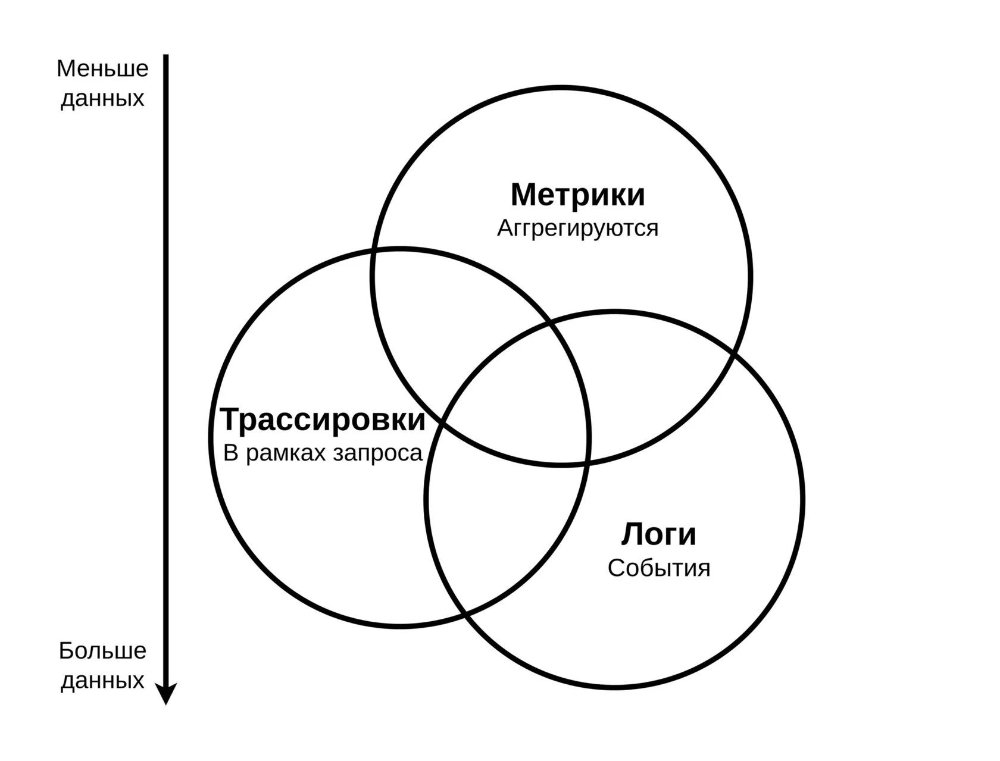
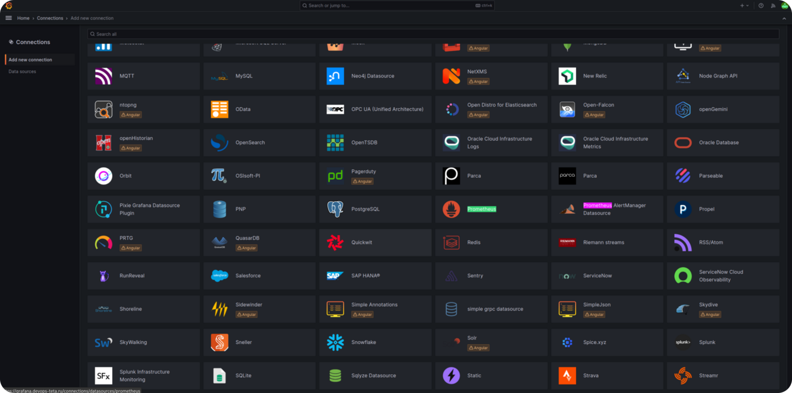
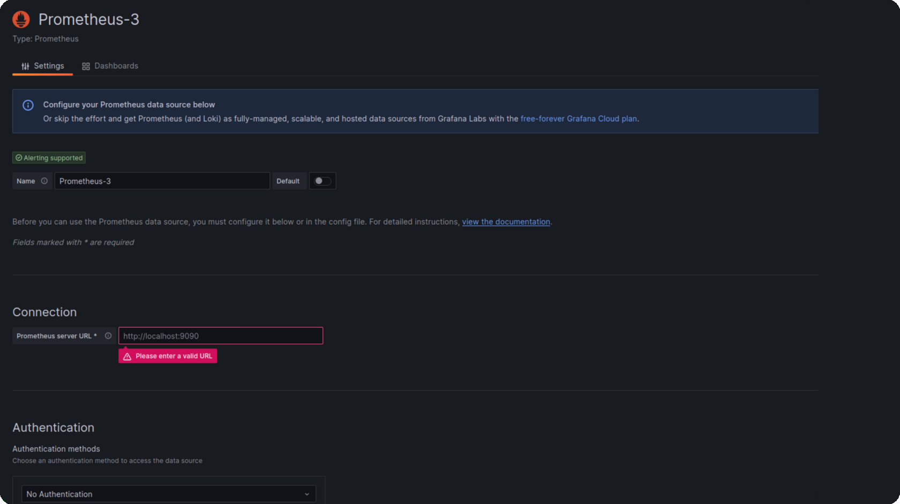
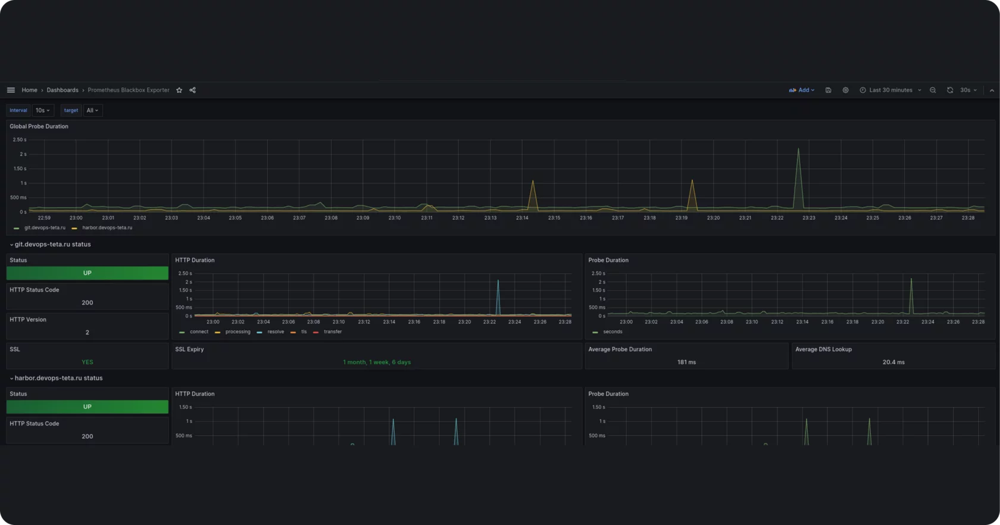
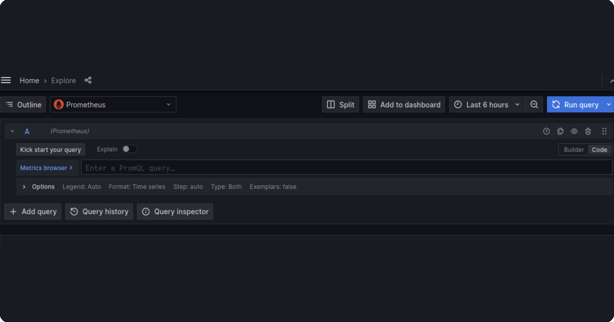
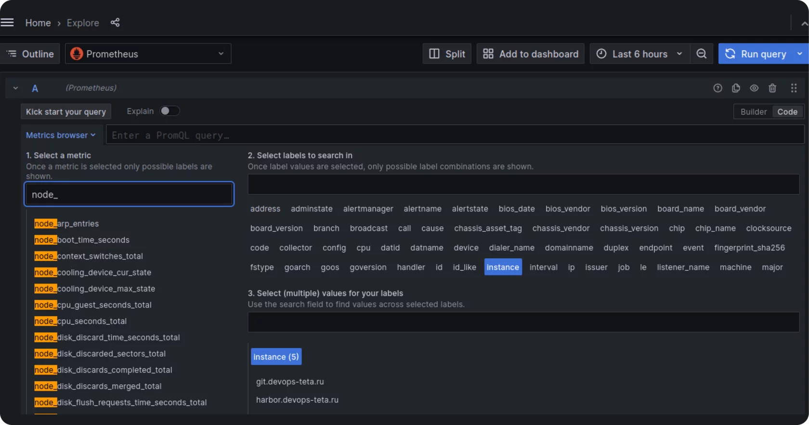
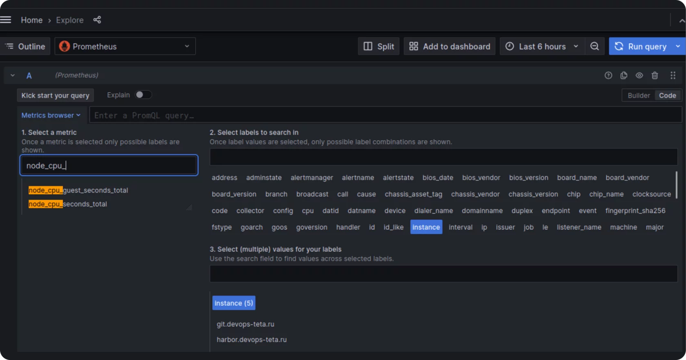
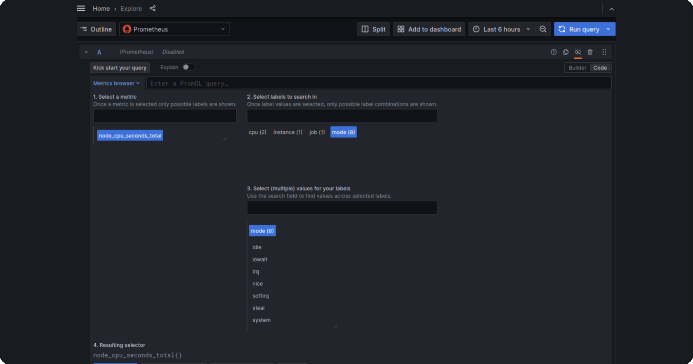
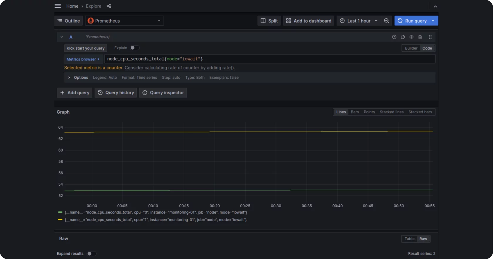
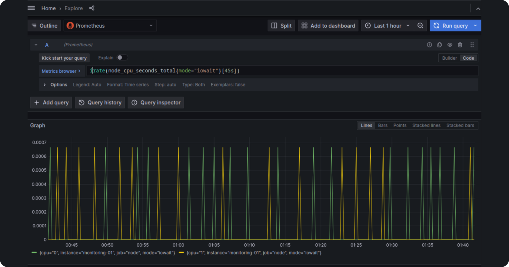

Наблюдаемость

Ранее на курсе мы рассматрели Ansible для конфигурирования элементов инфраструктуры. Конечным результатом использования подобных инструментов мы считали какие-либо развернутые службы, конкретное состояние ВМ и т. д.

После этого возникает вопрос: «Как обеспечить работу развернутых нами служб в будущем? Как узнать о проблемах на наших серверах и службах?»

Набор методик для решения таких проблем называют наблюдаемостью и в общем эти подходы предполагают, что компоненты инфраструктуры сообщают в некоторые внешние системы детали своей работы, далее при помощи этих данных мы можем анализировать насколько хорошо работают службы и предпринимать какие-либо действия в противном случае:

*   отправлять оповещения разработчиками или инженерам в случае неполадок;
*   увеличивать число реплик развернутых служб при повышении нагрузки;
*   анализировать взаимодействие сервисов для поиска «бутылочных горлышек».

Выделяют три большие категории экспортируемых данных:

Метрики — набор численных показателей, характеризующих работу инфраструктурного элемента в момент времени (например, в 21:00 на сервере использовалось 4 гигабайта оперативной памяти); ключевая характеристика метрик -- их аггрегируемость, имея несколько однотипных показателей, мы легко можем вычислить более общий, высокоуровневый показатель;

Логи — информация о конкретном событии в системе (например, пользователь Василий Пупкин авторизовался в системе в 16:45);

Трассировки — информация о том, что именно происходило в службах в рамках конкретного запроса. Например, пользователь отправил запрос с идентификатором X к инвентарному сервису на добавление нового товара на склад, в рамках запроса были вызваны три функции с определенными аргументами.



Существует множество систем наблюдаемости, сегодня мы рассмотрим одно из самых популярных хранилищ метрик — Prometheus и систему визуализации — Grafana: настроим сбор метрик с PostgreSQL, который развернули на предыдущем занятии и системных метрик с ВМ2, затем визуализируем их в Grafana.

Prometheus

Prometheus — это система мониторинга с открытым исходным кодом, разработанная в рамках проекта Google Incubator. Он был создан для сбора и хранения метрик времени исполнения для приложений и сервисов.

Prometheus использует для этого механизм, называемый «pulling», который означает, что он периодически опрашивает каждый наблюдаемый сервис для получения информации о его метриках. Prometheus может собирать различные типы данных, включая количество запросов, время ответа, использование памяти и многое другое. Собранные данные могут быть визуализированы с помощью Grafana или другой системы визуализации.

Prometheus также поддерживает функцию оповещения, которая позволяет отправлять уведомления при достижении определенных пороговых значений метрик.

Prometheus Blackbox Exporter

Prometheus Blackbox Exporter — это инструмент разработанный для мониторинга и сбора метрик от различных сервисов и приложений. Он обеспечивает простую интеграцию с Prometheus и позволяет собирать данные о доступности, производительности и использовании ресурсов различных сервисов.

Prometheus Blackbox может собирать метрики с различных источников, включая HTTP (S), DNS, TCP, ICMP, Unix Domain Sockets и многое другое. Он использует различные методы для проверки работоспособности сервисов, такие как проверка статуса HTTP, проверка на доступность IP, пинг и т. д.

Основные функции Prometheus Blackbox включают:  

1.  Поддержка широкого спектра протоколов и методов проверки.
2.  Интеграция с Prometheus для простого и гибкого мониторинга.
3.  Возможность определения пользовательских метрик и правил для сбора данных.
4.  Возможность масштабирования для обслуживания больших объемов данных.
5.  Простота настройки и развертывания.
6.  Возможность интеграции с другими инструментами мониторинга, такими как Grafana или Loki.
7.  Поддержка различных операционных систем, включая Linux, Windows и MacOS.

В целом, Prometheus Blackbox является отличным инструментом для мониторинга различных сервисов и приложений с использованием Prometheus.

Prometheus Node Exporter

Prometheus Node Exporter — это инструмент мониторинга, который собирает данные о производительности и состоянии системы из различных источников и отправляет их на сервер Prometheus для анализа. Он работает на уровне операционной системы и собирает информацию о процессоре, памяти, диске, сети, процессах и других системных ресурсах. Prometheus Node Exporter позволяет отслеживать загрузку системы, выявлять узкие места и оптимизировать ресурсы для повышения производительности.

Prometheus Alertmanager

Prometheus Alertmanager — это инструмент для управления оповещениями в системе мониторинга Prometheus. Он предназначен для обработки, фильтрации и маршрутизации оповещений, полученных от Prometheus, и отправки их на соответствующие адресат: например, системы уведомлений, почтовые серверы и т. д.

Alertmanager позволяет настроить различные параметры оповещений, такие как уровни серьезности, интервалы повторений, правила обработки и т. д. Он также предоставляет возможность создания групп оповещений, которые могут быть использованы для группировки похожих оповещений и упрощения управления ими.

Кроме того, Alertmanager поддерживает интеграцию с другими системами мониторинга, такими как Graphana, Loki и Thanos, что позволяет более эффективно управлять оповещениями и получать дополнительную информацию о состоянии системы.

Одним из преимуществ Prometheus Alertmanager является его гибкость и масштабируемость. Он может быть настроен для работы с большим количеством оповещений и при этом оставаться эффективным и стабильным. Кроме того, Alertmanager имеет открытый исходный код, что позволяет пользователям настраивать его под свои нужды и интегрировать с другими системами.

Установка  
Prometheus Server, Blackbox exporter и Alertmanager

Установим prometheus на свою ВМ с помощью ansible роли [https://git.devops-teta.ru/materials/ansible.git](https://git.devops-teta.ru/materials/ansible.git)

**prometheus tree**

```
├── inventory
│   ├── group_vars
│   │   └── prometheus.yml
│   └── hosts.yml
├── prometheus.yml
└── roles
     └── prometheus
        ├── defaults
        │   └── main.yml
        ├── files
        │   └── etc-prometheus-blackbox-exporter.yml
        ├── tasks
        │   ├── alertmanager.yml
        │   ├── blackbox.yml
        │   ├── directory_create.yml
        │   ├── main.yml
        │   ├── prometheus.yml
        │   └── requestment.yml
        └── templates
            ├── etc-prometheus-additional-alert-rules-yml.j2
            ├── etc-prometheus-alertmanager-yml.j2
            ├── etc-prometheus-default-alert-rules-yml.j2
            ├── etc-prometheus-prometheus-yml.j2
            └── file_sd_config-template-yml.j2
```

Подготовим Inventory:

**prometheus.yml**

```
###
### Настройка сервера prometheus
###
prometheus_docker_data_dir: /srv/prometheus-data
prometheus_alertmanager_data_dir: /srv/alertmanager-data
prometheus_docker_network: monitoring
```

Рассмотрим ключевые задачи в нашей роле Prometheus:

**roles/prometheus/tasks/main.yml**

```
###
### Запустим docker контейнер prometheus
###
- name: prometheus | docker prometheus
  become: true
  docker_container:
    ### Формируем команду запуска, где указываем места хранения ключевых конфигурационных файлов
    command: >
      --config.file=/etc/prometheus/prometheus.yml
      --storage.tsdb.path=/prometheus
      --web.console.libraries=/usr/share/prometheus/console_libraries
      --web.console.templates=/usr/share/prometheus/consoles
      {\{ prometheus_additional_command_args }}
    ### Используем переменную версии для быстрого обновления контейнера из vars
    image: prom/prometheus:v{\{ prometheus_version }}
    ### Указываем имя контейнера
    name: prometheus
    ### Настраиваем общую docker сеть для доступа между компанентами
    networks:
      - name: "{\{ prometheus_docker_network }}"
    published_ports: >-
      {\{ (prometheus_port > 0) | ternary([(prometheus_port | string) +
         ':9090'], []) }}
    ### Указываем флаг пересоздание контейнера, если изменились конфигурационный файлы
    recreate: >-
      {\{ prometheus_configuration.changed or
         prometheus_alert_rules.changed or
         prometheus_alert_rules_additional.changed }}
    ### Выставляем политику перезагрузки в случае неожиданого завершения
    restart_policy: always
    state: started
    user: "{\{ prometheus_docker_user | default(omit) }}"
    ### Настраиваем монтирование конфигурации
    volumes:
      # We could mount /etc/prometheus instead but the Docker image contains
      # additional (optional) files
      - /etc/prometheus/rules/:/etc/prometheus/rules/:ro
      - /etc/prometheus/prometheus.yml:/etc/prometheus/prometheus.yml:ro
      - /etc/prometheus/targets/:/etc/prometheus/targets/:ro
      - "{\{ prometheus_docker_data_dir | default(prometheus_docker_data_volume) }}:/prometheus"
  register: _prometheus_container
```

Создаем inventory для установки prometheus сервера на VM2:

**Запуск playbook**

```
ansible-playbook -i inventory/hosts.yml prometheus.yml --diff
```

Postgres Exporter

Postgres Exporter — это инструмент для мониторинга показателей PostgreSQL, который собирает метрики, такие как количество активных соединений, использование памяти, время выполнения запроса и т. д., и позволяет интегрировать их в Prometheus для дальнейшего анализа. С помощью Postgres Exporter можно отслеживать состояние PostgreSQL, выявлять проблемы и оптимизировать производительность.

Установим postgres exporter на наш сервер с postgres, с помощью плейбука с ролью postgres [https://git.devops-teta.ru/materials/ansible.git](https://git.devops-teta.ru/materials/ansible.git)

Для этого в наш inventory добавим переменную:

**group\_vars/postgres.yml**

```
###
### Включить установку postgres exporter
###
pgsql_enable_prometheus_exporter: true
```

**Запустим установку:**

```
ansible-playbook -i inventory/hosts.yml postgres.yml --diff
```

**Строка подключения Postgres Exporter к Postgres:**

```
DATA_SOURCE_NAME='postgresql://postgres@localhost:5432/postgres?sslmode=disable'
```

**Проверим работу экспортера:**

```
$ curl http://localhost:9187/metrics
```

```
# HELP go_gc_duration_seconds A summary of the pause duration of garbage collection cycles.
# TYPE go_gc_duration_seconds summary
go_gc_duration_seconds{quantile="0"} 0
go_gc_duration_seconds{quantile="0.25"} 0
go_gc_duration_seconds{quantile="0.5"} 0
go_gc_duration_seconds{quantile="0.75"} 0
go_gc_duration_seconds{quantile="1"} 0
go_gc_duration_seconds_sum 0
go_gc_duration_seconds_count 0
# HELP go_goroutines Number of goroutines that currently exist.
# TYPE go_goroutines gauge
go_goroutines 7
# HELP go_info Information about the Go environment.
# TYPE go_info gauge
go_info{version="go1.15.8"} 1
# HELP go_memstats_alloc_bytes Number of bytes allocated and still in use.
# TYPE go_memstats_alloc_bytes gauge
go_memstats_alloc_bytes 1.33144e+06
# HELP go_memstats_alloc_bytes_total Total number of bytes allocated, even if freed.
# TYPE go_memstats_alloc_bytes_total counter
go_memstats_alloc_bytes_total 1.33144e+06
# HELP go_memstats_buck_hash_sys_bytes Number of bytes used by the profiling bucket hash table.
# TYPE go_memstats_buck_hash_sys_bytes gauge
go_memstats_buck_hash_sys_bytes 1.444476e+06
# HELP go_memstats_frees_total Total number of frees.
# TYPE go_memstats_frees_total counter
go_memstats_frees_total 472
# HELP go_memstats_gc_cpu_fraction The fraction of this program's available CPU time used by the GC since the program started.
# TYPE go_memstats_gc_cpu_fraction gauge
go_memstats_gc_cpu_fraction 0
# HELP go_memstats_gc_sys_bytes Number of bytes used for garbage collection system metadata.
# TYPE go_memstats_gc_sys_bytes gauge
go_memstats_gc_sys_bytes 4.07316e+06
# HELP go_memstats_heap_alloc_bytes Number of heap bytes allocated and still in use.
# TYPE go_memstats_heap_alloc_bytes gauge
go_memstats_heap_alloc_bytes 1.33144e+06
# HELP go_memstats_heap_idle_bytes Number of heap bytes waiting to be used.
# TYPE go_memstats_heap_idle_bytes gauge
go_memstats_heap_idle_bytes 6.4569344e+07
# HELP go_memstats_heap_inuse_bytes Number of heap bytes that are in use.
# TYPE go_memstats_heap_inuse_bytes gauge
go_memstats_heap_inuse_bytes 2.21184e+06
# HELP go_memstats_heap_objects Number of allocated objects.
# TYPE go_memstats_heap_objects gauge
go_memstats_heap_objects 5717
# HELP go_memstats_heap_released_bytes Number of heap bytes released to OS.
# TYPE go_memstats_heap_released_bytes gauge
go_memstats_heap_released_bytes 6.4503808e+07
# HELP go_memstats_heap_sys_bytes Number of heap bytes obtained from system.
# TYPE go_memstats_heap_sys_bytes gauge
go_memstats_heap_sys_bytes 6.6781184e+07
# HELP go_memstats_last_gc_time_seconds Number of seconds since 1970 of last garbage collection.
# TYPE go_memstats_last_gc_time_seconds gauge
go_memstats_last_gc_time_seconds 0
# HELP go_memstats_lookups_total Total number of pointer lookups.
# TYPE go_memstats_lookups_total counter
go_memstats_lookups_total 0
# HELP go_memstats_mallocs_total Total number of mallocs.
# TYPE go_memstats_mallocs_total counter
go_memstats_mallocs_total 6189
# HELP go_memstats_mcache_inuse_bytes Number of bytes in use by mcache structures.
# TYPE go_memstats_mcache_inuse_bytes gauge
go_memstats_mcache_inuse_bytes 3472
# HELP go_memstats_mcache_sys_bytes Number of bytes used for mcache structures obtained from system.
# TYPE go_memstats_mcache_sys_bytes gauge
go_memstats_mcache_sys_bytes 16384
# HELP go_memstats_mspan_inuse_bytes Number of bytes in use by mspan structures.
# TYPE go_memstats_mspan_inuse_bytes gauge
go_memstats_mspan_inuse_bytes 27880
# HELP go_memstats_mspan_sys_bytes Number of bytes used for mspan structures obtained from system.
# TYPE go_memstats_mspan_sys_bytes gauge
go_memstats_mspan_sys_bytes 32768
# HELP go_memstats_next_gc_bytes Number of heap bytes when next garbage collection will take place.
# TYPE go_memstats_next_gc_bytes gauge
go_memstats_next_gc_bytes 4.473924e+06
# HELP go_memstats_other_sys_bytes Number of bytes used for other system allocations.
# TYPE go_memstats_other_sys_bytes gauge
go_memstats_other_sys_bytes 414652
# HELP go_memstats_stack_inuse_bytes Number of bytes in use by the stack allocator.
# TYPE go_memstats_stack_inuse_bytes gauge
go_memstats_stack_inuse_bytes 327680
# HELP go_memstats_stack_sys_bytes Number of bytes obtained from system for stack allocator.
# TYPE go_memstats_stack_sys_bytes gauge
go_memstats_stack_sys_bytes 327680
# HELP go_memstats_sys_bytes Number of bytes obtained from system.
# TYPE go_memstats_sys_bytes gauge
go_memstats_sys_bytes 7.3090304e+07
# HELP go_threads Number of OS threads created.
# TYPE go_threads gauge
go_threads 5
# HELP pg_exporter_last_scrape_duration_seconds Duration of the last scrape of metrics from PostgresSQL.
# TYPE pg_exporter_last_scrape_duration_seconds gauge
pg_exporter_last_scrape_duration_seconds 1.01025602
# HELP pg_exporter_last_scrape_error Whether the last scrape of metrics from PostgreSQL resulted in an error (1 for error, 0 for success).
# TYPE pg_exporter_last_scrape_error gauge
pg_exporter_last_scrape_error 1
# HELP pg_exporter_scrapes_total Total number of times PostgresSQL was scraped for metrics.
# TYPE pg_exporter_scrapes_total counter
pg_exporter_scrapes_total 3
# HELP pg_up Whether the last scrape of metrics from PostgreSQL was able to connect to the server (1 for yes, 0 for no).
# TYPE pg_up gauge
pg_up 0
# HELP postgres_exporter_build_info A metric with a constant '1' value labeled by version, revision, branch, and goversion from which postgres_exporter was built.
# TYPE postgres_exporter_build_info gauge
postgres_exporter_build_info{branch="",goversion="go1.15.8",revision="",version="0.0.1"} 1
# HELP process_cpu_seconds_total Total user and system CPU time spent in seconds.
# TYPE process_cpu_seconds_total counter
process_cpu_seconds_total 0.02
# HELP process_max_fds Maximum number of open file descriptors.
# TYPE process_max_fds gauge
process_max_fds 1024
# HELP process_open_fds Number of open file descriptors.
# TYPE process_open_fds gauge
process_open_fds 9
# HELP process_resident_memory_bytes Resident memory size in bytes.
# TYPE process_resident_memory_bytes gauge
process_resident_memory_bytes 1.0313728e+07
# HELP process_start_time_seconds Start time of the process since unix epoch in seconds.
# TYPE process_start_time_seconds gauge
process_start_time_seconds 1.69997014327e+09
# HELP process_virtual_memory_bytes Virtual memory size in bytes.
# TYPE process_virtual_memory_bytes gauge
process_virtual_memory_bytes 7.30550272e+08
# HELP process_virtual_memory_max_bytes Maximum amount of virtual memory available in bytes.
# TYPE process_virtual_memory_max_bytes gauge
process_virtual_memory_max_bytes -1
# HELP promhttp_metric_handler_requests_in_flight Current number of scrapes being served.
# TYPE promhttp_metric_handler_requests_in_flight gauge
promhttp_metric_handler_requests_in_flight 1
# HELP promhttp_metric_handler_requests_total Total number of scrapes by HTTP status code.
# TYPE promhttp_metric_handler_requests_total counter
promhttp_metric_handler_requests_total{code="200"} 2
promhttp_metric_handler_requests_total{code="500"} 0
promhttp_metric_handler_requests_total{code="503"} 0
```

Подключаем exporter в Prometheus

Пример конфигурации prometheus для получения метрик от экспортера по порту 9187.

**/etc/prometheus/prometheus.yml**

```
scrape_configs:
  - job_name: postgres
    scrape_interval: 15s
    metrics_path: /metrics
    static_configs:
    - targets:
      - "91.185.84.227:9187"
      labels:
        instance: postgres-01
```

В нашей роли установки prometheus предусмотрена конфигурация scrape\_configs. Для этого необходимо добавить переменные, посмотрим на примере нашего inventory:

**inventory/group\_vars/prometheus.yml**

```
###
### Настройка источников мониторинга для prometheus exporter
###
prometheus_targets:
  - jobname: postgres
    groups: [postgres]
    port: 9187
 
###
### Настройка источников мониторинга для blackbox exporter
###
prometheus_http_2xx_internal_targets:
  - git.devops-teta.ru
  - harbor.devops-teta.ru
```

Запустим еще раз плейбук для конфигурации scrape\_configs нашего эксземпляра prometheus.

**Запуск playbook**

```
ansible-playbook -i inventory/hosts.yml prometheus.yml --diff
```

# Grafana

Мы настроили сбор метрик при помощи экспортеров и Prometheus, теперь посмотрим как отобразить эти метрики так, чтобы наглядно видеть состояние своей инфраструктуры.

Начнем с настройки Grafana: откройте [grafana.devops-teta.ru](https://grafana.devops-teta.ru/) и авторизуйтесь при помощи GitLab. Затем в выпадающем меню слева выберите Connections -> Add new connection, в огромном числе доступных источников данных найдите Prometheus.



В открывшемся окне нажмите на кнопку Add new data source и настройте новое подключение:



В имени источника укажите Prometheus-\<ВАШ ЛОГИН В GitLab>, в строке подключения внутренний адрес вашего Prometheus. На этом закончим с подготовкой и наконец визуализируем наши метрики.

Довольно часто мы настраиваем мониторинг открытого ПО при помощи готовых сборщиков. Наше занятие — не исключение: для всех установленных нами сборщиков есть готовые наборы визуализаций:  
[Node Exporter](https://grafana.com/grafana/dashboards/1860-node-exporter-full/)  
[Postgres Exporter](https://grafana.com/grafana/dashboards/9628-postgresql-database/)  
[Blackbox exporter](https://grafana.com/grafana/dashboards/13659-blackbox-exporter-http-prober/)

Такие дэшборды — простой и быстрый способ получить низкоуровневый технический мониторинг своей инфраструктуры. Для мониторинга своих приложений обычно интегрируют сбор метрик внутрь приложения и собирают релевантные бизнес и технические метрики. В случае отсутствия таких интеграций приложения можно мониторить методом «черного ящика»: собирая метрики производительности из среды выполнения: например, при помощи [Process Exporter](https://github.com/ncabatoff/process-exporter) для обычных процессов, [CAdvisor](https://github.com/google/cadvisor) для Docker-контейнеров, или того же [Blackbox exporter](https://github.com/prometheus/blackbox_exporter) для мониторинга доступности сервиса.

Посмотрим как выглядят дэшборды в Grafana на примере Prometheus Blackbox exporter: перейдите на страницу [Dashboards](https://grafana.devops-teta.ru/dashboards) и выберите его из списка доступных [или откройте по прямой ссылке](https://grafana.devops-teta.ru/d/xtkCtBkiz/prometheus-blackbox-exporter?orgId=1&refresh=30s).



Вы увидите множество однотипных строковых полей, кнопок и графиков: Grafana не предоставляет возможности тонко настраивать стили визуализаций и приделывать всякие украшательства, это мониторинговая система, которая ставит на первое место информативность.

Сверху справа отображаются настройки времени: можно выбрать временной промежуток и частоту обновления дэшборда. Ниже слева отображается строка переменных: в ней можно указать параметры, которые будут подставлены в запросы внутри визуализаций. Эти параметры могут быть статическими (задаваться вручную) или динамическими (получаться как результат запроса в один из источников данных). При разработке собственных дэшбордов вы сможете подставлять значения переменных в любые запросы, отправляемые Grafana в источники данных, и таким образом параметризировать их.

Скачав визуализации для отдельных компонентов инфраструкруры (или воспользовавшись готовыми дэшбордами в [платформе наблюдаемости](https://confluence.mts.ru/pages/viewpage.action?pageId=370053898)) вы получите представление полной картины происходящего в вашей системе, т.к. все системы состоят из комбинации готовых компонент, собственных приложений и различных скриптов/задач склеивающих их вместе. Поэтому чтобы получить понимание о происходящем в системе в целом нужно проработать метрики приложений исходя из бизнес-сценариев и выбрать самые значимые метрики инфраструктуры. Подходы к постоению таких витрин исходят из понимания архитектуры конкретного продукта и выходят за рамки этой практики, поэтому мы не будем здесь останавливаться. Вместо этого познакомимся с языком запросов Prometheus — PromQL и напишем собственные запросы для мониторинга загруженности сервера Prometheus.

Перейдите во вкладку [Explore](https://grafana.devops-teta.ru/explore) и выберите справа опцию Code: это позволит вам писать запросы на языке PromQL, в обход конструктора запросов Grafana. Пока оставьте  Prometheus по умолчанию как источник данных, т.к. в нем хранятся метрики сервера мониторинга.



Для примера напишем запрос, показывающий сколько процессорного времени заняло ожидание ввода-вывода: Prometheus как СУБД часто упирается в задержки записи на диск, т.к. при большом числе наблюдаемых сервисов или частом сборе метрик он записывает десятки или сотни тысяч временных рядов несколько раз в минуту. Предположим, что нужная нам метрика собирается Node Exporter и поищем в Metrics browser метрики, начинающиеся с node\_:



И их очень много… [README](https://github.com/prometheus/node_exporter/blob/master/README.md) Node Exporter подсказывает, что сам экспортер состоит из множества различных сборщиков (collectors) (это типичное решение для сложных экспортеров) и каждый сборщик отвечает за свое подмножество метрик, за сбор информации о нагрузке процессора отвечает сборщик cpu, который включен по умолчанию. Уточним наш запрос до node\_cpu\_:



Осталось две метрики, при наведении курсора на каждую в тултипе появится их краткое описание: первая метрика означает время, которое процессор провел в гостевых ВМ, вторая — время, которое процессор провел в каждом из режимов работы. Что такое режимы работы? Быстрый поиск приведет нас к миллиону статей, как написать интересующий нас запрос и к информации об источнике данных этой метрики: системном файле /proc/stat. Приведем выдержку из [мануала по файловой системе /proc](https://man7.org/linux/man-pages/man5/procfs.5.html):

**man 5 proc**

```
/proc/stat
  kernel/system statistics.  Varies with architecture.
  Common entries include:

  cpu 10132153 290696 3084719 46828483 16683 0 25195 0
  175628 0
  cpu0 1393280 32966 572056 13343292 6130 0 17875 0 23933 0
    The amount of time, measured in units of USER_HZ
    (1/100ths of a second on most architectures, use
    sysconf(_SC_CLK_TCK) to obtain the right value),
    that the system ("cpu" line) or the specific CPU
    ("cpuN" line) spent in various states:

    user   (1) Time spent in user mode.

    nice   (2) Time spent in user mode with low
      priority (nice).

    system (3) Time spent in system mode.

    idle   (4) Time spent in the idle task.  This value
      should be USER_HZ times the second entry in
      the /proc/uptime pseudo-file.

    iowait (since Linux 2.5.41)
      (5) Time waiting for I/O to complete.  This
      value is not reliable, for the following
      reasons:

      •  The CPU will not wait for I/O to
        complete; iowait is the time that a task
        is waiting for I/O to complete.  When a
        CPU goes into idle state for outstanding
        task I/O, another task will be scheduled
        on this CPU.

      •  On a multi-core CPU, the task waiting for
        I/O to complete is not running on any
        CPU, so the iowait of each CPU is
        difficult to calculate.

      •  The value in this field may decrease in
        certain conditions.

    irq (since Linux 2.6.0)
      (6) Time servicing interrupts.

    softirq (since Linux 2.6.0)
      (7) Time servicing softirqs.

    steal (since Linux 2.6.11)
      (8) Stolen time, which is the time spent in
      other operating systems when running in a
      virtualized environment

    guest (since Linux 2.6.24)
      (9) Time spent running a virtual CPU for
      guest operating systems under the control of
      the Linux kernel.

    guest_nice (since Linux 2.6.33)
      (10) Time spent running a niced guest
      (virtual CPU for guest operating systems
      under the control of the Linux kernel).
```

Судя по описанию нам подходит режим работы iowait. Также заметим, что эти режимы взаимоисключающие, т. е. если взять разность измерений в два момента времени, отличающихся на секунду, для каждого режима работы, то получится одна секунда.  
Выберите в браузере метрик node\_cpu\_seconds\_total и интересующую нас метку — mode (режим работы). В доступных значениях заметим интересующий наc iowait:



Выберите значение iowait и нажмите кнопку Use query, получим в строке ввода следующий запрос:

```
node_cpu_seconds_total{mode="iowait"}
```

Этот запрос выбрал нам набор метрик с именами node\_cpu\_seconds\_total и имеющими метку mode в значении iowait. В Prometheus каждая метрика состоит из имени и набора метрик, конкретный временной ряд определяется заданным именем метрики и конкретными значениями меток. В нашем случае запрос выбрал 2 ряда, т.к. метрика собирается для каждого ядра по отдельности:



Каждая метрика в свою очередь состоит из последовательности моментов времени и значений метрики в этот момент времени, как мы видим на графике. Обратите внимание на предупреждение Grafana: «Selected metric is a counter». Что это значит?

Prometheus поддерживает четыре вида метрик:  
Counter, счетчик — возрастающее число, обнуляющееся только при перезапуске службы (например, число запросов со старта сервера);  
Gauge, измерение — численное значение, которое может как убывать, так и возрастать: например, длина очереди обработчика асинхронных запросов;  
Histogram, гистограмма;  
Summary, сводное значение;

Последние два вида метрик требуют более обширного пояснения и погружения в статистику (см. [документацию Prometheus](https://prometheus.io/docs/practices/histograms/) и, например, [эту статью](https://habr.com/ru/companies/tochka/articles/690814/)).

В нашем случае метрика node\_cpu\_seconds\_total{mode="iowait"} показывает сколько секунд процессор ВМ провел в режиме iowait с момента включения до момента измерения. Само по себе это число нам ничего не говорит, но если вычислить скорость изменения этого значения в секунду, то мы получим сколько времени в каждую секунду процессор провел в нужном нам режиме, т. е. процент загрузки процессора задачами типа iowait в момент времени.

Prometheus поддерживает две функции для вычисления скорости роста, без учета убывающих метрик:  
[rate](https://prometheus.io/docs/prometheus/latest/querying/functions/#rate) — усредненная скорость роста за заданный интервал времени (берутся все измерения в интервале и усредняются);  
[irate](https://prometheus.io/docs/prometheus/latest/querying/functions/#irate) — мгновенная скорость роста за заданный интервал (в интервале находятся два последних измерения и усредняются).

Вы легко заметите, что в нашем запросе не указаны никакие интервалы времени, а если мы усредним за интервал запроса Grafana, то мы получим одно значение — усредненную нагрузку за последний час, что не очень полезно для нас. Чтобы использовать функции, работающие над интервалами значений используйте оператор выбора диапазона (\[\]):

```
node_cpu_seconds_total{mode="iowait"}[5m]
```

Здесь в квадратных скобках указывается из какого диапазона времени брать предыдущие значения, т. е. такой запрос в каждый момент измерения равен последовательности измерений за прошлые пять минут. Непосредственно от таких запросов немного смысла и Grafana намекнет нам на это, отказавшись это отображать.

Но мы можем вернуться к обычной скалярной метрике (когда каждому измерению соответствует ровно одно число) применив одну из функций, вычисления скорости роста. Здесь мы выберем irate, чтобы лучше видеть пики нагрузки без дополнительных усреднений. Т.к. нас интересуют последние два значения в каждом интервале, то можем уменьшить длину интервала. На нашем сервере настроен интервал сбора 15 секунд, поэтому выберем интервал 45с., чтобы заложить потенциальные задержки сбора метрик.

```
irate(node_cpu_seconds_total{mode="iowait"}[45s])
```

Увидим довольно хаотичную картину с периодическими пиками:



В целом нас не сильно интересует разбивка по ядрам, поэтому соберем метрики в одну. Чтобы это сделать нужно усреднить собранные значения в каждый момент времени: Prometheus поддерживает несколько [аггрегирующих операций](https://prometheus.io/docs/prometheus/latest/querying/operators/#aggregation-operators).

Самые часто использующиеся это:  
sum — сумма;  
avg — среднее;  
count — число метрик;  
min — минимальное значение;  
max — максимальное значение.

Метрики группируются по совпадающим значениям меток, т. е. чтобы усреднить по cpu, нужно сгруппировать по оставшимся меткам instance, job, mode:

```
avg by (instance, job, mode) (irate(node_cpu_seconds_total{mode="iowait"}[45s]))
```

Или же воспользуемся опцией without, чтобы сгруппировать по всем меткам, кроме указанных:

```
avg without (cpu, mode) (irate(node_cpu_seconds_total{mode="iowait"}[45s]))
```

Здесь мы сгруппировали по cpu и mode, но т.к. из-за фильтра mode имеет только одно значение эта группировка лишь убирает метку mode из получившейся метрики. Заметим, что синтакис аггреграции довольно прост: пишем оператор, затем модификатор by или without, набор метрик в скобках и после аггрегируемую метрику в скобках. Также модификатор by/without и метки можно указать после метрики:

```
avg (irate(node_cpu_seconds_total{mode="iowait"}[45s])) by (instance, job, mode)
avg (irate(node_cpu_seconds_total{mode="iowait"}[45s])) without (instance, job, mode)
```

Теперь умножим метрику на 100, чтобы получить значение в процентах:

```
100 * avg without (cpu, mode) (irate(node_cpu_seconds_total{mode="iowait"}[45s]))
```

Также обратите внимание, что мы усредняем после вычисления скорости, мы обязаны аггрегировать после вычисления rate/irate в любом случае, чтобы Prometheus мог корректно обрабатывать перезапуски счетчика (см. [документацию](https://prometheus.io/docs/prometheus/latest/querying/functions/#rate))

Написанный нами запрос подходит для просмотра графика с частыми пиками, но, например, для оповещений при превышении заданного порога — нет, т.к. имеет резкие короткие пики, что может привести к ложно-положительным срабатываниям условия. В таких случаях метрику можно сгладить, перейдя на rate и увеличив интервал:

```
100 * avg without (cpu, mode) (rate(node_cpu_seconds_total{mode="iowait"}[2m]))
```

Домашнее задание

1.  Необходимо установить node\_exporter на VM1 и VM2.
2.  Подключить установленные node exporter к своему prometheus.
3.  Добавить свой prometheus в Grafana [grafana.devops-teta.ru](http://grafana.devops-teta.ru/) и создать Dashboard, в котором отображается информация о ваших vm. Загрузка CPU, RAM, свободное место на диске, сетевая активность.